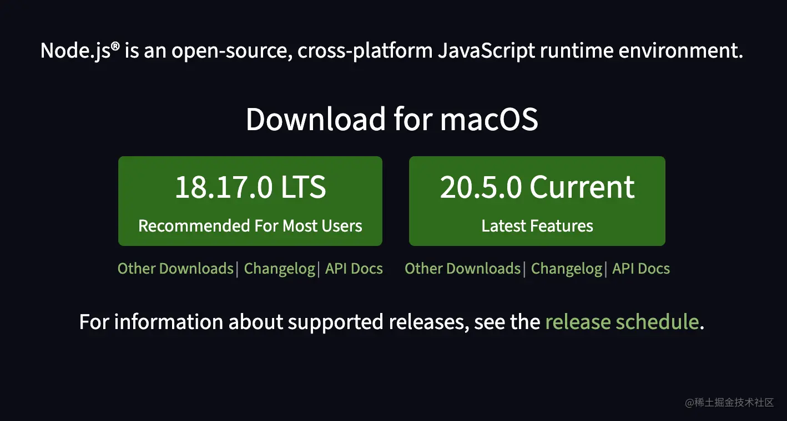
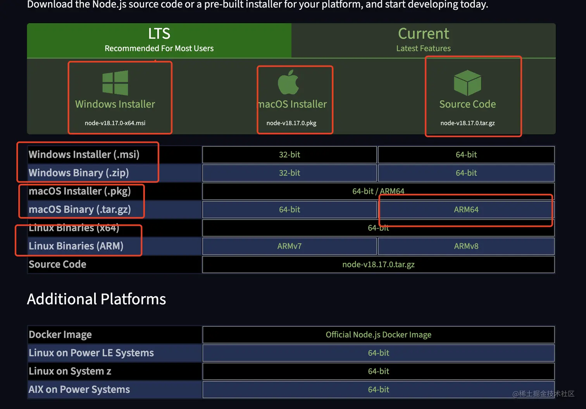
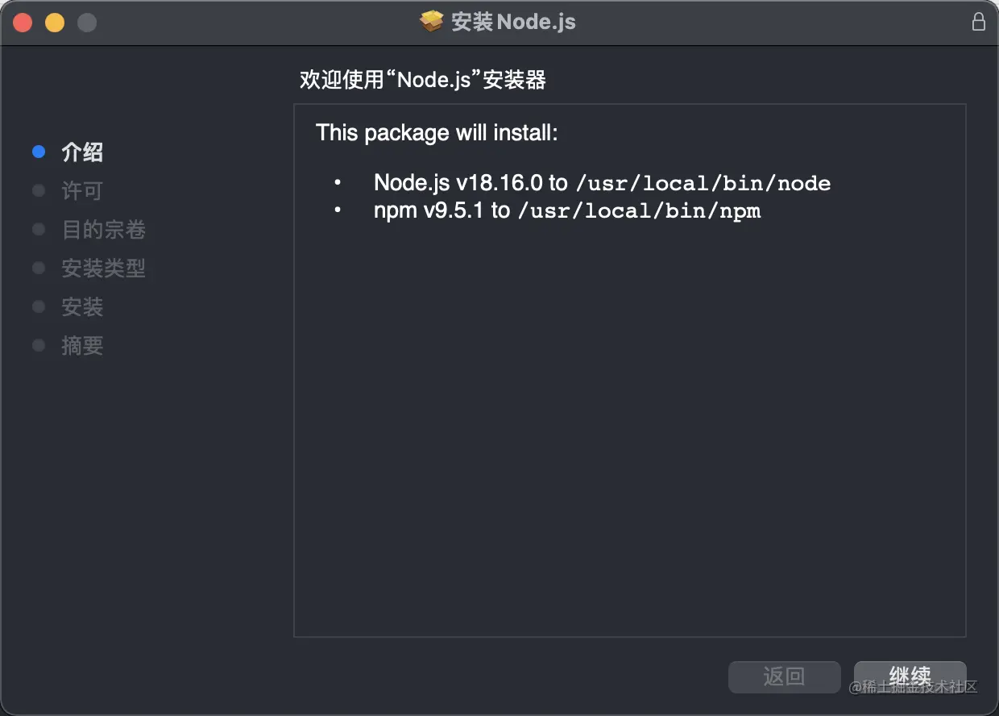
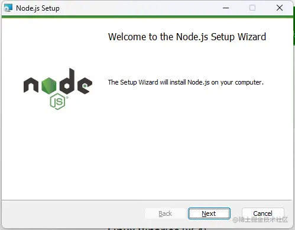
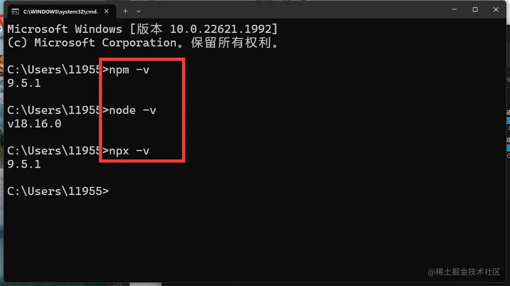

## 安装nodejs

访问官网

1. en nodejs.org/en
2. cn www.nodejs.com.cn/



```
LTS 长期支持版
```

```
Current 尝鲜版
```



选择自己的操作系统 windows Mac Linux windows需要区分64位和32位 Mac需要区分64位还是ARM芯片 Linux同上。 其中msi 和 pkg 可以直接安装较为简单

Mac Pkg



windows msi



也可以自行下载压缩包，配置环境变量

检查是否安装成功


