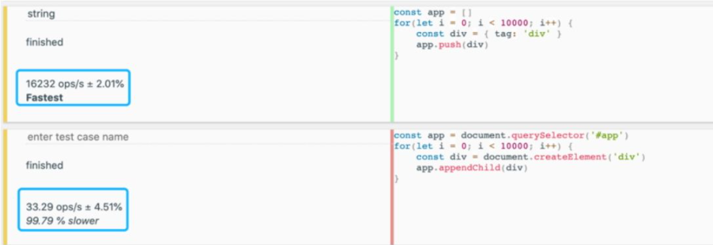
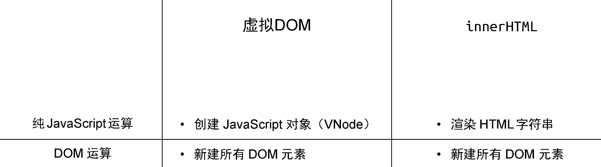
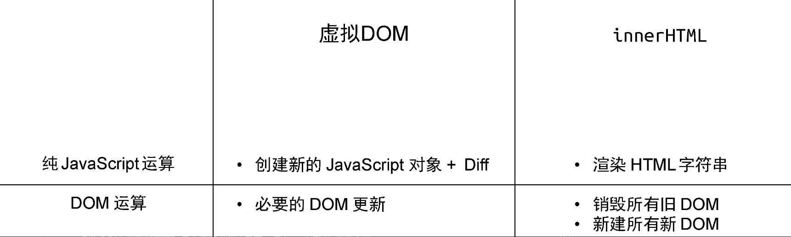
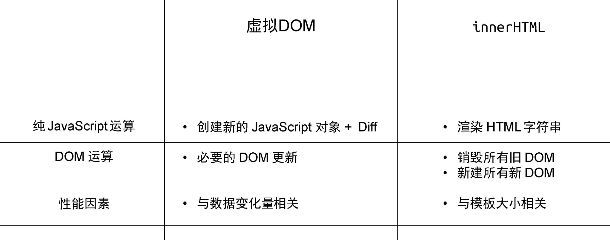
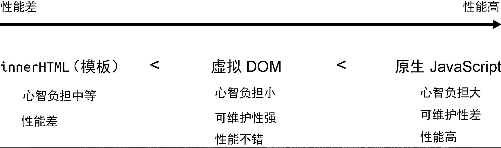
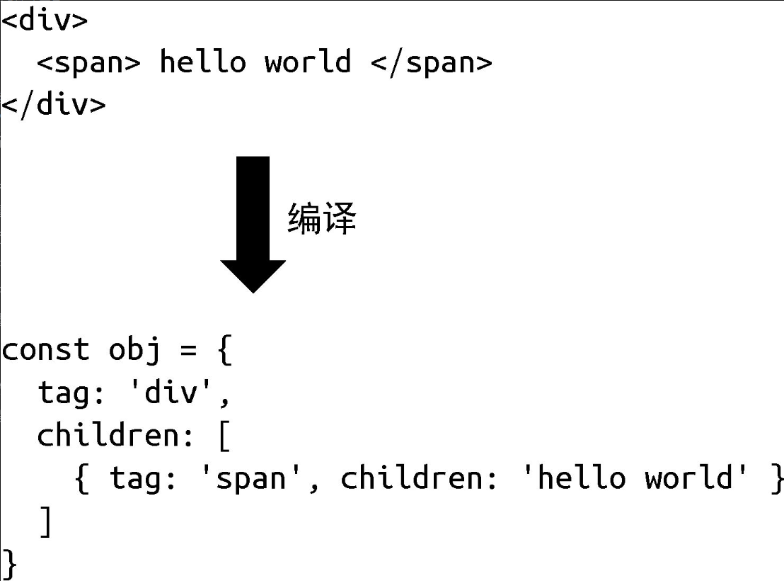
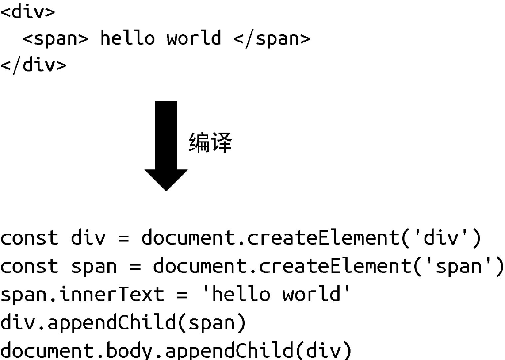

“框架设计里到处都体现了权衡的艺术。”

在深入讨论 Vue.js 3 各个模块的实现思路和细节之前，我认为有必要先来讨论视图层框架设计方面的内容。为什么呢？这是因为当我们设计一个框架的时候，框架本身的各个模块之间并不是相互独立的，而是相互关联、相互制约的。因此作为框架设计者，一定要对框架的定位和方向拥有全局的把控，这样才能做好后续的模块设计和拆分。同样，作为学习者，我们在学习框架的时候，也应该从全局的角度对框架的设计拥有清晰的认知，否则很容易被细节困住，看不清全貌。

另外，从范式的角度来看，我们的框架应该设计成命令式的还是声明式的呢？这两种范式有何优缺点？我们能否汲取两者的优点？除此之外，我们的框架要设计成纯运行时的还是纯编译时的，甚至是运行时+编译时的呢？它们之间又有何差异？优缺点分别是什么？这里面都体现了“权衡”的艺术。

## 1.1　命令式和声明式

从范式上来看，视图层框架通常分为命令式和声明式，它们各有优缺点。作为框架设计者，应该对两种范式都有足够的认知，这样才能做出正确的选择，甚至想办法汲取两者的优点并将其捏合。

接下来，我们先来看看命令式框架和声明式框架的概念。早年间流行的jQuery 就是典型的命令式框架。命令式框架的一大特点就是关注过程。例如，我们把下面这段话翻译成对应的代码：

```python
01 - 获取 id 为 app 的 div 标签
02 - 它的文本内容为 hello world
03 - 为其绑定点击事件
04 - 当点击时弹出提示：ok
```

对应的代码为：

```javascript
$("#app") // 获取 div
  .text("hello world") // 设置文本内容
  .on("click", () => {
    alert("ok");
  }); // 绑定点击事件
```

以上就是 jQuery 的代码示例，考虑到有些读者可能没有用过 jQuery，因此我们再用原生 JavaScript 来实现同样的功能：

```javascript
const div = document.querySelector("#app"); // 获取 div
div.innerText = "hello world"; // 设置文本内容
div.addEventListener("click", () => {
  alert("ok");
}); // 绑定点击事件
```

可以看到，自然语言描述能够与代码产生一一对应的关系，代码本身描述的是“做事的过程”，这符合我们的逻辑直觉。

那么，什么是声明式框架呢？与命令式框架更加关注过程不同，声明式框架更加关注结果。结合 Vue.js，我们来看看如何实现上面自然语言描述的功能：

```XML
<div @click="() => alert('ok')">hello world</div>
```

这段类 HTML 的模板就是 Vue.js 实现如上功能的方式。可以看到，我们提供的是一个“结果”，至于如何实现这个“结果”，我们并不关心，这就像我们在告诉 Vue.js：“嘿，Vue.js，看到没，我要的就是一个 div，文本内容是 hello world，它有个事件绑定，你帮我搞定吧。”至于实现该“结果”的过程，则是由 Vue.js 帮我们完成的。换句话说，Vue.js 帮我们封装了过程。因此，我们能够猜到 Vue.js 的内部实现一定是命令式的，而暴露给用户的却更加声明式。

## 1.2　性能与可维护性的权衡

命令式和声明式各有优缺点，在框架设计方面，则体现在性能与可维护性之间的权衡。这里我们先抛出一个结论：**声明式代码的性能不优于命令式代码的性能。**

还是拿上面的例子来说，假设现在我们要将 div 标签的文本内容修改为hello vue3，那么如何用命令式代码实现呢？很简单，因为我们明确知道要修改的是什么，所以直接调用相关命令操作即可：

```javascript
div.textContent = "hello vue3"; // 直接修改
```

现在思考一下，还有没有其他办法比上面这句代码的性能更好？答案是“没有”。可以看到，理论上命令式代码可以做到极致的性能优化，因为我们明确知道哪些发生了变更，只做必要的修改就行了。但是声明式代码不一定能做到这一点，因为它描述的是结果：

```xml
<!-- 之前： -->
<div @click="() => alert('ok')">hello world</div>
<!-- 之后： -->
<div @click="() => alert('ok')">hello vue3</div>
```

对于框架来说，为了实现最优的更新性能，它需要找到前后的差异并只更新变化的地方，但是最终完成这次更新的代码仍然是：

```javascript
div.textContent = "hello vue3"; // 直接修改
```

如果我们把直接修改的性能消耗定义为 A，把找出差异的性能消耗定义为B，那么有：

- 命令式代码的更新性能消耗 = A
- 声明式代码的更新性能消耗 = B + A

可以看到，声明式代码会比命令式代码多出找出差异的性能消耗，因此最理想的情况是，当找出差异的性能消耗为 0 时，声明式代码与命令式代码的性能相同，但是无法做到超越， **毕竟框架本身就是封装了命令式代码才实现了面向用户的声明式。** 这符合前文中给出的性能结论：**声明式代码的性能不优于命令式代码的性能。**

既然在性能层面命令式代码是更好的选择，那么为什么 Vue.js 要选择声明式的设计方案呢？原因就在于声明式代码的可维护性更强。从上面例子的代码中我们也可以感受到，在采用命令式代码开发的时候，我们需要维护实现目标的整个过程，包括要手动完成 DOM 元素的创建、更新、删除等工作。而声明式代码展示的就是我们要的结果，看上去更加直观，至于做事儿的过程，并不需要我们关心，Vue.js 都为我们封装好了。

这就体现了我们在框架设计上要做出的关于可维护性与性能之间的权衡。在采用声明式提升可维护性的同时，性能就会有一定的损失，而框架设计者要做的就是：在保持可维护性的同时让性能损失最小化。

## 1.3　虚拟 DOM 的性能到底如何

考虑到有些读者可能不知道什么是虚拟 DOM，这里我们不会对其做深入讨论，但这既不影响你理解本节内容，也不影响你阅读后续章节。如果实在看不明白，也没关系，至少有个印象，等后面我们深入讲解虚拟 DOM后再回来看这里的内容，相信你会有不同的感受。

前文说到，声明式代码的更新性能消耗 = 找出差异的性能消耗 + 直接修改的性能消耗，因此，如果我们能够最小化找出差异的性能消耗，就可以让声明式代码的性能无限接近命令式代码的性能。而所谓的虚拟 DOM，就是为了最小化找出差异这一步的性能消耗而出现的。

至此，相信你也应该清楚一件事了，那就是采用虚拟 DOM 的更新技术的性能理论上不可能比原生 JavaScript 操作 DOM 更高。这里我们强调了理论上三个字，因为这很关键，为什么呢？因为在大部分情况下，我们很难写出绝对优化的命令式代码，尤其是当应用程序的规模很大的时候，即使你写出了极致优化的代码，也一定耗费了巨大的精力，这时的投入产出比其实并不高。

那么，有没有什么办法能够让我们不用付出太多的努力（写声明式代码），还能够保证应用程序的性能下限，让应用程序的性能不至于太差，甚至想办法逼近命令式代码的性能呢？这其实就是虚拟 DOM 要解决的问题。

不过前文中所说的原生 JavaScript 实际上指的是像document.createElement 之类的 DOM 操作方法，并不包含innerHTML，因为它比较特殊，需要单独讨论。在早年使用 jQuery 或者直接使用 JavaScript 编写页面的时候，使用 innerHTML 来操作页面非常常见。其实我们可以思考一下：使用 innerHTML 操作页面和虚拟DOM 相比性能如何？innerHTML 和 document.createElement 等DOM 操作方法有何差异？

先来看第一个问题，为了比较 innerHTML 和虚拟 DOM 的性能，我们需要了解它们创建、更新页面的过程。对于 innerHTML 来说，为了创建页面，我们需要构造一段 HTML 字符串：

```javascript
const html = `
<div><span>...</span></div>
`;
```

接着将该字符串赋值给 DOM 元素的 innerHTML 属性：

```javascript
div.innerHTML = html;
```

然而这句话远没有看上去那么简单。为了渲染出页面，首先要把字符串解析成 DOM 树，这是一个 DOM 层面的计算。我们知道，涉及 DOM 的运算要远比 JavaScript 层面的计算性能差，这有一个跑分结果可供参考，如图 1-1 所示。



在图 1-1 中，上边是纯 JavaScript 层面的计算，循环 10 000 次，每次创建一个 JavaScript 对象并将其添加到数组中；下边是 DOM 操作，每次创建一个 DOM 元素并将其添加到页面中。跑分结果显示，纯JavaScript 层面的操作要比 DOM 操作快得多，它们不在一个数量级上。基于这个背景，我们可以用一个公式来表达通过 innerHTML 创建页面的性能：HTML 字符串拼接的计算量 + innerHTML 的 DOM 计算量。

图 1-2 直观地对比了 innerHTML 和虚拟 DOM 在创建页面时的性能。



可以看到，无论是纯 JavaScript 层面的计算，还是 DOM 层面的计算，其实两者差距不大。这里我们从宏观的角度只看数量级上的差异。如果在同一个数量级，则认为没有差异。在创建页面的时候，都需要新建所有DOM 元素。

刚刚我们讨论了创建页面时的性能情况，大家可能会觉得虚拟 DOM 相比innerHTML 没有优势可言，甚至细究的话性能可能会更差。别着急，接下来我们看看它们在更新页面时的性能。

使用 innerHTML 更新页面的过程是重新构建 HTML 字符串，再重新设置 DOM 元素的 innerHTML 属性，这其实是在说，哪怕我们只更改了一个文字，也要重新设置 innerHTML 属性。而重新设置 innerHTML 属性就等价于销毁所有旧的 DOM 元素，再全量创建新的 DOM 元素。再来看虚拟 DOM 是如何更新页面的。它需要重新创建 JavaScript 对象（虚拟 DOM 树），然后比较新旧虚拟 DOM，找到变化的元素并更新它。图 1-3 可作为对照。



可以发现，在更新页面时，虚拟 DOM 在 JavaScript 层面的运算要比创建页面时多出一个 Diff 的性能消耗，然而它毕竟也是 JavaScript 层面的运算，所以不会产生数量级的差异。再观察 DOM 层面的运算，可以发现虚拟 DOM 在更新页面时只会更新必要的元素，但 innerHTML 需要全量更新。这时虚拟 DOM 的优势就体现出来了。

另外，我们发现，当更新页面时，影响虚拟 DOM 的性能因素与影响innerHTML 的性能因素不同。对于虚拟 DOM 来说，无论页面多大，都只会更新变化的内容，而对于 innerHTML 来说，页面越大，就意味着更新时的性能消耗越大。如果加上性能因素，那么最终它们在更新页面时的性能如图 1-4 所示。



基于此，我们可以粗略地总结一下 innerHTML、虚拟 DOM 以及原生JavaScript（指 createElement 等方法）在更新页面时的性能，如图 1-5所示。



我们分了几个维度：心智负担、可维护性和性能。其中原生 DOM 操作方法的心智负担最大，因为你要手动创建、删除、修改大量的 DOM 元素。但它的性能是最高的，不过为了使其性能最佳，我们同样要承受巨大的心智负担。另外，以这种方式编写的代码，可维护性也极差。而对于innerHTML 来说，由于我们编写页面的过程有一部分是通过拼接 HTML 字符串来实现的，这有点儿接近声明式的意思，但是拼接字符串总归也是有一定心智负担的，而且对于事件绑定之类的事情，我们还是要使用原生JavaScript 来处理。如果 innerHTML 模板很大，则其更新页面的性能最差，尤其是在只有少量更新时。最后，我们来看看虚拟 DOM，它是声明式的，因此心智负担小，可维护性强，性能虽然比不上极致优化的原生JavaScript，但是在保证心智负担和可维护性的前提下相当不错。

至此，我们有必要思考一下：有没有办法做到，既声明式地描述 UI，又具备原生 JavaScript 的性能呢？看上去有点儿鱼与熊掌兼得的意思，我们会在下一章中继续讨论。

## 1.4　运行时和编译时

当设计一个框架的时候，我们有三种选择：纯运行时的、运行时 + 编译时的或纯编译时的。这需要你根据目标框架的特征，以及对框架的期望，做出合适的决策。另外，为了做出合适的决策，你需要清楚地知道什么是运行时，什么是编译时，它们各自有什么特征，它们对框架有哪些影响，本节将会逐步讨论这些内容。

我们先聊聊纯运行时的框架。假设我们设计了一个框架，它提供一个Render 函数，用户可以为该函数提供一个树型结构的数据对象，然后Render 函数会根据该对象递归地将数据渲染成 DOM 元素。我们规定树型结构的数据对象如下：

```javascript
const obj = {
  tag: "div",
  children: [{ tag: "span", children: "hello world" }],
};
```

每个对象都有两个属性：tag 代表标签名称，children 既可以是一个数组（代表子节点），也可以直接是一段文本（代表文本子节点）。接着，我们来实现 Render 函数：

```javascript
function Render(obj, root) {
  const el = document.createElement(obj.tag);
  if (typeof obj.children === "string") {
    const text = document.createTextNode(obj.children);
    el.appendChild(text);
  } else if (obj.children) {
    // 数组，递归调用 Render，使用 el 作为 root 参数
    obj.children.forEach((child) => Render(child, el));
  }

  // 将元素添加到 root
  root.appendChild(el);
}
```

有了这个函数，用户就可以这样来使用它：

```javascript
const obj = {
  tag: "div",
  children: [{ tag: "span", children: "hello world" }],
};
// 渲染到 body 下
Render(obj, document.body);
```

在浏览器中运行上面这段代码，就可以看到我们预期的内容。

现在我们回过头来思考一下用户是如何使用 Render 函数的。可以发现，用户在使用它渲染内容时，直接为 Render 函数提供了一个树型结构的数据对象。这里面不涉及任何额外的步骤，用户也不需要学习额外的知识。但是有一天，你的用户抱怨说：“手写树型结构的数据对象太麻烦了，而且不直观，能不能支持用类似于 HTML 标签的方式描述树型结构的数据对象呢？”你看了看现在的 Render 函数，然后回答：“抱歉，暂不支持。”实际上，我们刚刚编写的框架就是一个纯运行时的框架。

为了满足用户的需求，你开始思考，能不能引入编译的手段，把 HTML标签编译成树型结构的数据对象，这样不就可以继续使用 Render 函数了吗？思路如图 1-6 所示。



为此，你编写了一个叫作 Compiler 的程序，它的作用就是把 HTML 字符串编译成树型结构的数据对象，于是交付给用户去用了。那么用户该怎么用呢？其实这也是我们要思考的问题，最简单的方式就是让用户分别调用 Compiler 函数和 Render 函数：

```javascript
const html = `
<div>
  <span>hello world</span>
</div>
`;
// 调用 Compiler 编译得到树型结构的数据对象
const obj = Compiler(html);
// 再调用 Render 进行渲染
Render(obj, document.body);
```

上面这段代码能够很好地工作，这时我们的框架就变成了一个运行时 +编译时的框架。它既支持运行时，用户可以直接提供数据对象从而无须编译；又支持编译时，用户可以提供 HTML 字符串，我们将其编译为数据对象后再交给运行时处理。准确地说，上面的代码其实是运行时编译，意思是代码运行的时候才开始编译，而这会产生一定的性能开销，因此我们也可以在构建的时候就执行 Compiler 程序将用户提供的内容编译好，等到运行时就无须编译了，这对性能是非常友好的。

不过，聪明的你一定意识到了另外一个问题：既然编译器可以把 HTML 字符串编译成数据对象，那么能不能直接编译成命令式代码呢？图 1-7展示了将 HTML 字符串编译为命令式代码的过程。



这样我们只需要一个 Compiler 函数就可以了，连 Render 都不需要了。其实这就变成了一个纯编译时的框架，因为我们不支持任何运行时内容，用户的代码通过编译器编译后才能运行。

我们用简单的例子讲解了框架设计层面的运行时、编译时以及运行时 +编译时。我们发现，一个框架既可以是纯运行时的，也可以是纯编译时的，还可以是既支持运行时又支持编译时的。那么，它们都有哪些优缺点呢？是不是既支持运行时又支持编译时的框架最好呢？为了搞清楚这个问题，我们逐个分析。

首先是纯运行时的框架。由于它没有编译的过程，因此我们没办法分析用户提供的内容，但是如果加入编译步骤，可能就大不一样了，我们可以分析用户提供的内容，看看哪些内容未来可能会改变，哪些内容永远不会改变，这样我们就可以在编译的时候提取这些信息，然后将其传递给Render 函数，Render 函数得到这些信息之后，就可以做进一步的优化了。然而，假如我们设计的框架是纯编译时的，那么它也可以分析用户提供的内容。由于不需要任何运行时，而是直接编译成可执行的 JavaScript代码，因此性能可能会更好，但是这种做法有损灵活性，即用户提供的内 容必须编译后才能用。实际上，在这三个方向上业内都有探索，其中Svelte 就是纯编译时的框架，但是它的真实性能可能达不到理论高度。Vue.js 3 仍然保持了运行时 + 编译时的架构，在保持灵活性的基础上能够尽可能地去优化。等到后面讲解 Vue.js 3 的编译优化相关内容时，你会看到 Vue.js 3 在保留运行时的情况下，其性能甚至不输纯编译时的框架。

## 1.5　总结

在本章中，我们先讨论了命令式和声明式这两种范式的差异，其中命令式更加关注过程，而声明式更加关注结果。命令式在理论上可以做到极致优化，但是用户要承受巨大的心智负担；而声明式能够有效减轻用户的心智负担，但是性能上有一定的牺牲，框架设计者要想办法尽量使性能损耗最小化。

接着，我们讨论了虚拟 DOM 的性能，并给出了一个公式：声明式的更新性能消耗 = 找出差异的性能消耗 + 直接修改的性能消耗。虚拟 DOM 的意义就在于使找出差异的性能消耗最小化。我们发现，用原生 JavaScript操作 DOM 的方法（如 document.createElement）、虚拟 DOM 和innerHTML 三者操作页面的性能，不可以简单地下定论，这与页面大小、变更部分的大小都有关系，除此之外，与创建页面还是更新页面也有关系，选择哪种更新策略，需要我们结合心智负担、可维护性等因素综合考虑。一番权衡之后，我们发现虚拟 DOM 是个还不错的选择。

最后，我们介绍了运行时和编译时的相关知识，了解纯运行时、纯编译时以及两者都支持的框架各有什么特点，并总结出 Vue.js 3 是一个编译时+ 运行时的框架，它在保持灵活性的基础上，还能够通过编译手段分析用户提供的内容，从而进一步提升更新性能。
  