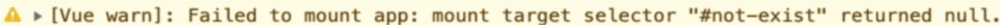
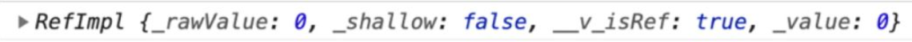
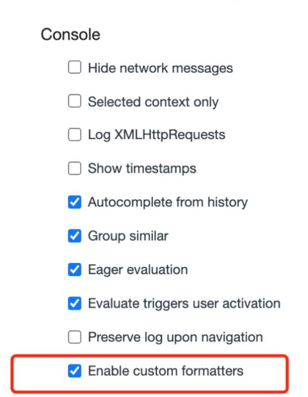
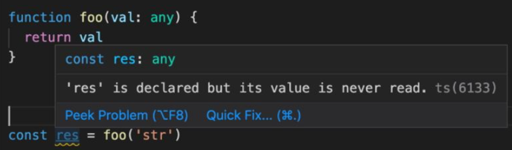

框架设计要比想象得复杂，并不是说只把功能开发完成，能用就算大功告成了，这里面还有很多学问。比如，我们的框架应该给用户提供哪些构建产物？产物的模块格式如何？当用户没有以预期的方式使用框架时，是否应该打印合适的警告信息从而提供更好的开发体验，让用户快速定位问题？开发版本的构建和生产版本的构建有何区别？热更新（hot modulereplacement，HMR）需要框架层面的支持，我们是否也应该考虑？另外，当你的框架提供了多个功能，而用户只需要其中几个功能时，用户能否选择关闭其他功能从而减少最终资源的打包体积？上述问题是我们在设计框架的过程中应该考虑的。

学习本章时，要求大家对常用的模块打包工具有一定的使用经验，尤其是rollup.js 和 webpack。如果你只用过或了解过其中一个，也没关系，因为它们的很多概念其实是类似的。如果你没有使用过任何模块打包工具，那么需要自行了解一下，有了初步认识之后再来阅读本章会更好一些。

##  2.1　提升用户的开发体验

```javascript
createApp(App).mount("#not-exist");
```

当我们创建一个 Vue.js 应用并试图将其挂载到一个不存在的 DOM 节点时，就会收到一条警告信息，如图 2-1 所示。



这条信息告诉我们挂载失败了，并说明了失败的原因：Vue.js 根据我们提供的选择器无法找到相应的 DOM 元素（返回 null）。这条信息让我们能够清晰且快速地定位问题。试想一下，如果 Vue.js 内部不做任何处理，那么我们很可能得到的是 JavaScript 层面的错误信息，例如Uncaught TypeError: Cannot read property 'xxx' of null，而根据此信息我们很难知道问题出在哪里。

所以在框架设计和开发过程中，提供友好的警告信息至关重要。如果这一点做得不好，那么很可能会经常收到用户的抱怨。始终提供友好的警告信息不仅能够帮助用户快速定位问题，节省用户的时间，还能够让框架收获良好的口碑，让用户认可框架的专业性。

在 Vue.js 的源码中，我们经常能够看到 warn 函数的调用，例如图 2-1中的信息就是由下面这个 warn 函数调用打印的：

```javascript
warn(
  `Failed to mount app: mount target selector "${container}" returned null.`
);
```

对于 warn 函数来说，由于它需要尽可能提供有用的信息，因此它需要收集当前发生错误的组件栈信息。如果你去看源码，就会发现有些复杂，但其实最终就是调用了 console.warn 函数。

除了提供必要的警告信息外，还有很多其他方面可以作为切入口，进一步提升用户的开发体验。例如，在 Vue.js 3 中，当我们在控制台打印一个ref 数据时：

```javascript
const count = ref(0);
console.log(count);
```

打开控制台查看输出，结果如图 2-2 所示。



可以发现，打印的数据非常不直观。当然，我们可以选择直接打印count.value 的值，这样就只会输出 0，非常直观。那么有没有办法在打印 count 的时候让输出的信息更友好呢？当然可以，浏览器允许我们编写自定义的 formatter，从而自定义输出形式。在 Vue.js 3 的源码中，你可以搜索到名为 initCustomFormatter 的函数，该函数就是用来在开发环境下初始化自定义 formatter 的。以 Chrome 为例，我们可以打开DevTools 的设置，然后勾选“Console”→“Enable customformatters”选项，如图 2-3 所示。



然后刷新浏览器并查看控制台，会发现输出内容变得非常直观，如图 2-4所示。


框架的大小也是衡量框架的标准之一。在实现同样功能的情况下，当然是用的代码越少越好，这样体积就会越小，最后浏览器加载资源的时间也就越少。这时我们不禁会想，提供越完善的警告信息就意味着我们要编写更多的代码，这不是与控制代码体积相悖吗？没错，所以我们要想办法解决这个问题。

如果我们去看 Vue.js 3 的源码，就会发现每一个 warn 函数的调用都会配合 __DEV__ 常量的检查，例如：

```javascript
if (__DEV__ && !res) {
  warn(
    `Failed to mount app: mount target selector "${container}" returned null.`
  );
}
```

可以看到，打印警告信息的前提是：__DEV__ 这个常量一定要为 true，这里的 __DEV__ 常量就是达到目的的关键。

Vue.js 使用 rollup.js 对项目进行构建，这里的 __DEV__ 常量实际上是通过 rollup.js 的插件配置来预定义的，其功能类似于 webpack 中的DefinePlugin 插件。

Vue.js 在输出资源的时候，会输出两个版本，其中一个用于开发环境，如vue.global.js，另一个用于生产环境，如 vue.global.prod.js，通过文件名我们也能够区分。

当 Vue.js 构建用于开发环境的资源时，会把 __DEV__ 常量设置为 true，这时上面那段输出警告信息的代码就等价于：

```javascript
if (true && !res) {
  warn(
    `Failed to mount app: mount target selector "${container}" returned null.`
  );
}
```

可以看到，这里我们把 __DEV__ 常量替换成字面量 true，所以这段代码在开发环境中是肯定存在的。

当 Vue.js 用于构建生产环境的资源时，会把 __DEV__ 常量设置为false，这时上面那段输出警告信息的代码就等价于：

```javascript
if (false && !res) {
  warn(
    `Failed to mount app: mount target selector "${container}" returned null.`
  );
}
```

可以看到，__DEV__ 常量替换为字面量 false，这时我们发现这段分支代码永远都不会执行，因为判断条件始终为假，这段永远不会执行的代码称为 dead code，它不会出现在最终产物中，在构建资源的时候就会被移除，因此在 vue.global.prod.js 中是不会存在这段代码的。

这样我们就做到了在开发环境中为用户提供友好的警告信息的同时，不会增加生产环境代码的体积。

## 2.3　框架要做到良好的 Tree-Shaking

上文提到通过构建工具设置预定义的常量 __DEV__，就能够在生产环境中使得框架不包含用于打印警告信息的代码，从而使得框架自身的代码量不随警告信息的增加而增加。但是从用户的角度来看，这么做仍然不够，还是拿 Vue.js 来举个例子。我们知道 Vue.js 内建了很多组件，例如`<Transition>` 组件，如果我们的项目中根本就没有用到该组件，那么它的代码需要包含在项目最终的构建资源中吗？答案是“当然不需要”，那么如何做到这一点呢？这就不得不提到本节的主角 Tree-Shaking。

什么是 Tree-Shaking 呢？在前端领域，这个概念因 rollup.js 而普及。简单地说，Tree-Shaking 指的就是消除那些永远不会被执行的代码，也就是排除 dead code，现在无论是 rollup.js 还是 webpack，都支持Tree-Shaking。

想要实现 Tree-Shaking，必须满足一个条件，即模块必须是 ESM（ESModule），因为 Tree-Shaking 依赖 ESM 的静态结构。我们以rollup.js 为例看看 Tree-Shaking 如何工作，其目录结构如下：

```
├── demo
│   └── package.json
│   └── input.js
│   └── utils.js
```

首先安装 rollup.js：

```
yarn add rollup -D
# 或者 npm install rollup -D
```

下面是 input.js 和 utils.js 文件的内容：

```javascript
// input.js
import { foo } from "./utils.js";
foo();
// utils.js
export function foo(obj) {
  obj && obj.foo;
}
export function bar(obj) {
  obj && obj.bar;
}
```

代码很简单，我们在 utils.js 文件中定义并导出了两个函数，分别是 foo函数和 bar 函数，然后在 input.js 中导入了 foo 函数并执行。注意，我们并没有导入 bar 函数。

```
npx rollup input.js -f esm -o bundle.js
```

这句命令的意思是，以 input.js 文件为入口，输出 ESM，输出的文件叫作 bundle.js。命令执行成功后，我们打开 bundle.js 来查看一下它的内容：

```javascript
// bundle.js
function foo(obj) {
  obj && obj.foo;
}
foo();
```

可以看到，其中并不包含 bar 函数，这说明 Tree-Shaking 起了作用。由于我们并没有使用 bar 函数，因此它作为 dead code 被删除了。但是仔细观察会发现，foo 函数的执行也没有什么意义，仅仅是读取了对象的值，所以它的执行似乎没什么必要。既然把这段代码删了也不会对我们的应用程序产生影响，那么为什么 rollup.js 不把这段代码也作为 deadcode 移除呢？

这就涉及 Tree-Shaking 中的第二个关键点——副作用。如果一个函数调用会产生副作用，那么就不能将其移除。什么是副作用？简单地说，副作用就是，当调用函数的时候会对外部产生影响，例如修改了全局变量。这时你可能会说，上面的代码明显是读取对象的值，怎么会产生副作用呢？其实是有可能的，试想一下，如果 obj 对象是一个通过 Proxy 创建的代理对象，那么当我们读取对象属性时，就会触发代理对象的 get 夹子（trap），在 get 夹子中是可能产生副作用的，例如我们在 get 夹子中修改了某个全局变量。而到底会不会产生副作用，只有代码真正运行的时候才能知道，JavaScript 本身是动态语言，因此想要静态地分析哪些代码是 dead code 很有难度，上面只是举了一个简单的例子。

因为静态地分析 JavaScript 代码很困难，所以像 rollup.js 这类工具都会提供一个机制，让我们能明确地告诉 rollup.js：“放心吧，这段代码不会 产生副作用，你可以移除它。”具体怎么做呢？如以下代码所示，我们修改 input.js 文件：

```javascript
import { foo } from "./utils";

/*#__PURE__*/ foo();
```

注意注释代码 `/*#__PURE__*/` ，其作用就是告诉 rollup.js，对于 foo 函数的调用不会产生副作用，你可以放心地对其进行 Tree-Shaking，此时再次执行构建命令并查看 bundle.js 文件，就会发现它的内容是空的，这说明 Tree-Shaking 生效了。

基于这个案例，我们应该明白，在编写框架的时候需要合理使用  `/*#__PURE__*/` 注释。如果你去搜索 Vue.js 3 的源码，会发现它大量使用了该注释，例如下面这句：

```javascript
export const isHTMLTag = /*#__PURE__*/ makeMap(HTML_TAGS);
```

这会不会对编写代码造成很大的心智负担呢？其实不会，因为通常产生副作用的代码都是模块内函数的顶级调用。什么是顶级调用呢？如以下代码所示：

```javascript
foo(); // 顶级调用

function bar() {
  foo(); // 函数内调用
}
```

可以看到，对于顶级调用来说，是可能产生副作用的；但对于函数内调用来说，只要函数 bar 没有被调用，那么 foo 函数的调用自然不会产生副作用。因此，在 Vue.js 3 的源码中，基本都是在一些顶级调用的函数上使用 `/*#__PURE__*/` 注释。当然，该注释不仅仅作用于函数，它可以应用于任何语句上。该注释也不是只有 rollup.js 才能识别，webpack 以及压缩工具（如 terser）都能识别它。

## 2.4　框架应该输出怎样的构建产物

上文提到 Vue.js 会为开发环境和生产环境输出不同的包，例如vue.global.js 用于开发环境，它包含必要的警告信息，而vue.global.prod.js 用于生产环境，不包含警告信息。实际上，Vue.js 的构建产物除了有环境上的区分之外，还会根据使用场景的不同而输出其他形式的产物。本节中，我们将讨论这些产物的用途以及在构建阶段如何输出这些产物。

不同类型的产物一定有对应的需求背景，因此我们从需求讲起。首先我们希望用户可以直接在 HTML 页面中使用 `<script>` 标签引入框架并使用：

```javascript
<body>
  <script src="/path/to/vue.js"></script>
  <script>const {createApp} = Vue // ...</script>
</body>;
```

为了实现这个需求，我们需要输出一种叫作 IIFE 格式的资源。IIFE 的全称是 Immediately Invoked Function Expression，即“立即调用的函数表达式”，易于用 JavaScript 来表达：

```javascript
(function () {
  // ...
})();
```

如以上代码所示，这是一个立即执行的函数表达式。实际上，vue.global.js 文件就是 IIFE 形式的资源，它的代码结构如下所示：

```javascript
var Vue = (function (exports) {
  // ...
  exports.createApp = createApp;
  // ...
  return exports;
})({});
```

这样当我们使用 `<script>` 标签直接引入 vue.global.js 文件后，全局变量 Vue 就是可用的了。

在 rollup.js 中，我们可以通过配置 format: 'iife' 来输出这种形式的资源：

```javascript
// rollup.config.js
const config = {
  input: "input.js",
  output: {
    file: "output.js",
    format: "iife", // 指定模块形式
  },
};

export default config;
```

不过随着技术的发展和浏览器的支持，现在主流浏览器对原生 ESM 的支持都不错，所以用户除了能够使用 `<script>` 标签引用 IIFE 格式的资源外，还可以直接引入 ESM 格式的资源，例如 Vue.js 3 还会输出vue.esm-browser.js 文件，用户可以直接用 `<script type="module">` 标签引入：

```html
<script type="module" src="/path/to/vue.esm-browser.js"></script>
```

为了输出 ESM 格式的资源，rollup.js 的输出格式需要配置为：format:'esm'。

你可能已经注意到了，为什么 vue.esm-browser.js 文件中会有 -browser 字样？其实对于 ESM 格式的资源来说，Vue.js 还会输出一个vue.esm-bundler.js 文件，其中 -browser 变成了 -bundler。为什么这么做呢？我们知道，无论是 rollup.js 还是 webpack，在寻找资源时，如果 package.json 中存在 module 字段，那么会优先使用 module 字段指向的资源来代替 main 字段指向的资源。我们可以打开 Vue.js 源码中的 packages/vue/package.json 文件看一下：

```json
{
  "main": "index.js",
  "module": "dist/vue.runtime.esm-bundler.js"
}
```

其中 module 字段指向的是 vue.runtime.esm-bundler.js 文件，意思是说，如果项目是使用 webpack 构建的，那么你使用的 Vue.js 资源就是vue.runtime.esm-bundler.js 也就是说，带有 -bundler 字样的 ESM 资源是给 rollup.js 或 webpack 等打包工具使用的，而带有 -browser 字样的 ESM 资源是直接给 `<script type="module">` 使用的。它们之间有何区别？这就不得不提到上文中的 __DEV__ 常量。当构建用于 `<script>` 标签的 ESM 资源时，如果是用于开发环境，那么 __DEV__ 会设置为true；如果是用于生产环境，那么 __DEV__ 常量会设置为 false，从而被Tree-Shaking 移除。但是当我们构建提供给打包工具的 ESM 格式的资源时，不能直接把 __DEV__ 设置为 true 或 false，而要使用(process.env.NODE_ENV !== 'production') 替换 __DEV__ 常量。例如下面的源码：

```javascript
if (__DEV__) {
  warn(`useCssModule() is not supported in the global build.`);
}
```

在带有 -bundler 字样的资源中会变成：

```javascript
if (process.env.NODE_ENV !== "production") {
  warn(`useCssModule() is not supported in the global build.`);
}
```

这样做的好处是，用户可以通过 webpack 配置自行决定构建资源的目标环境，但是最终效果其实一样，这段代码也只会出现在开发环境中。

用户除了可以直接使用 `<script>` 标签引入资源外，我们还希望用户可以在 Node.js 中通过 require 语句引用资源，例如：

```javascript
const Vue = require("vue");
```

为什么会有这种需求呢？答案是“服务端渲染”。当进行服务端渲染时，Vue.js 的代码是在 Node.js 环境中运行的，而非浏览器环境。在Node.js 环境中，资源的模块格式应该是 CommonJS，简称 cjs。为了能够输出 cjs 模块的资源，我们可以通过修改 rollup.config.js 的配置format: 'cjs' 来实现：

```javascript
// rollup.config.js
const config = {
  input: "input.js",
  output: {
    file: "output.js",
    format: "cjs", // 指定模块形式
  },
};

export default config;
```

## 2.5　特性开关

在设计框架时，框架会给用户提供诸多特性（或功能），例如我们提供A、B、C 三个特性给用户，同时还提供了 a、b、c 三个对应的特性开关，用户可以通过设置 a、b、c 为 true 或 false 来代表开启或关闭对应的特性，这将会带来很多益处。

- 对于用户关闭的特性，我们可以利用 Tree-Shaking 机制让其不包含在最终的资源中。
- 该机制为框架设计带来了灵活性，可以通过特性开关任意为框架添加新的特性，而不用担心资源体积变大。同时，当框架升级时，我们也可以通过特性开关来支持遗留 API，这样新用户可以选择不使用遗留 API，从而使最终打包的资源体积最小化。

那怎么实现特性开关呢？其实很简单，原理和上文提到的 __DEV__ 常量一样，本质上是利用 rollup.js 的预定义常量插件来实现。拿 Vue.js 3 源码中的一段 rollup.js 配置来说：

```
{
  __FEATURE_OPTIONS_API__: isBundlerESMBuild ? `__VUE_OPTIONS_API__` : true,
};
```

其中 __FEATURE_OPTIONS_API__ 类似于 __DEV__。在 Vue.js 3 的源码中搜索，可以找到很多类似于如下代码的判断分支：

```javascript
// support for 2.x options
if (__FEATURE_OPTIONS_API__) {
  currentInstance = instance;
  pauseTracking();
  applyOptions(instance, Component);
  resetTracking();
  currentInstance = null;
}
```

当 Vue.js 构建资源时，如果构建的资源是供打包工具使用的（即带有 -bundler 字样的资源），那么上面的代码在资源中会变成：

```javascript
// support for 2.x options
if (__VUE_OPTIONS_API__) {
  // 注意这里
  currentInstance = instance;
  pauseTracking();
  applyOptions(instance, Component);
  resetTracking();
  currentInstance = null;
}
```

其中 __VUE_OPTIONS_API__ 是一个特性开关，用户可以通过设置 __VUE_OPTIONS_API__ 预定义常量的值来控制是否要包含这段代码。通常用户可以使用 webpack.DefinePlugin 插件来实现：

```javascript
// webpack.DefinePlugin 插件配置
new webpack.DefinePlugin({
  __VUE_OPTIONS_API__: JSON.stringify(true), // 开启特性
});
```

最后详细解释 __VUE_OPTIONS_API__ 开关有什么用。在 Vue.js 2 中，我们编写的组件叫作组件选项 API：

```javascript
export default {
  data() {}, // data 选项
  computed: {}, // computed 选项
  // 其他选项
};
```

但是在 Vue.js 3 中，推荐使用 Composition API 来编写代码，例如：

```javascript
export default {
  setup() {
    const count = ref(0);
    const doubleCount = computed(() => count.value * 2); // 相当于 Vue.js 2 中的 computed 选项
  },
};
```

但是为了兼容 Vue.js 2，在 Vue.js 3 中仍然可以使用选项 API 的方式编写代码。但是如果明确知道自己不会使用选项 API，用户就可以使用__VUE_OPTIONS_API__ 开关来关闭该特性，这样在打包的时候 Vue.js的这部分代码就不会包含在最终的资源中，从而减小资源体积。

## 2.6　错误处理

错误处理是框架开发过程中非常重要的环节。框架错误处理机制的好坏直接决定了用户应用程序的健壮性，还决定了用户开发时处理错误的心智负担。

为了让大家更加直观地感受错误处理的重要性，我们从一个小例子说起。假设我们开发了一个工具模块，代码如下：

```javascript
// utils.js
export default {
  foo(fn) {
    fn && fn();
  },
};
```

该模块导出一个对象，其中 foo 属性是一个函数，接收一个回调函数作为参数，调用 foo 函数时会执行该回调函数，在用户侧使用时：

```javascript
import utils from "utils.js";
utils.foo(() => {
  // ...
});
```

大家思考一下，如果用户提供的回调函数在执行的时候出错了，怎么办？此时有两个办法，第一个办法是让用户自行处理，这需要用户自己执行try...catch：

```javascript
import utils from "utils.js";
utils.foo(() => {
  try {
    // ...
  } catch (e) {
    // ...
  }
});
```

但是这会增加用户的负担。试想一下，如果 utils.js 不是仅仅提供了一个foo 函数，而是提供了几十上百个类似的函数，那么用户在使用的时候就需要逐一添加错误处理程序。

第二个办法是我们代替用户统一处理错误，如以下代码所示：

```javascript
// utils.js
export default {
  foo(fn) {
    try {
      fn && fn();
    } catch (e) {
      /* ... */
    }
  },
  bar(fn) {
    try {
      fn && fn();
    } catch (e) {
      /* ... */
    }
  },
};
```

在每个函数内都增加 try...catch 代码块，实际上，我们可以进一步将错误处理程序封装为一个函数，假设叫它 callWithErrorHandling：

```javascript
// utils.js
export default {
  foo(fn) {
    callWithErrorHandling(fn);
  },
  bar(fn) {
    callWithErrorHandling(fn);
  },
};
function callWithErrorHandling(fn) {
  try {
    fn && fn();
  } catch (e) {
    console.log(e);
  }
}
```

可以看到，代码变得简洁多了。但简洁不是目的，这么做真正的好处是，我们能为用户提供统一的错误处理接口，如以下代码所示：

```javascript
// utils.js
let handleError = null;
export default {
  foo(fn) {
    callWithErrorHandling(fn);
  },
  // 用户可以调用该函数注册统一的错误处理函数
  registerErrorHandler(fn) {
    handleError = fn;
  },
};
function callWithErrorHandling(fn) {
  try {
    fn && fn();
  } catch (e) {
    // 将捕获到的错误传递给用户的错误处理程序
    handleError(e);
  }
}
```

我们提供了 registerErrorHandler 函数，用户可以使用它注册错误处理程序，然后在 callWithErrorHandling 函数内部捕获错误后，把错误传递给用户注册的错误处理程序。

这样用户侧的代码就会非常简洁且健壮：

```javascript
import utils from "utils.js";
// 注册错误处理程序
utils.registerErrorHandler((e) => {
  console.log(e);
});
utils.foo(() => {
  /*...*/
});
utils.bar(() => {
  /*...*/
});
```

这时错误处理的能力完全由用户控制，用户既可以选择忽略错误，也可以调用上报程序将错误上报给监控系统。

实际上，这就是 Vue.js 错误处理的原理，你可以在源码中搜索到callWithErrorHandling 函数。另外，在 Vue.js 中，我们也可以注册统一的错误处理函数：

```javascript
import App from "App.vue";
const app = createApp(App);
app.config.errorHandler = () => {
  // 错误处理程序
};
```

## 2.7　良好的 TypeScript 类型支持

TypeScript 是由微软开源的编程语言，简称 TS，它是 JavaScript 的超集，能够为 JavaScript 提供类型支持。现在越来越多的开发者和团队在项目中使用 TS。使用 TS 的好处有很多，如代码即文档、编辑器自动提示、一定程度上能够避免低级 bug、代码的可维护性更强等。因此对 TS类型的支持是否完善也成为评价一个框架的重要指标。

如何衡量一个框架对 TS 类型支持的水平呢？这里有一个常见的误区，很多读者以为只要是使用 TS 编写框架，就等价于对 TS 类型支持友好，其实这是两件完全不同的事。考虑到有的读者可能没有接触过 TS，所以这里不会做深入讨论，我们只举一个简单的例子。下面是使用 TS 编写的函数：

```typescript
function foo(val: any) {
  return val;
}
```

 这个函数很简单，它接收参数 val 并且该参数可以是任意类型（any），该函数直接将参数作为返回值，这说明返回值的类型是由参数决定的，如果参数是 number 类型，那么返回值也是 number 类型。然后我们尝试使用一下这个函数，如图 2-5 所示。

 

 在调用 foo 函数时，我们传递了一个字符串类型的参数 'str'，按照之前的分析，得到的结果 res 的类型应该也是字符串类型，然而当我们把鼠标指针悬浮到 res 常量上时，可以看到其类型是 any，这并不是我们想要的结果。为了达到理想状态，我们只需要对 foo 函数做简单的修改即可：大家不需要理解这段代码，我们直接来看现在的表现，如图 2-6 所示。图2-6　能够推导出返回值类型可以看到，res 的类型是字符字面量 'str' 而不是 any 了，这说明我们的代码生效了。

 ```typescript
 function foo<T extends any>(val: T): T {
  return val;
}
```

可以看到，res 的类型是字符字面量 'str' 而不是 any 了，这说明我们的代码生效了。

通过这个简单的例子我们认识到，使用 TS 编写代码与对 TS 类型支持友好是两件事。在编写大型框架时，想要做到完善的 TS 类型支持很不容易，大家可以查看 Vue.js 源码中的 runtime-core/src/apiDefineComponent.ts 文件，整个文件里真正会在浏览器中运行的代码其实只有 3 行，但是全部的代码接近 200 行，其实这些代码都是在为类型支持服务。由此可见，框架想要做到完善的类型支持，需要付出相当大的努力。

除了要花大力气做类型推导，从而做到更好的类型支持外，还要考虑对TSX 的支持，后续章节会详细讨论这部分内容。

## 2.8　总结

本章首先讲解了框架设计中关于开发体验的内容，开发体验是衡量一个框架的重要指标之一。提供友好的警告信息至关重要，这有助于开发者快速定位问题，因为大多数情况下“框架”要比开发者更清楚问题出在哪里，因此在框架层面抛出有意义的警告信息是非常必要的。

但提供的警告信息越详细，就意味着框架体积越大。因此，为了框架体积不受警告信息的影响，我们需要利用 Tree-Shaking 机制，配合构建工具预定义常量的能力，例如预定义 __DEV__ 常量，从而实现仅在开发环境中打印警告信息，而生产环境中则不包含这些用于提升开发体验的代码，从而实现线上代码体积的可控性。

Tree-Shaking 是一种排除 dead code 的机制，框架中会内建多种能力，例如 Vue.js 内建的组件等。对于用户可能用不到的能力，我们可以利用 Tree-Shaking 机制使最终打包的代码体积最小化。另外，Tree-Shaking 本身基于 ESM，并且 JavaScript 是一门动态语言，通过纯静态分析的手段进行 Tree-Shaking 难度较大，因此大部分工具能够识别/*#__PURE__*/ 注释，在编写框架代码时，我们可以利用 `/*#__PURE__*/` 来辅助构建工具进行 Tree-Shaking。

接着我们讨论了框架的输出产物，不同类型的产物是为了满足不同的需求。为了让用户能够通过 `<script>` 标签直接引用并使用，我们需要输出 IIFE 格式的资源，即立即调用的函数表达式。为了让用户能够通过 `<script type="module">` 引用并使用，我们需要输出 ESM 格式的资源。这里需要注意的是，ESM 格式的资源有两种：用于浏览器的 esm-browser.js 和用于打包工具的 esm-bundler.js。它们的区别在于对预定义常量 __DEV__ 的处理，前者直接将 __DEV__ 常量替换为字面量 true或 false，后者则将 __DEV__ 常量替换为 process.env.NODE_ENV !=='production' 语句。

框架会提供多种能力或功能。有时出于灵活性和兼容性的考虑，对于同样的任务，框架提供了两种解决方案，例如 Vue.js 中的选项对象式 API 和组合式 API 都能用来完成页面的开发，两者虽然不互斥，但从框架设计的角度看，这完全是基于兼容性考虑的。有时用户明确知道自己仅会使用组合式 API，而不会使用选项对象式 API，这时用户可以通过特性开关关闭对应的特性，这样在打包的时候，用于实现关闭功能的代码将会被Tree-Shaking 机制排除。

框架的错误处理做得好坏直接决定了用户应用程序的健壮性，同时还决定 了用户开发应用时处理错误的心智负担。框架需要为用户提供统一的错误处理接口，这样用户可以通过注册自定义的错误处理函数来处理全部的框架异常。

最后，我们点出了一个常见的认知误区，即“使用 TS 编写框架和框架对TS 类型支持友好是两件完全不同的事”。有时候为了让框架提供更加友好的类型支持，甚至要花费比实现框架功能本身更多的时间和精力。
