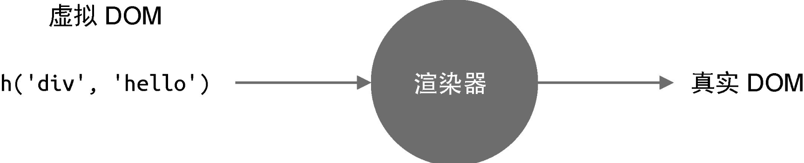

在第1章中，我们阐述了框架设计是权衡的艺术，这里面存在取舍，例如性能与可维护性之间的取舍、运行时与编译时之间的取舍等。在第2章中，我们详细讨论了框架设计的几个核心要素，有些要素是框架设计者必须要考虑的，另一些要素则是从专业和提升开发体验的角度考虑的。框架设计讲究全局视角的把控，一个项目就算再大，也是存在一条核心思路的，并围绕核心展开。本章我们就从全局视角了解 Vue.js 3 的设计思路、工作机制及其重要的组成部分。我们可以把这些组成部分当作独立的功能模块，看看它们之间是如何相互配合的。在后续的章节中，我们会深入各个功能模块了解它们的运作机制。

## 3.1　声明式地描述 UI

Vue.js 3 是一个声明式的 UI 框架，意思是说用户在使用 Vue.js 3 开发页面时是声明式地描述 UI 的。思考一下，如果让你设计一个声明式的 UI框架，你会怎么设计呢？为了搞清楚这个问题，我们需要了解编写前端页 面都涉及哪些内容，具体如下。

- DOM 元素：例如是 div 标签还是 a 标签。
- 属性：如 a 标签的 href 属性，再如 id、class 等通用属性。
- 事件：如 click、keydown 等。
- 元素的层级结构：DOM 树的层级结构，既有子节点，又有父节点。
   - 那么，如何声明式地描述上述内容呢？这是框架设计者需要思考的问题。其实方案有很多。拿 Vue.js 3 来说，相应的解决方案是：
- 使用与 HTML 标签一致的方式来描述 DOM 元素，例如描述一个 div标签时可以使用  `<div></div>` ；
- 使用与 HTML 标签一致的方式来描述属性，例如 `<div id="app"></div>` ；
- 使用 : 或 v-bind 来描述动态绑定的属性，例如 `<div:id="dynamicId"></div>` ；
- 使用 @ 或 v-on 来描述事件，例如点击事件 `<div@click="handler"></div>` ；
- 使用与 HTML 标签一致的方式来描述层级结构，例如一个具有 span子节点的 div 标签  `<div><span></span></div>` 。

可以看到，在 Vue.js 中，哪怕是事件，都有与之对应的描述方式。用户不需要手写任何命令式代码，这就是所谓的声明式地描述 UI。

除了上面这种使用模板来声明式地描述 UI 之外，我们还可以用JavaScript 对象来描述，代码如下所示：

```javascript
const title = {
  // 标签名称
  tag: "h1",
  // 标签属性
  props: {
    onClick: handler,
  },
  // 子节点
  children: [{ tag: "span" }],
};
```

对应到 Vue.js 模板，其实就是：

```html
<h1 @click="handler"><span></span></h1>
```

那么，使用模板和 JavaScript 对象描述 UI 有何不同呢？答案是：使用JavaScript 对象描述 UI 更加灵活。举个例子，假如我们要表示一个标题，根据标题级别的不同，会分别采用 h1~h6 这几个标签，如果用JavaScript 对象来描述，我们只需要使用一个变量来代表 h 标签即可：

```javascript
// h 标签的级别
let level = 3;
const title = {
  tag: `h${level}`, // h3 标签
};
```

可以看到，当变量 level 值改变，对应的标签名字也会在 h1 和 h6 之间变化。但是如果使用模板来描述，就不得不穷举：

```html
<h1 v-if="level === 1"></h1>
<h2 v-else-if="level === 2"></h2>
<h3 v-else-if="level === 3"></h3>
<h4 v-else-if="level === 4"></h4>
<h5 v-else-if="level === 5"></h5>
<h6 v-else-if="level === 6"></h6>
```

这远没有 JavaScript 对象灵活。而使用 JavaScript 对象来描述 UI 的方式，其实就是所谓的虚拟 DOM。现在大家应该觉得虚拟 DOM 其实也没有那么神秘了吧。正是因为虚拟 DOM 的这种灵活性，Vue.js 3 除了支持使用模板描述 UI 外，还支持使用虚拟 DOM 描述 UI。其实我们在Vue.js 组件中手写的渲染函数就是使用虚拟 DOM 来描述 UI 的，如以下代码所示：

```javascript
import { h } from "vue";

export default {
  render() {
    return h("h1", { onClick: handler }); // 虚拟 DOM
  },
};
```

有的读者可能会说，这里是 h 函数调用呀，也不是 JavaScript 对象啊。其实 h 函数的返回值就是一个对象，其作用是让我们编写虚拟 DOM 变得更加轻松。如果把上面 h 函数调用的代码改成 JavaScript 对象，就需要写更多内容：

```javascript
export default {
  render() {
    return {
      tag: "h1",
      props: { onClick: handler },
    };
  },
};
```

如果还有子节点，那么需要编写的内容就更多了，所以 h 函数就是一个辅助创建虚拟 DOM 的工具函数，仅此而已。另外，这里有必要解释一下什么是组件的渲染函数。一个组件要渲染的内容是通过渲染函数来描述的，也就是上面代码中的 render 函数，Vue.js 会根据组件的 render 函数的返回值拿到虚拟 DOM，然后就可以把组件的内容渲染出来了。

## 3.2　初识渲染器

现在我们已经了解了什么是虚拟 DOM，它其实就是用 JavaScript 对象来描述真实的 DOM 结构。那么，虚拟 DOM 是如何变成真实 DOM 并渲染到浏览器页面中的呢？这就用到了我们接下来要介绍的：渲染器。

渲染器的作用就是把虚拟 DOM 渲染为真实 DOM，如图 3-1 所示。



渲染器是非常重要的角色，大家平时编写的 Vue.js 组件都是依赖渲染器来工作的，因此后面我们会专门讲解渲染器。不过这里有必要先初步认识渲染器，以便更好地理解 Vue.js 的工作原理。

假设我们有如下虚拟 DOM：

首先简单解释一下上面这段代码。

- tag 用来描述标签名称，所以 tag: 'div' 描述的就是一个 `<div>` 标签。
- props 是一个对象，用来描述 `<div>` 标签的属性、事件等内容。可以看到，我们希望给 div 绑定一个点击事件。
- children 用来描述标签的子节点。在上面的代码中，children 是一个字符串值，意思是 div 标签有一个文本子节点：`<div>click me</div>`

实际上，你完全可以自己设计虚拟 DOM 的结构，例如可以使用tagName 代替 tag，因为它本身就是一个 JavaScript 对象，并没有特殊含义。

接下来，我们需要编写一个渲染器，把上面这段虚拟 DOM 渲染为真实DOM：

```javascript
function renderer(vnode, container) {
  // 使用 vnode.tag 作为标签名称创建 DOM 元素
  const el = document.createElement(vnode.tag);
  // 遍历 vnode.props，将属性、事件添加到 DOM 元素
  for (const key in vnode.props) {
    if (/^on/.test(key)) {
      // 如果 key 以 on 开头，说明它是事件
      el.addEventListener(
        key.substr(2).toLowerCase(), // 事件名称 onClick ---> click
        vnode.props[key] // 事件处理函数
      );
    }
  }

  // 处理 children
  if (typeof vnode.children === "string") {
    // 如果 children 是字符串，说明它是元素的文本子节点
    el.appendChild(document.createTextNode(vnode.children));
  } else if (Array.isArray(vnode.children)) {
    // 递归地调用 renderer 函数渲染子节点，使用当前元素 el 作为挂载点
    vnode.children.forEach((child) => renderer(child, el));
  }

  // 将元素添加到挂载点下
  container.appendChild(el);
}
```

这里的 renderer 函数接收如下两个参数。

- vnode：虚拟 DOM 对象。
- container：一个真实 DOM 元素，作为挂载点，渲染器会把虚拟DOM 渲染到该挂载点下。

接下来，我们可以调用 renderer 函数：

```javascript
renderer(vnode, document.body); // body 作为挂载点
```

在浏览器中运行这段代码，会渲染出“click me”文本，点击该文本，会弹出 alert('hello')，如图 3-2 所示。

现在我们回过头来分析渲染器 renderer 的实现思路，总体来说分为三步。

- 创建元素：把 vnode.tag 作为标签名称来创建 DOM 元素。
- 为元素添加属性和事件：遍历 vnode.props 对象，如果 key 以 on 字符开头，说明它是一个事件，把字符 on 截取掉后再调用 toLowerCase函数将事件名称小写化，最终得到合法的事件名称，例如 onClick 会变成click，最后调用 addEventListener 绑定事件处理函数。
- 处理 children：如果 children 是一个数组，就递归地调用 renderer  继续渲染，注意，此时我们要把刚刚创建的元素作为挂载点（父节点）；如果 children 是字符串，则使用 createTextNode 函数创建一个文本节点，并将其添加到新创建的元素内。

怎么样，是不是感觉渲染器并没有想象得那么神秘？其实不然，别忘了我们现在所做的还仅仅是创建节点，渲染器的精髓都在更新节点的阶段。假设我们对 vnode 做一些小小的修改：

```javascript
const vnode = {
  tag: "div",
  props: {
    onClick: () => alert("hello"),
  },
  children: "click again", // 从 click me 改成 click again
};
```

对于渲染器来说，它需要精确地找到 vnode 对象的变更点并且只更新变更的内容。就上例来说，渲染器应该只更新元素的文本内容，而不需要再走一遍完整的创建元素的流程。这些内容后文会重点讲解，但无论如何，希望大家明白，渲染器的工作原理其实很简单，归根结底，都是使用一些我们熟悉的 DOM 操作 API 来完成渲染工作。

## 3.3　组件的本质

我们已经初步了解了虚拟 DOM 和渲染器，知道了虚拟 DOM 其实就是用来描述真实 DOM 的普通 JavaScript 对象，渲染器会把这个对象渲染为真实 DOM 元素。那么组件又是什么呢？组件和虚拟 DOM 有什么关系？渲染器如何渲染组件？接下来，我们就来讨论这些问题。

其实虚拟 DOM 除了能够描述真实 DOM 之外，还能够描述组件。例如使用 { tag: 'div' } 来描述 `<div>` 标签，但是组件并不是真实的 DOM 元素，那么如何使用虚拟 DOM 来描述呢？想要弄明白这个问题，就需要先搞清楚组件的本质是什么。一句话总结：组件就是一组 DOM 元素的封装，这组 DOM 元素就是组件要渲染的内容，因此我们可以定义一个函数来代表组件，而函数的返回值就代表组件要渲染的内容：

```javascript
const MyComponent = function () {
  return {
    tag: "div",
    props: {
      onClick: () => alert("hello"),
    },
    children: "click me",
  };
};
```

可以看到，组件的返回值也是虚拟 DOM，它代表组件要渲染的内容。搞清楚了组件的本质，我们就可以定义用虚拟 DOM 来描述组件了。很简单，我们可以让虚拟 DOM 对象中的 tag 属性来存储组件函数：

```javascript
const vnode = {
  tag: MyComponent,
};
```

就像 tag: 'div' 用来描述 `<div>` 标签一样，tag: MyComponent 用来描述组件，只不过此时的 tag 属性不是标签名称，而是组件函数。为了能够渲染组件，需要渲染器的支持。修改前面提到的 renderer 函数，如下所示：


```javascript
function renderer(vnode, container) {
  if (typeof vnode.tag === "string") {
    // 说明 vnode 描述的是标签元素
    mountElement(vnode, container);
  } else if (typeof vnode.tag === "function") {
    // 说明 vnode 描述的是组件
    mountComponent(vnode, container);
  }
}
```

如果 vnode.tag 的类型是字符串，说明它描述的是普通标签元素，此时调用 mountElement 函数完成渲染；如果 vnode.tag 的类型是函数，则说明它描述的是组件，此时调用 mountComponent 函数完成渲染。其中 mountElement 函数与上文中 renderer 函数的内容一致：

```javascript
function mountElement(vnode, container) {
  // 使用 vnode.tag 作为标签名称创建 DOM 元素
  const el = document.createElement(vnode.tag);
  // 遍历 vnode.props，将属性、事件添加到 DOM 元素
  for (const key in vnode.props) {
    if (/^on/.test(key)) {
      // 如果 key 以字符串 on 开头，说明它是事件
      el.addEventListener(
        key.substr(2).toLowerCase(), // 事件名称 onClick ---> click
        vnode.props[key] // 事件处理函数
      );
    }
  }

  // 处理 children
  if (typeof vnode.children === "string") {
    // 如果 children 是字符串，说明它是元素的文本子节点
    el.appendChild(document.createTextNode(vnode.children));
  } else if (Array.isArray(vnode.children)) {
    // 递归地调用 renderer 函数渲染子节点，使用当前元素 el 作为挂载点
    vnode.children.forEach((child) => renderer(child, el));
  }

  // 将元素添加到挂载点下
  container.appendChild(el);
}
```

再来看 mountComponent 函数是如何实现的：

```javascript
function mountComponent(vnode, container) {
  // 调用组件函数，获取组件要渲染的内容（虚拟 DOM）
  const subtree = vnode.tag();
  // 递归地调用 renderer 渲染 subtree
  renderer(subtree, container);
}
```

可以看到，非常简单。首先调用 vnode.tag 函数，我们知道它其实就是组件函数本身，其返回值是虚拟 DOM，即组件要渲染的内容，这里我们称之为 subtree。既然 subtree 也是虚拟 DOM，那么直接调用renderer 函数完成渲染即可。

这里希望大家能够做到举一反三，例如组件一定得是函数吗？当然不是，我们完全可以使用一个 JavaScript 对象来表达组件，例如：

```javascript
// MyComponent 是一个对象
const MyComponent = {
  render() {
    return {
      tag: "div",
      props: {
        onClick: () => alert("hello"),
      },
      children: "click me",
    };
  },
};
```

这里我们使用一个对象来代表组件，该对象有一个函数，叫作 render，其返回值代表组件要渲染的内容。为了完成组件的渲染，我们需要修改renderer 渲染器以及 mountComponent 函数。

首先，修改渲染器的判断条件：

```javascript
function renderer(vnode, container) {
  if (typeof vnode.tag === "string") {
    mountElement(vnode, container);
  } else if (typeof vnode.tag === "object") {
    // 如果是对象，说明 vnode 描述的是组件
    mountComponent(vnode, container);
  }
}
```

现在我们使用对象而不是函数来表达组件，因此要将 typeof vnode.tag=== 'function' 修改为 typeof vnode.tag === 'object'。

接着，修改 mountComponent 函数：

```javascript
function mountComponent(vnode, container) {
  // vnode.tag 是组件对象，调用它的 render 函数得到组件要渲染的内容（虚拟 DOM）
  const subtree = vnode.tag.render();
  // 递归地调用 renderer 渲染 subtree
  renderer(subtree, container);
}
```

在上述代码中，vnode.tag 是表达组件的对象，调用该对象的 render 函数得到组件要渲染的内容，也就是虚拟 DOM。

可以发现，我们只做了很小的修改，就能够满足用对象来表达组件的需求。那么大家可以继续发挥想象力，看看能否创造出其他的组件表达方式。其实 Vue.js 中的有状态组件就是使用对象结构来表达的。

## 3.4　模板的工作原理

无论是手写虚拟 DOM（渲染函数）还是使用模板，都属于声明式地描述UI，并且 Vue.js 同时支持这两种描述 UI 的方式。上文中我们讲解了虚拟DOM 是如何渲染成真实 DOM 的，那么模板是如何工作的呢？这就要提到 Vue.js 框架中的另外一个重要组成部分：编译器。

编译器和渲染器一样，只是一段程序而已，不过它们的工作内容不同。编译器的作用其实就是将模板编译为渲染函数，例如给出如下模板：

```html
<div @click="handler">
  click me
</div>
```

对于编译器来说，模板就是一个普通的字符串，它会分析该字符串并生成一个功能与之相同的渲染函数：

```javascript
render() {
  return h('div', { onClick: handler }, 'click me')
}
```

以我们熟悉的 .vue 文件为例，一个 .vue 文件就是一个组件，如下所示：

```html
<template>
  <div @click="handler">
    click me
  </div>
</template>

<script>
  export default {
    data() {/* ... */ },
    methods: {
      handler: () => {/* ... */ }
    }
  }
</script>
```

其中 `<template>` 标签里的内容就是模板内容，编译器会把模板内容编译成渲染函数并添加到 `<script>` 标签块的组件对象上，所以最终在浏览器里运行的代码就是：

```javascript
export default {
  data() {
    /* ... */
  },
  methods: {
    handler: () => {
      /* ... */
    },
  },
  render() {
    return h("div", { onClick: handler }, "click me");
  },
};
```

所以，无论是使用模板还是直接手写渲染函数，对于一个组件来说，它要渲染的内容最终都是通过渲染函数产生的，然后渲染器再把渲染函数返回的虚拟 DOM 渲染为真实 DOM，这就是模板的工作原理，也是 Vue.js渲染页面的流程。

编译器是一个比较大的话题，后面我们会着重讲解，这里大家只需要清楚编译器的作用及角色即可。

## 3.5　Vue.js 是各个模块组成的有机整体

如前所述，组件的实现依赖于渲染器，模板的编译依赖于编译器，并且编译后生成的代码是根据渲染器和虚拟 DOM 的设计决定的，因此 Vue.js的各个模块之间是互相关联、互相制约的，共同构成一个有机整体。因此，我们在学习 Vue.js 原理的时候，应该把各个模块结合到一起去看，才能明白到底是怎么回事。

这里我们以编译器和渲染器这两个非常关键的模块为例，看看它们是如何配合工作，并实现性能提升的。

假设我们有如下模板：

```html
<div id="foo" :class="cls"></div>
```

根据上文的介绍，我们知道编译器会把这段代码编译成渲染函数：

```javascript
{
  render() {
    // 为了效果更加直观，这里没有使用 h 函数，而是直接采用了虚拟 DOM 对象
    // 下面的代码等价于：
    // return h('div', { id: 'foo', class: cls })
    return {
      tag: "div",
      props: {
        id: "foo",
        class: cls,
      },
    };
  },
};
```

可以发现，在这段代码中，cls 是一个变量，它可能会发生变化。我们知道渲染器的作用之一就是寻找并且只更新变化的内容，所以当变量 cls 的值发生变化时，渲染器会自行寻找变更点。对于渲染器来说，这个“寻找”的过程需要花费一些力气。那么从编译器的视角来看，它能否知道哪些内容会发生变化呢？如果编译器有能力分析动态内容，并在编译阶段把这些信息提取出来，然后直接交给渲染器，这样渲染器不就不需要花费大力气去寻找变更点了吗？这是个好想法并且能够实现。Vue.js 的模板是有特点的，拿上面的模板来说，我们一眼就能看出其中 id="foo" 是永远不会变化的，而 :class="cls" 是一个 v-bind 绑定，它是可能发生变化的。所以编译器能识别出哪些是静态属性，哪些是动态属性，在生成代码的时候完全可以附带这些信息：

```javascript
{
  render() {
    return {
      tag: "div",
      props: {
        id: "foo",
        class: cls,
      },
      patchFlags: 1, // 假设数字 1 代表 class 是动态的
    };
  },
};
```

如上面的代码所示，在生成的虚拟 DOM 对象中多出了一个 patchFlags属性，我们假设数字 1 代表“ class 是动态的”，这样渲染器看到这个标志时就知道：“哦，原来只有 class 属性会发生改变。”对于渲染器来说，就相当于省去了寻找变更点的工作量，性能自然就提升了。

通过这个例子，我们了解到编译器和渲染器之间是存在信息交流的，它们互相配合使得性能进一步提升，而它们之间交流的媒介就是虚拟 DOM 对象。在后面的学习中，我们会看到一个虚拟 DOM 对象中会包含多种数据字段，每个字段都代表一定的含义。

## 3.6　总结

在本章中，我们首先介绍了声明式地描述 UI 的概念。我们知道，Vue.js是一个声明式的框架。声明式的好处在于，它直接描述结果，用户不需要  关注过程。Vue.js 采用模板的方式来描述 UI，但它同样支持使用虚拟DOM 来描述 UI。虚拟 DOM 要比模板更加灵活，但模板要比虚拟DOM 更加直观。

然后我们讲解了最基本的渲染器的实现。渲染器的作用是，把虚拟 DOM对象渲染为真实 DOM 元素。它的工作原理是，递归地遍历虚拟 DOM对象，并调用原生 DOM API 来完成真实 DOM 的创建。渲染器的精髓在于后续的更新，它会通过 Diff 算法找出变更点，并且只会更新需要更新的内容。后面我们会专门讲解渲染器的相关知识。

接着，我们讨论了组件的本质。组件其实就是一组虚拟 DOM 元素的封装，它可以是一个返回虚拟 DOM 的函数，也可以是一个对象，但这个对象下必须要有一个函数用来产出组件要渲染的虚拟 DOM。渲染器在渲染组件时，会先获取组件要渲染的内容，即执行组件的渲染函数并得到其返回值，我们称之为 subtree，最后再递归地调用渲染器将 subtree 渲染出来即可。

Vue.js 的模板会被一个叫作编译器的程序编译为渲染函数，后面我们会着重讲解编译器相关知识。最后，编译器、渲染器都是 Vue.js 的核心组成部分，它们共同构成一个有机的整体，不同模块之间互相配合，进一步提升框架性能。
