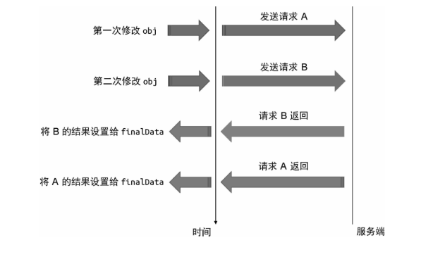
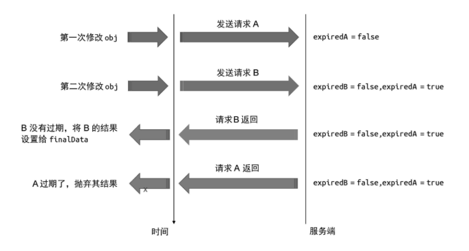

竞态问题通常在多进程或多线程编程中被提及，前端工程师可能很少讨论它，但在日常工作中你可能早就遇到过与竞态问题相似的场景，举个例子：

```javascript
let finalData;

watch(obj, async () => {
  // 发送并等待网络请求
  const res = await fetch("/path/to/request");
  // 将请求结果赋值给 data
  finalData = res;
});
```

在这段代码中，我们使用 watch 观测 obj 对象的变化，每次 obj对象发生变化都会发送网络请求，例如请求接口数据，等数据请求成功之后，将结果赋值给 finalData 变量。

观察上面的代码，乍一看似乎没什么问题。但仔细思考会发现这段代码会发生竞态问题。假设我们第一次修改 obj 对象的某个字段值，这会导致回调函数执行，同时发送了第一次请求 A。随着时间的推移，在请求 A 的结果返回之前，我们对 obj 对象的某个字段值进行了第二次修改，这会导致发送第二次请求 B。此时请求 A 和请求 B 都在进行中，那么哪一个请求会先返回结果呢？我们不确定，如果请求B 先于请求 A 返回结果，就会导致最终 finalData 中存储的是 A 请求的结果，如图 4-11 所示。



但由于请求 B 是后发送的，因此我们认为请求 B 返回的数据才是“最新”的，而请求 A 则应该被视为“过期”的，所以我们希望变量finalData 存储的值应该是由请求 B 返回的结果，而非请求 A 返回的结果。

实际上，我们可以对这个问题做进一步总结。请求 A 是副作用函数第一次执行所产生的副作用，请求 B 是副作用函数第二次执行所产生的副作用。由于请求 B 后发生，所以请求 B 的结果应该被视为“最新”的，而请求 A 已经“过期”了，其产生的结果应被视为无效。通过这种方式，就可以避免竞态问题导致的错误结果。

归根结底，我们需要的是一个让副作用过期的手段。为了让问题更加清晰，我们先拿 Vue.js 中的 watch 函数来复现场景，看看 Vue.js是如何帮助开发者解决这个问题的，然后尝试实现这个功能。

在 Vue.js 中，watch 函数的回调函数接收第三个参数onInvalidate，它是一个函数，类似于事件监听器，我们可以使用onInvalidate 函数注册一个回调，这个回调函数会在当前副作用函数过期时执行：

```javascript
watch(obj, async (newValue, oldValue, onInvalidate) => {
  // 定义一个标志，代表当前副作用函数是否过期，默认为 false，代表没有过期
  let expired = false;
  // 调用 onInvalidate() 函数注册一个过期回调
  onInvalidate(() => {
    // 当过期时，将 expired 设置为 true
    expired = true;
  });

  // 发送网络请求
  const res = await fetch("/path/to/request");

  // 只有当该副作用函数的执行没有过期时，才会执行后续操作。
  if (!expired) {
    finalData = res;
  }
});
```

如上面的代码所示，在发送请求之前，我们定义了 expired 标志变量，用来标识当前副作用函数的执行是否过期；接着调用onInvalidate 函数注册了一个过期回调，当该副作用函数的执行过期时将 expired 标志变量设置为 true；最后只有当没有过期时才采用请求结果，这样就可以有效地避免上述问题了。

那么 Vue.js 是怎么做到的呢？换句话说，onInvalidate 的原理是什么呢？其实很简单，在 watch 内部每次检测到变更后，在副作用函数重新执行之前，会先调用我们通过 onInvalidate 函数注册的过期回调，仅此而已，如以下代码所示：

```javascript
function watch(source, cb, options = {}) {
  let getter;
  if (typeof source === "function") {
    getter = source;
  } else {
    getter = () => traverse(source);
  }

  let oldValue, newValue;

  // cleanup 用来存储用户注册的过期回调
  let cleanup;
  // 定义 onInvalidate 函数
  function onInvalidate(fn) {
    // 将过期回调存储到 cleanup 中
    cleanup = fn;
  }

  const job = () => {
    newValue = effectFn();
    // 在调用回调函数 cb 之前，先调用过期回调
    if (cleanup) {
      cleanup();
    }
    // 将 onInvalidate 作为回调函数的第三个参数，以便用户使用
    cb(newValue, oldValue, onInvalidate);
    oldValue = newValue;
  };

  const effectFn = effect(
    // 执行 getter
    () => getter(),
    {
      lazy: true,
      scheduler: () => {
        if (options.flush === "post") {
          const p = Promise.resolve();
          p.then(job);
        } else {
          job();
        }
      },
    }
  );

  if (options.immediate) {
    job();
  } else {
    oldValue = effectFn();
  }
}
```

在这段代码中，我们首先定义了 cleanup 变量，这个变量用来存储用户通过 onInvalidate 函数注册的过期回调。可以看到onInvalidate 函数的实现非常简单，只是把过期回调赋值给了cleanup 变量。这里的关键点在 job 函数内，每次执行回调函数 cb之前，先检查是否存在过期回调，如果存在，则执行过期回调函数cleanup。最后我们把 onInvalidate 函数作为回调函数的第三个参数传递给 cb，以便用户使用。

我们还是通过一个例子来进一步说明：

```javascript
watch(obj, async (newValue, oldValue, onInvalidate) => {
  let expired = false;
  onInvalidate(() => {
    expired = true;
  });

  const res = await fetch("/path/to/request");

  if (!expired) {
    finalData = res;
  }
});

// 第一次修改
obj.foo++;
setTimeout(() => {
  // 200ms 后做第二次修改
  obj.foo++;
}, 200);
```

如以上代码所示，我们修改了两次 obj.foo 的值，第一次修改是立即执行的，这会导致 watch 的回调函数执行。由于我们在回调函数内调用了 onInvalidate，所以会注册一个过期回调，接着发送请求A。假设请求 A 需要 1000ms 才能返回结果，而我们在 200ms 时第二次修改了 obj.foo 的值，这又会导致 watch 的回调函数执行。这时要注意的是，在我们的实现中，每次执行回调函数之前要先检查过期回调是否存在，如果存在，会优先执行过期回调。由于在 watch 的回调函数第一次执行的时候，我们已经注册了一个过期回调，所以在watch 的回调函数第二次执行之前，会优先执行之前注册的过期回调，这会使得第一次执行的副作用函数内闭包的变量 expired 的值变为 true，即副作用函数的执行过期了。于是等请求 A 的结果返回时，其结果会被抛弃，从而避免了过期的副作用函数带来的影响，如图 4-12 所示。


