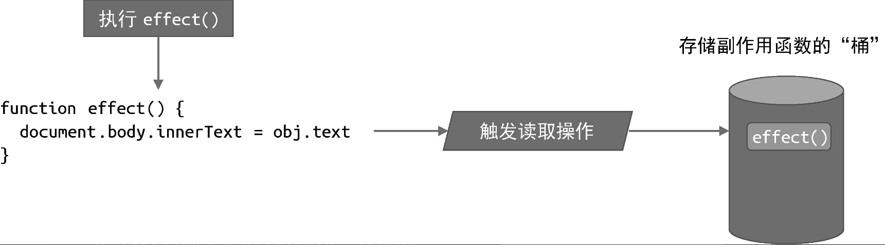
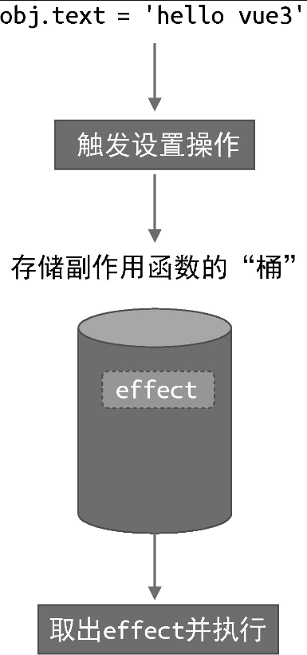

接着上文思考，如何才能让 obj 变成响应式数据呢？通过观察我们能发现两点线索：

- 当副作用函数 effect 执行时，会触发字段 obj.text 的读取操作；
- 当修改 obj.text 的值时，会触发字段 obj.text 的设置操作。

如果我们能拦截一个对象的读取和设置操作，事情就变得简单了，当读取字段 obj.text 时，我们可以把副作用函数 effect 存储到一个“桶”里，如图 4-1 所示。



接着，当设置 obj.text 时，再把副作用函数 effect 从“桶”里取出并执行即可，如图 4-2 所示。



现在问题的关键变成了我们如何才能拦截一个对象属性的读取和设置操作。在 ES2015 之前，只能通过 Object.defineProperty 函数实现，这也是 Vue.js 2 所采用的方式。在 ES2015+ 中，我们可以使用代理对象Proxy 来实现，这也是 Vue.js 3 所采用的方式。

接下来我们就根据如上思路，采用 Proxy 来实现：

```javascript
// 存储副作用函数的桶
const bucket = new Set();

// 原始数据
const data = { text: "hello world" };
// 对原始数据的代理
const obj = new Proxy(data, {
  // 拦截读取操作
  get(target, key) {
    // 将副作用函数 effect 添加到存储副作用函数的桶中
    bucket.add(effect);
    // 返回属性值
    return target[key];
  },
  // 拦截设置操作
  set(target, key, newVal) {
    // 设置属性值
    target[key] = newVal;
    // 把副作用函数从桶里取出并执行
    bucket.forEach((fn) => fn());
    // 返回 true 代表设置操作成功
    return true;
  },
});
```

首先，我们创建了一个用于存储副作用函数的桶 bucket ，它是 Set 类型。接着定义原始数据 data，obj 是原始数据的代理对象，我们分别设置了 get 和 set 拦截函数，用于拦截读取和设置操作。当读取属性时将副作用函数 effect 添加到桶里，即 bucket.add(effect)，然后返回属性值；当设置属性值时先更新原始数据，再将副作用函数从桶里取出并重新执行，这样我们就实现了响应式数据。可以使用下面的代码来测试一下：

```javascript
// 副作用函数
function effect() {
  document.body.innerText = obj.text;
}
// 执行副作用函数，触发读取
effect();
// 1 秒后修改响应式数据
setTimeout(() => {
  obj.text = "hello vue3";
}, 1000);
```

在浏览器中运行上面这段代码，会得到期望的结果。

但是目前的实现还存在很多缺陷，例如我们直接通过名字（effect）来获取副作用函数，这种硬编码的方式很不灵活。副作用函数的名字可以任意取，我们完全可以把副作用函数命名为 myEffect，甚至是一个匿名函数，因此我们要想办法去掉这种硬编码的机制。下一节会详细讲解这一点，这里大家只需要理解响应式数据的基本实现和工作原理即可。