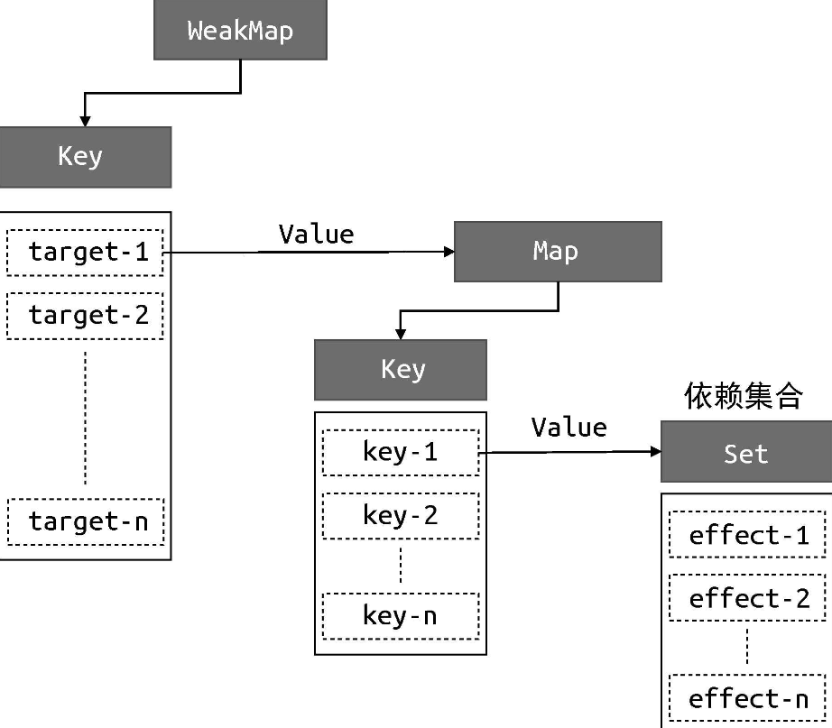

在上一节中，我们了解了如何实现响应式数据。但其实在这个过程中我们已经实现了一个微型响应系统，之所以说“微型”，是因为它还不完善，本节我们将尝试构造一个更加完善的响应系统。

从上一节的例子中不难看出，一个响应系统的工作流程如下：

- 当读取操作发生时，将副作用函数收集到“桶”中；
- 当设置操作发生时，从“桶”中取出副作用函数并执行。

看上去很简单，但需要处理的细节还真不少。例如在上一节的实现中，我们硬编码了副作用函数的名字（effect），导致一旦副作用函数的名字不叫 effect，那么这段代码就不能正确地工作了。而我们希望的是，哪怕副作用函数是一个匿名函数，也能够被正确地收集到“桶”中。为了实现这一点，我们需要提供一个用来注册副作用函数的机制，如以下代码所示：

```javascript
// 用一个全局变量存储被注册的副作用函数
let activeEffect;
// effect 函数用于注册副作用函数
function effect(fn) {
  // 当调用 effect 注册副作用函数时，将副作用函数 fn 赋值给 activeEffect
  activeEffect = fn;
  // 执行副作用函数
  fn();
}
```

首先，定义了一个全局变量 activeEffect，初始值是 undefined，它的作用是存储被注册的副作用函数。接着重新定义了 effect 函数，它变成了一个用来注册副作用函数的函数，effect 函数接收一个参数 fn，即要注册的副作用函数。我们可以按照如下所示的方式使用 effect 函数：

```javascript
effect(
  // 一个匿名的副作用函数
  () => {
    document.body.innerText = obj.text;
  }
);
```

可以看到，我们使用一个匿名的副作用函数作为 effect 函数的参数。当effect 函数执行时，首先会把匿名的副作用函数 fn 赋值给全局变量activeEffect。接着执行被注册的匿名副作用函数 fn，这将会触发响应式数据 obj.text 的读取操作，进而触发代理对象 Proxy 的 get 拦截函数：

```javascript
const obj = new Proxy(data, {
  get(target, key) {
    // 将 activeEffect 中存储的副作用函数收集到“桶”中
    if (activeEffect) {
      // 新增
      bucket.add(activeEffect); // 新增
    } // 新增
    return target[key];
  },
  set(target, key, newVal) {
    target[key] = newVal;
    bucket.forEach((fn) => fn());
    return true;
  },
});
```

如上面的代码所示，由于副作用函数已经存储到了 activeEffect 中，所以在 get 拦截函数内应该把 activeEffect 收集到“桶”中，这样响应系统就不依赖副作用函数的名字了。

但如果我们再对这个系统稍加测试，例如在响应式数据 obj 上设置一个不存在的属性时：

```javascript
effect(
  // 匿名副作用函数
  () => {
    console.log("effect run"); // 会打印 2 次
    document.body.innerText = obj.text;
  }
);

setTimeout(() => {
  // 副作用函数中并没有读取 notExist 属性的值
  obj.notExist = "hello vue3";
}, 1000);
```

可以看到，匿名副作用函数内部读取了字段 obj.text 的值，于是匿名副作用函数与字段 obj.text 之间会建立响应联系。接着，我们开启了一个定时器，一秒钟后为对象 obj 添加新的 notExist 属性。我们知道，在匿名副作用函数内并没有读取 obj.notExist 属性的值，所以理论上，字段obj.notExist 并没有与副作用建立响应联系，因此，定时器内语句的执行不应该触发匿名副作用函数重新执行。但如果我们执行上述这段代码就会发现，定时器到时后，匿名副作用函数却重新执行了，这是不正确的。为了解决这个问题，我们需要重新设计“桶”的数据结构。

在上一节的例子中，我们使用一个 Set 数据结构作为存储副作用函数的“桶”。导致该问题的根本原因是，我们没有在副作用函数与被操作的目标字段之间建立明确的联系。例如当读取属性时，无论读取的是哪一个属性，其实都一样，都会把副作用函数收集到“桶”里；当设置属性时，无论设置的是哪一个属性，也都会把“桶”里的副作用函数取出并执行。副作用函数与被操作的字段之间没有明确的联系。解决方法很简单，只需要在副作用函数与被操作的字段之间建立联系即可，这就需要我们重新设计“桶”的数据结构，而不能简单地使用一个 Set 类型的数据作为“桶”了。

那应该设计怎样的数据结构呢？在回答这个问题之前，我们需要先仔细观察下面的代码：

```javascript
effect(function effectFn() {
  document.body.innerText = obj.text;
});
```

在这段代码中存在三个角色：

- 被操作（读取）的代理对象 obj；
- 被操作（读取）的字段名 text；
- 使用 effect 函数注册的副作用函数 effectFn。

如果用 target 来表示一个代理对象所代理的原始对象，用 key 来表示被操作的字段名，用 effectFn 来表示被注册的副作用函数，那么可以为这三个角色建立如下关系：

```
target
    └── key
        └── effectFn
```

这是一种树型结构，下面举几个例子来对其进行补充说明。

如果有两个副作用函数同时读取同一个对象的属性值：

```javascript
effect(function effectFn1() {
  obj.text;
});
effect(function effectFn2() {
  obj.text;
});
```

那么关系如下：

```
target
    └── text
        └── effectFn1
        └── effectFn2
```

如果一个副作用函数中读取了同一个对象的两个不同属性：

```javascript
effect(function effectFn() {
  obj.text1;
  obj.text2;
});
```

那么关系如下：

```
target
    └── text1
        └── effectFn
    └── text2
        └── effectFn
```

如果在不同的副作用函数中读取了两个不同对象的不同属性：

```javascript
effect(function effectFn1() {
  obj1.text1;
});
effect(function effectFn2() {
  obj2.text2;
});
```

那么关系如下：

```
target1
    └── text1
        └── effectFn1
target2
    └── text2
        └── effectFn2
```

总之，这其实就是一个树型数据结构。这个联系建立起来之后，就可以解决前文提到的问题了。拿上面的例子来说，如果我们设置了 obj2.text2的值，就只会导致 effectFn2 函数重新执行，并不会导致 effectFn1 函数重新执行。

接下来我们尝试用代码来实现这个新的“桶”。首先，需要使用WeakMap 代替 Set 作为桶的数据结构：

```javascript
// 存储副作用函数的桶
const bucket = new WeakMap();
```

然后修改 get/set 拦截器代码：

```javascript
const obj = new Proxy(data, {
  // 拦截读取操作
  get(target, key) {
    // 没有 activeEffect，直接 return
    if (!activeEffect) return target[key];
    // 根据 target 从“桶”中取得 depsMap，它也是一个 Map 类型：key --> effects
    let depsMap = bucket.get(target);
    // 如果不存在 depsMap，那么新建一个 Map 并与 target 关联
    if (!depsMap) {
      bucket.set(target, (depsMap = new Map()));
    }
    // 再根据 key 从 depsMap 中取得 deps，它是一个 Set 类型，
    // 里面存储着所有与当前 key 相关联的副作用函数：effects
    let deps = depsMap.get(key);
    // 如果 deps 不存在，同样新建一个 Set 并与 key 关联
    if (!deps) {
      depsMap.set(key, (deps = new Set()));
    }
    // 最后将当前激活的副作用函数添加到“桶”里
    deps.add(activeEffect);

    // 返回属性值
    return target[key];
  },
  // 拦截设置操作
  set(target, key, newVal) {
    // 设置属性值
    target[key] = newVal;
    // 根据 target 从桶中取得 depsMap，它是 key --> effects
    const depsMap = bucket.get(target);
    if (!depsMap) return;
    // 根据 key 取得所有副作用函数 effects
    const effects = depsMap.get(key);
    // 执行副作用函数
    effects && effects.forEach((fn) => fn());
  },
});
```

从这段代码可以看出构建数据结构的方式，我们分别使用了 WeakMap、Map 和 Set：

- WeakMap 由 target --> Map 构成；
- Map 由 key --> Set 构成。

其中 WeakMap 的键是原始对象 target，WeakMap 的值是一个 Map实例，而 Map 的键是原始对象 target 的 key，Map 的值是一个由副作用函数组成的 Set。它们的关系如图 4-3 所示。



为了方便描述，我们把图 4-3 中的 Set 数据结构所存储的副作用函数集合称为 key 的依赖集合。

搞清了它们之间的关系，我们有必要解释一下这里为什么要使用WeakMap，这其实涉及 WeakMap 和 Map 的区别，我们用一段代码来讲解：

```javascript
const map = new Map();
const weakmap = new WeakMap();

(function () {
  const foo = { foo: 1 };
  const bar = { bar: 2 };

  map.set(foo, 1);
  weakmap.set(bar, 2);
})();
```

首先，我们定义了 map 和 weakmap 常量，分别对应 Map 和WeakMap 的实例。接着定义了一个立即执行的函数表达式（IIFE），在函数表达式内部定义了两个对象：foo 和 bar，这两个对象分别作为map 和 weakmap 的 key。当该函数表达式执行完毕后，对于对象 foo 来说，它仍然作为 map 的 key 被引用着，因此垃圾回收器（grabagecollector）不会把它从内存中移除，我们仍然可以通过 map.keys 打印出对象 foo。然而对于对象 bar 来说，由于 WeakMap 的 key 是弱引用，它不影响垃圾回收器的工作，所以一旦表达式执行完毕，垃圾回收器就会把对象 bar 从内存中移除，并且我们无法获取 weakmap 的 key值，也就无法通过 weakmap 取得对象 bar。

简单地说，WeakMap 对 key 是弱引用，不影响垃圾回收器的工作。据这个特性可知，一旦 key 被垃圾回收器回收，那么对应的键和值就访问不到了。所以 WeakMap 经常用于存储那些只有当 key 所引用的对象存在时（没有被回收）才有价值的信息，例如上面的场景中，如果 target对象没有任何引用了，说明用户侧不再需要它了，这时垃圾回收器会完成回收任务。但如果使用 Map 来代替 WeakMap，那么即使用户侧的代码对 target 没有任何引用，这个 target 也不会被回收，最终可能导致内存溢出。

最后，我们对上文中的代码做一些封装处理。在目前的实现中，当读取属性值时，我们直接在 get 拦截函数里编写把副作用函数收集到“桶”里的这部分逻辑，但更好的做法是将这部分逻辑单独封装到一个 track 函数中，函数的名字叫 track 是为了表达追踪的含义。同样，我们也可以把触发副作用函数重新执行的逻辑封装到 trigger 函数中：

```javascript
const obj = new Proxy(data, {
  // 拦截读取操作
  get(target, key) {
    // 将副作用函数 activeEffect 添加到存储副作用函数的桶中
    track(target, key);
    // 返回属性值
    return target[key];
  },
  // 拦截设置操作
  set(target, key, newVal) {
    // 设置属性值
    target[key] = newVal;
    // 把副作用函数从桶里取出并执行
    trigger(target, key);
  },
});

// 在 get 拦截函数内调用 track 函数追踪变化
function track(target, key) {
  // 没有 activeEffect，直接 return
  if (!activeEffect) return;
  let depsMap = bucket.get(target);
  if (!depsMap) {
    bucket.set(target, (depsMap = new Map()));
  }
  let deps = depsMap.get(key);
  if (!deps) {
    depsMap.set(key, (deps = new Set()));
  }
  deps.add(activeEffect);
}
// 在 set 拦截函数内调用 trigger 函数触发变化
function trigger(target, key) {
  const depsMap = bucket.get(target);
  if (!depsMap) return;
  const effects = depsMap.get(key);
  effects && effects.forEach((fn) => fn());
}
```

如以上代码所示，分别把逻辑封装到 track 和 trigger 函数内，这能为我们带来极大的灵活性。
