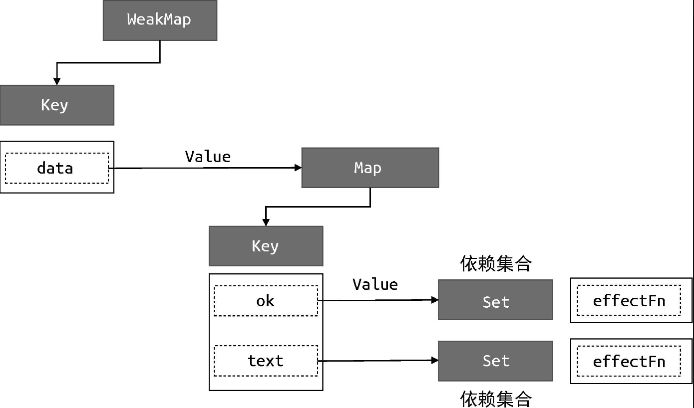
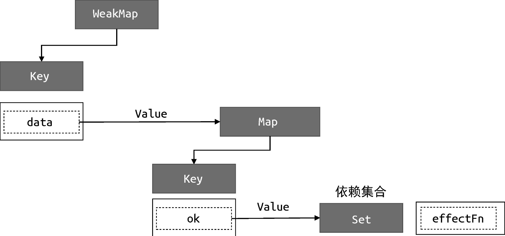
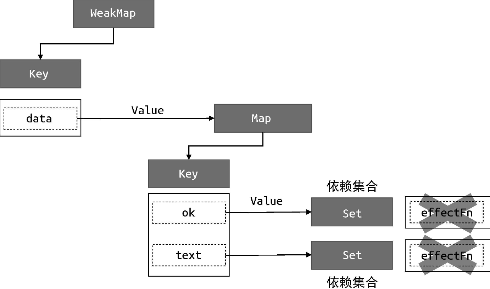
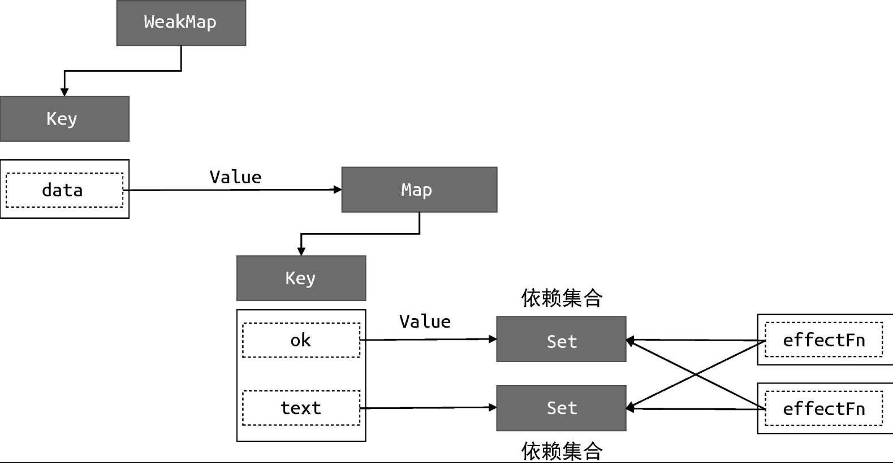

首先，我们需要明确分支切换的定义，如下面的代码所示：

```javascript
const data = { ok: true, text: "hello world" };
const obj = new Proxy(data, {
  /* ... */
});

effect(function effectFn() {
  document.body.innerText = obj.ok ? obj.text : "not";
});
```

在 effectFn 函数内部存在一个三元表达式，根据字段 obj.ok 值的不同会执行不同的代码分支。当字段 obj.ok 的值发生变化时，代码执行的分支会跟着变化，这就是所谓的分支切换。

分支切换可能会产生遗留的副作用函数。拿上面这段代码来说，字段obj.ok 的初始值为 true，这时会读取字段 obj.text 的值，所以当effectFn 函数执行时会触发字段 obj.ok 和字段 obj.text 这两个属性的读取操作，此时副作用函数 effectFn 与响应式数据之间建立的联系如下：

```
data
    └── ok
        └── effectFn
    └── text
        └── effectFn
```

图 4-4 给出了更详细的描述。



可以看到，副作用函数 effectFn 分别被字段 data.ok 和字段 data.text所对应的依赖集合收集。当字段 obj.ok 的值修改为 false，并触发副作用函数重新执行后，由于此时字段 obj.text 不会被读取，只会触发字段obj.ok 的读取操作，所以理想情况下副作用函数 effectFn 不应该被字段obj.text 所对应的依赖集合收集，如图 4-5 所示。



但按照前文的实现，我们还做不到这一点。也就是说，当我们把字段obj.ok 的值修改为 false，并触发副作用函数重新执行之后，整个依赖关系仍然保持图 4-4 所描述的那样，这时就产生了遗留的副作用函数。

遗留的副作用函数会导致不必要的更新，拿下面这段代码来说：

```javascript
const data = { ok: true, text: "hello world" };
const obj = new Proxy(data, {
  /* ... */
});

effect(function effectFn() {
  document.body.innerText = obj.ok ? obj.text : "not";
});
```

obj.ok 的初始值为 true，当我们将其修改为 false 后：

```javascript
obj.ok = false
```

这会触发更新，即副作用函数会重新执行。但由于此时 obj.ok 的值为false，所以不再会读取字段 obj.text 的值。换句话说，无论字段obj.text 的值如何改变，document.body.innerText 的值始终都是字符串 'not'。所以最好的结果是，无论 obj.text 的值怎么变，都不需要重新执行副作用函数。但事实并非如此，如果我们再尝试修改 obj.text 的值：

```javascript
obj.text = "hello vue3";
```

这仍然会导致副作用函数重新执行，即使 document.body.innerText 的值不需要变化。

解决这个问题的思路很简单，每次副作用函数执行时，我们可以先把它从所有与之关联的依赖集合中删除，如图 4-6 所示。



当副作用函数执行完毕后，会重新建立联系，但在新的联系中不会包含遗留的副作用函数，即图 4-5 所描述的那样。所以，如果我们能做到每次副作用函数执行前，将其从相关联的依赖集合中移除，那么问题就迎刃而解了。

要将一个副作用函数从所有与之关联的依赖集合中移除，就需要明确知道哪些依赖集合中包含它，因此我们需要重新设计副作用函数，如下面的代码所示。在 effect 内部我们定义了新的 effectFn 函数，并为其添加了effectFn.deps 属性，该属性是一个数组，用来存储所有包含当前副作用函数的依赖集合：

```javascript
// 用一个全局变量存储被注册的副作用函数
let activeEffect;
function effect(fn) {
  const effectFn = () => {
    // 当 effectFn 执行时，将其设置为当前激活的副作用函数
    activeEffect = effectFn;
    fn();
  };
  // activeEffect.deps 用来存储所有与该副作用函数相关联的依赖集合
  effectFn.deps = [];
  // 执行副作用函数
  effectFn();
}
```

那么 effectFn.deps 数组中的依赖集合是如何收集的呢？其实是在 track函数中：

```javascript
function track(target, key) {
  // 没有 activeEffect，直接 return
  if (!activeEffect) return;
  let depsMap = bucket.get(target);
  if (!depsMap) {
    bucket.set(target, (depsMap = new Map()));
  }
  let deps = depsMap.get(key);
  if (!deps) {
    depsMap.set(key, (deps = new Set()));
  }
  // 把当前激活的副作用函数添加到依赖集合 deps 中
  deps.add(activeEffect);
  // deps 就是一个与当前副作用函数存在联系的依赖集合
  // 将其添加到 activeEffect.deps 数组中
  activeEffect.deps.push(deps); // 新增
}
```

如以上代码所示，在 track 函数中我们将当前执行的副作用函数activeEffect 添加到依赖集合 deps 中，这说明 deps 就是一个与当前副作用函数存在联系的依赖集合，于是我们也把它添加到activeEffect.deps 数组中，这样就完成了对依赖集合的收集。图 4-7 描述了这一步所建立的关系。



有了这个联系后，我们就可以在每次副作用函数执行时，根据effectFn.deps 获取所有相关联的依赖集合，进而将副作用函数从依赖集合中移除：

```javascript
// 用一个全局变量存储被注册的副作用函数
let activeEffect;
function effect(fn) {
  const effectFn = () => {
    // 调用 cleanup 函数完成清除工作
    cleanup(effectFn); // 新增
    activeEffect = effectFn;
    fn();
  };
  effectFn.deps = [];
  effectFn();
}
```

下面是 cleanup 函数的实现：

```javascript
function cleanup(effectFn) {
  // 遍历 effectFn.deps 数组
  for (let i = 0; i < effectFn.deps.length; i++) {
    // deps 是依赖集合
    const deps = effectFn.deps[i];
    // 将 effectFn 从依赖集合中移除
    deps.delete(effectFn);
  }
  // 最后需要重置 effectFn.deps 数组
  effectFn.deps.length = 0;
}
```

cleanup 函数接收副作用函数作为参数，遍历副作用函数的effectFn.deps 数组，该数组的每一项都是一个依赖集合，然后将该副作用函数从依赖集合中移除，最后重置 effectFn.deps 数组。

至此，我们的响应系统已经可以避免副作用函数产生遗留了。但如果你尝试运行代码，会发现目前的实现会导致无限循环执行，问题出在 trigger函数中：

```javascript
function trigger(target, key) {
  const depsMap = bucket.get(target);
  if (!depsMap) return;
  const effects = depsMap.get(key);
  effects && effects.forEach((fn) => fn()); // 问题出在这句代码
}
```

在 trigger 函数内部，我们遍历 effects 集合，它是一个 Set 集合，里面存储着副作用函数。当副作用函数执行时，会调用 cleanup 进行清除，实际上就是从 effects 集合中将当前执行的副作用函数剔除，但是副作用函数的执行会导致其重新被收集到集合中，而此时对于 effects 集合的遍历仍在进行。这个行为可以用如下简短的代码来表达：

```javascript
const set = new Set([1]);

set.forEach((item) => {
  set.delete(1);
  set.add(1);
  console.log("遍历中");
});
```

在上面这段代码中，我们创建了一个集合 set，它里面有一个元素数字1，接着我们调用 forEach 遍历该集合。在遍历过程中，首先调用delete(1) 删除数字 1，紧接着调用 add(1) 将数字 1 加回，最后打印 '遍历中'。如果我们在浏览器中执行这段代码，就会发现它会无限执行下去。

语言规范中对此有明确的说明：在调用 forEach 遍历 Set 集合时，如果一个值已经被访问过了，但该值被删除并重新添加到集合，如果此时forEach 遍历没有结束，那么该值会重新被访问。因此，上面的代码会无限执行。解决办法很简单，我们可以构造另外一个 Set 集合并遍历它：

```javascript
const set = new Set([1]);

const newSet = new Set(set);
newSet.forEach((item) => {
  set.delete(1);
  set.add(1);
  console.log("遍历中");
});
```

这样就不会无限执行了。回到 trigger 函数，我们需要同样的手段来避免无限执行：

```javascript
function trigger(target, key) {
  const depsMap = bucket.get(target);
  if (!depsMap) return;
  const effects = depsMap.get(key);

  const effectsToRun = new Set(effects); // 新增
  effectsToRun.forEach((effectFn) => effectFn()); // 新增
  // effects && effects.forEach(effectFn => effectFn()) // 删除
}
```

如以上代码所示，我们新构造了 effectsToRun 集合并遍历它，代替直接遍历 effects 集合，从而避免了无限执行。

提示

ECMA 关于 Set.prototype.forEach 的规范，可参见 ECMAScript 2020 Language Specification。
