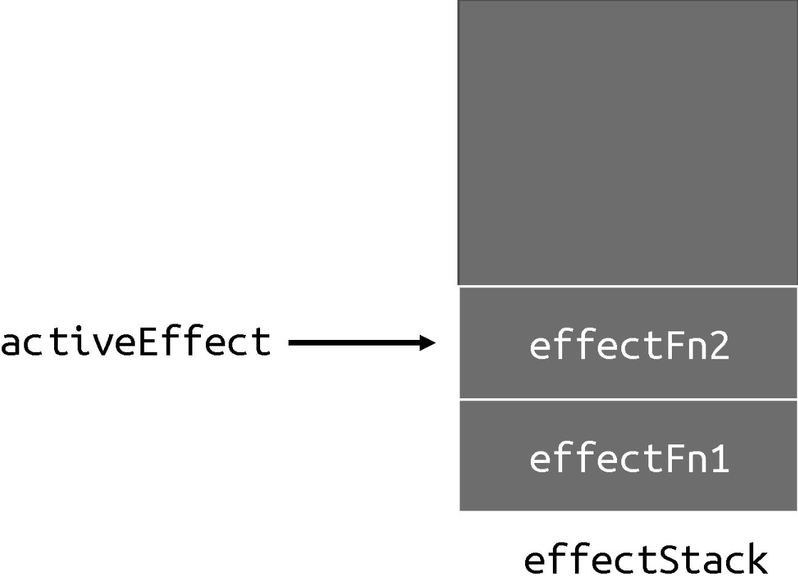
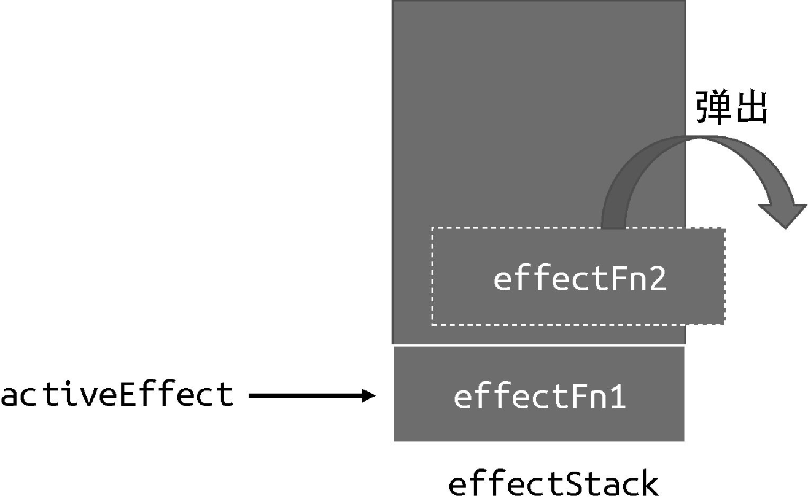

effect 是可以发生嵌套的，例如：

```javascript
effect(function effectFn1() {
  effect(function effectFn2() {
    /* ... */
  });
  /* ... */
});
```

在上面这段代码中，effectFn1 内部嵌套了 effectFn2，effectFn1 的执行会导致 effectFn2 的执行。那么，什么场景下会出现嵌套的 effect 呢？拿 Vue.js 来说，实际上 Vue.js 的渲染函数就是在一个 effect 中执行的：

```javascript
// Foo 组件
const Foo = {
  render() {
    return; /* ... */
  },
};
```

在一个 effect 中执行 Foo 组件的渲染函数：

```javascript
effect(() => {
  Foo.render();
});
```

当组件发生嵌套时，例如 Foo 组件渲染了 Bar 组件：

```javascript
// Bar 组件
const Bar = {
  render() {
    /* ... */
  },
};
// Foo 组件渲染了 Bar 组件
const Foo = {
  render() {
    return <Bar />; // jsx 语法
  },
};
```

此时就发生了 effect 嵌套，它相当于：

```javascript
effect(() => {
  Foo.render();
  // 嵌套
  effect(() => {
    Bar.render();
  });
});
```

这个例子说明了为什么 effect 要设计成可嵌套的。接下来，我们需要搞清楚，如果 effect 不支持嵌套会发生什么？实际上，按照前文的介绍与实现来看，我们所实现的响应系统并不支持 effect 嵌套，可以用下面的代码来测试一下：

```javascript
// 原始数据
const data = { foo: true, bar: true };
// 代理对象
const obj = new Proxy(data, {
  /* ... */
});

// 全局变量
let temp1, temp2;

// effectFn1 嵌套了 effectFn2
effect(function effectFn1() {
  console.log("effectFn1 执行");

  effect(function effectFn2() {
    console.log("effectFn2 执行");
    // 在 effectFn2 中读取 obj.bar 属性
    temp2 = obj.bar;
  });
  // 在 effectFn1 中读取 obj.foo 属性
  temp1 = obj.foo;
});
```

在上面这段代码中，effectFn1 内部嵌套了 effectFn2，很明显，effectFn1 的执行会导致 effectFn2 的执行。需要注意的是，我们在effectFn2 中读取了字段 obj.bar，在 effectFn1 中读取了字段 obj.foo，并且 effectFn2 的执行先于对字段 obj.foo 的读取操作。在理想情况下，我们希望副作用函数与对象属性之间的联系如下：

```
data
  └── foo
    └── effectFn1
  └── bar
    └── effectFn2
```

在这种情况下，我们希望当修改 obj.foo 时会触发 effectFn1 执行。由于effectFn2 嵌套在 effectFn1 里，所以会间接触发 effectFn2 执行，而当修改 obj.bar 时，只会触发 effectFn2 执行。但结果不是这样的，我们尝试修改 obj.foo 的值，会发现输出为：

```
'effectFn1 执行'
'effectFn2 执行'
'effectFn2 执行'
```

一共打印三次，前两次分别是副作用函数 effectFn1 与 effectFn2 初始执行的打印结果，到这一步是正常的，问题出在第三行打印。我们修改了字段 obj.foo 的值，发现 effectFn1 并没有重新执行，反而使得 effectFn2重新执行了，这显然不符合预期。

问题出在哪里呢？其实就出在我们实现的 effect 函数与 activeEffect 上。观察下面这段代码：

```javascript
// 用一个全局变量存储当前激活的 effect 函数
let activeEffect;
function effect(fn) {
  const effectFn = () => {
    cleanup(effectFn);
    // 当调用 effect 注册副作用函数时，将副作用函数赋值给 activeEffect
    activeEffect = effectFn;
    fn();
  };
  // activeEffect.deps 用来存储所有与该副作用函数相关的依赖集合
  effectFn.deps = [];
  // 执行副作用函数
  effectFn();
}
```

我们用全局变量 activeEffect 来存储通过 effect 函数注册的副作用函数，这意味着同一时刻 activeEffect 所存储的副作用函数只能有一个。当副作用函数发生嵌套时，内层副作用函数的执行会覆盖 activeEffect 的值，并且永远不会恢复到原来的值。这时如果再有响应式数据进行依赖收集，即使这个响应式数据是在外层副作用函数中读取的，它们收集到的副作用函数也都会是内层副作用函数，这就是问题所在。

为了解决这个问题，我们需要一个副作用函数栈 effectStack，在副作用函数执行时，将当前副作用函数压入栈中，待副作用函数执行完毕后将其从栈中弹出，并始终让 activeEffect 指向栈顶的副作用函数。这样就能做到一个响应式数据只会收集直接读取其值的副作用函数，而不会出现互相影响的情况，如以下代码所示：

```javascript
// 用一个全局变量存储当前激活的 effect 函数
let activeEffect;
// effect 栈
const effectStack = []; // 新增

function effect(fn) {
  const effectFn = () => {
    cleanup(effectFn);
    // 当调用 effect 注册副作用函数时，将副作用函数赋值给 activeEffect
    activeEffect = effectFn;
    // 在调用副作用函数之前将当前副作用函数压入栈中
    effectStack.push(effectFn); // 新增
    fn();
    // 在当前副作用函数执行完毕后，将当前副作用函数弹出栈，并把 activeEffect 还原为之前的值
    effectStack.pop(); // 新增
    activeEffect = effectStack[effectStack.length - 1]; // 新增
  };
  // activeEffect.deps 用来存储所有与该副作用函数相关的依赖集合
  effectFn.deps = [];
  // 执行副作用函数
  effectFn();
}
```

我们定义了 effectStack 数组，用它来模拟栈，activeEffect 没有变化，它仍然指向当前正在执行的副作用函数。不同的是，当前执行的副作用函数会被压入栈顶，这样当副作用函数发生嵌套时，栈底存储的就是外层副作用函数，而栈顶存储的则是内层副作用函数，如图 4-8 所示。



当内层副作用函数 effectFn2 执行完毕后，它会被弹出栈，并将副作用函数 effectFn1 设置为 activeEffect，如图 4-9 所示。



如此一来，响应式数据就只会收集直接读取其值的副作用函数作为依赖，从而避免发生错乱。