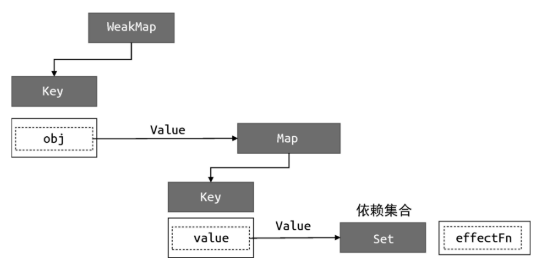

上文介绍了 effect 函数，它用来注册副作用函数，同时它也允许指定一选项参数 options，例如指定 scheduler 调度器来控制副作用函数的执时机和方式；也介绍了用来追踪和收集依赖的 track 函数，以及用来触副作用函数重新执行的 trigger 函数。实际上，综合这些内容，我们就以实现 Vue.js 中一个非常重要并且非常有特色的能力——计算属性。

深入讲解计算属性之前，我们需要先来聊聊关于懒执行的 effect，即 lazy 的 effect。这是什么意思呢？举个例子，现在我们所实现的 effect 函但执达数会立即执行传递给它的副作用函数，例如：

```javascript
effect(
  // 这个函数会立即执行
  () => {
    console.log(obj.foo);
  }
);
```

在有些场景下，我们并不希望它立即执行，而是希望它在需要的时候才行，例如计算属性。这时我们可以通过在 options 中添加 lazy 属性来到目的，如下面的代码所示：

```javascript
effect(
  // 指定了 lazy 选项，这个函数不会立即执行
  () => {
    console.log(obj.foo);
  },
  // options
  {
    lazy: true,
  }
);
```

lazy 选项和之前介绍的 scheduler 一样，它通过 options 选项对象指。有了它，我们就可以修改 effect 函数的实现逻辑了，当 options.lazy 为 true 时，则不立即执行副作用函数：

```javascript
function effect(fn, options = {}) {
  const effectFn = () => {
    cleanup(effectFn);
    activeEffect = effectFn;
    effectStack.push(effectFn);
    fn();
    effectStack.pop();
    activeEffect = effectStack[effectStack.length - 1];
  };
  effectFn.options = options;
  effectFn.deps = [];
  // 只有非 lazy 的时候，才执行
  if (!options.lazy) {
    // 新增
    // 执行副作用函数
    effectFn();
  }
  // 将副作用函数作为返回值返回
  return effectFn; // 新增
}
```

通过这个判断，我们就实现了让副作用函数不立即执行的功能。但问题，副作用函数应该什么时候执行呢？通过上面的代码可以看到，我们将副作用函数 effectFn 作为 effect 函数的返回值，这就意味着当调用 effect 函数时，通过其返回值能够拿到对应的副作用函数，这样我们就能手动执行该副作用函数了：

```javascript
const effectFn = effect(
  () => {
    console.log(obj.foo);
  },
  { lazy: true }
);

// 手动执行副作用函数
effectFn();
```

如果仅仅能够手动执行副作用函数，其意义并不大。但如果我们把传递给 effect 的函数看作一个 getter，那么这个 getter 函数可以返回任何值，如：

```javascript
const effectFn = effect(
  // getter 返回 obj.foo 与 obj.bar 的和
  () => obj.foo + obj.bar,
  { lazy: true }
);
// value 是 getter 的返回值
const value = effectFn();
```

这样我们在手动执行副作用函数时，就能够拿到其返回值：

为了实现这个目标，我们需要再对 effect 函数做一些修改，如以下代码示：

```javascript
function effect(fn, options = {}) {
  const effectFn = () => {
    cleanup(effectFn);
    activeEffect = effectFn;
    effectStack.push(effectFn);
    // 将 fn 的执行结果存储到 res 中
    const res = fn(); // 新增
    effectStack.pop();
    activeEffect = effectStack[effectStack.length - 1];
    // 将 res 作为 effectFn 的返回值
    return res; // 新增
  };
  effectFn.options = options;
  effectFn.deps = [];
  if (!options.lazy) {
    effectFn();
  }

  return effectFn;
}
```

过新增的代码可以看到，传递给 effect 函数的参数 fn 才是真正的副作用到然现执函数，而 effectFn 是我们包装后的副作用函数。为了通过 effectFn 得真正的副作用函数 fn 的执行结果，我们需要将其保存到 res 变量中，后将其作为 effectFn 函数的返回值。现在我们已经能够实现懒执行的副作用函数，并且能够拿到副作用函数的行结果了，接下来就可以实现计算属性了，如下所示：


```javascript
function computed(getter) {
  // 把 getter 作为副作用函数，创建一个 lazy 的 effect
  const effectFn = effect(getter, {
    lazy: true,
  });

  const obj = {
    // 当读取 value 时才执行 effectFn
    get value() {
      return effectFn();
    },
  };

  return obj;
}
```

首先我们定义一个 computed 函数，它接收一个 getter 函数作为参数，我们把 getter 函数作为副作用函数，用它创建一个 lazy 的 effect。 computed 函数的执行会返回一个对象，该对象的 value 属性是一个访器器属性，只有当读取 value 的值时，才会执行 effectFn 并将其结果作返回值返回。

```javascript
function computed(getter) {
  // value 用来缓存上一次计算的值
  let value;
  // dirty 标志，用来标识是否需要重新计算值，为 true 则意味着“脏”，需要计算
  let dirty = true;

  const effectFn = effect(getter, {
    lazy: true,
  });

  const obj = {
    get value() {
      // 只有“脏”时才计算值，并将得到的值缓存到 value 中
      if (dirty) {
        value = effectFn();
        // 将 dirty 设置为 false，下一次访问直接使用缓存到 value 中的值
        dirty = false;
      }
      return value;
    },
  };

  return obj;
}
```

我们可以使用 computed 函数来创建一个计算属性：

```javascript
const data = { foo: 1, bar: 2 };
const obj = new Proxy(data, {
  /* ... */
});

const sumRes = computed(() => obj.foo + obj.bar);

console.log(sumRes.value); // 3
```

可以看到它能够正确地工作。不过现在我们实现的计算属性只做到了懒计算，也就是说，只有当你真正读取 sumRes.value 的值时，它才会进行计并得到值。

但是还做不到对值进行缓存，即假如我们多次访问 sumRes.value 的值，会导致 effectFn 进行多次计算，即使 obj.foo 和 obj.bar 的值本身并没有变化：

```javascript
console.log(sumRes.value); // 3
console.log(sumRes.value); // 3
console.log(sumRes.value); // 3
```

上面的代码多次访问 sumRes.value 的值，每次访问都会调用 effectFn 重为行新计算。了解决这个问题，就需要我们在实现 computed 函数时，添加对值进缓存的功能，如以下代码所示：

```javascript
function computed(getter) {
  // value 用来缓存上一次计算的值
  let value;
  // dirty 标志，用来标识是否需要重新计算值，为 true 则意味着“脏”，需要计算
  let dirty = true;

  const effectFn = effect(getter, {
    lazy: true,
  });

  const obj = {
    get value() {
      // 只有“脏”时才计算值，并将得到的值缓存到 value 中
      if (dirty) {
        value = effectFn();
        // 将 dirty 设置为 false，下一次访问直接使用缓存到 value 中的值
        dirty = false;
      }
      return value;
    },
  };

  return obj;
}
```

我值s新多问新计算。了解决这个问题，就需要我们在实现 computed 函数时，添加对值进缓存的功能，如以下代码所示：

我们新增了两个变量 value 和 dirty，其中 value 用来缓存上一次计算的，而 dirty 是一个标识，代表是否需要重新计算。当我们通过 sumRes.value 访问值时，只有当 dirty 为 true 时才会调用 effectFn 重计算值，否则直接使用上一次缓存在 value 中的值。这样无论我们访问少次 sumRes.value，都只会在第一次访问时进行真正的计算，后续访都会直接读取缓存的 value 值。

相信聪明的你已经看到问题所在了，如果此时我们修改 obj.foo 或bj.bar 的值，再访问 sumRes.value 会发现访问到的值没有发生变化：

```javascript
const data = { foo: 1, bar: 2 };
const obj = new Proxy(data, {
  /* ... */
});

const sumRes = computed(() => obj.foo + obj.bar);

console.log(sumRes.value); // 3
console.log(sumRes.value); // 3

// 修改 obj.foo
obj.foo++;

// 再次访问，得到的仍然是 3，但预期结果应该是 4
console.log(sumRes.value); // 3
```

这是因为，当第一次访问 sumRes.value 的值后，变量 dirty 会设置为 false，代表不需要计算。即使我们修改了 obj.foo 的值，但只要 dirty 的为 false，就不会重新计算，所以导致我们得到了错误的值。解决办法很简单，当 obj.foo 或 obj.bar 的值发生变化时，只要 dirty 的值重置为 true 就可以了。那么应该怎么做呢？这时就用到了上一节介绍 scheduler 选项，如以下代码所示：

```javascript
function computed(getter) {
  let value;
  let dirty = true;

  const effectFn = effect(getter, {
    lazy: true,
    // 添加调度器，在调度器中将 dirty 重置为 true
    scheduler() {
      dirty = true;
    },
  });

  const obj = {
    get value() {
      if (dirty) {
        value = effectFn();
        dirty = false;
      }
      return value;
    },
  };

  return obj;
}
```

我们为 effect 添加了 scheduler 调度器函数，它会在 getter 函数中所依赖的响应式数据变化时执行，这样我们在 scheduler 函数内将 dirty 重置 true，当下一次访问 sumRes.value 时，就会重新调用 effectFn 计算，这样就能够得到预期的结果了。

现在，我们设计的计算属性已经趋于完美了，但还有一个缺陷，它体现在我们在另外一个 effect 中读取计算属性的值时：

```javascript
const sumRes = computed(() => obj.foo + obj.bar);

effect(() => {
  // 在该副作用函数中读取 sumRes.value
  console.log(sumRes.value);
});

// 修改 obj.foo 的值
obj.foo++;
```

如以上代码所示，sumRes 是一个计算属性，并且在另一个 effect 的副用函数中读取了 sumRes.value 的值。如果此时修改 obj.foo 的值，我期望副作用函数重新执行，就像我们在 Vue.js 的模板中读取计算属性的时候，一旦计算属性发生变化就会触发重新渲染一样。但是如果尝试行上面这段代码，会发现修改 obj.foo 的值并不会触发副作用函数的渲，因此我们说这是一个缺陷。

分析问题的原因，我们发现，从本质上看这就是一个典型的effect 嵌套。一个计算属性内部拥有自己的 effect，并且它是懒执行的，只有当真正读取计算属性的值时才会执行。对于计算属性的 getter 函数来说，它里面访问的响应式数据只会把 computed 内部的 effect 收集为依赖。而当把计算属性用于另外一个 effect 时，就会发生 effect 嵌套，外层的 effect 不会被内层 effect 中的响应式数据收集。

解决办法很简单。当读取计算属性的值时，我们可以手动调用 track 函数进行追踪；当计算属性依赖的响应式数据发生变化时，我们可以手动调用 trigger 函数触发响应：

```javascript
function computed(getter) {
  let value;
  let dirty = true;

  const effectFn = effect(getter, {
    lazy: true,
    scheduler() {
      if (!dirty) {
        dirty = true;
        // 当计算属性依赖的响应式数据变化时，手动调用 trigger 函数触发响应
        trigger(obj, "value");
      }
    },
  });

  const obj = {
    get value() {
      if (dirty) {
        value = effectFn();
        dirty = false;
      }
      // 当读取 value 时，手动调用 track 函数进行追踪
      track(obj, "value");
      return value;
    },
  };

  return obj;
}
```

如以上代码所示，当读取一个计算属性的 value 值时，我们手动调用 track 函数，把计算属性返回的对象 obj 作为 target，同时作为第一个参数传递给 track 函数。当计算属性所依赖的响应式数据变化时，会执行调度器函数，在调度器函数内手动调用 trigger 函数触发响应即可。这时，对于如下代码来说：

```javascript
effect(function effectFn() {
  console.log(sumRes.value);
});
```

它会建立这样的联系：

```
computed(obj)
└── value
└── effectFn
```

图 4-10 给出了更详细的描述.

