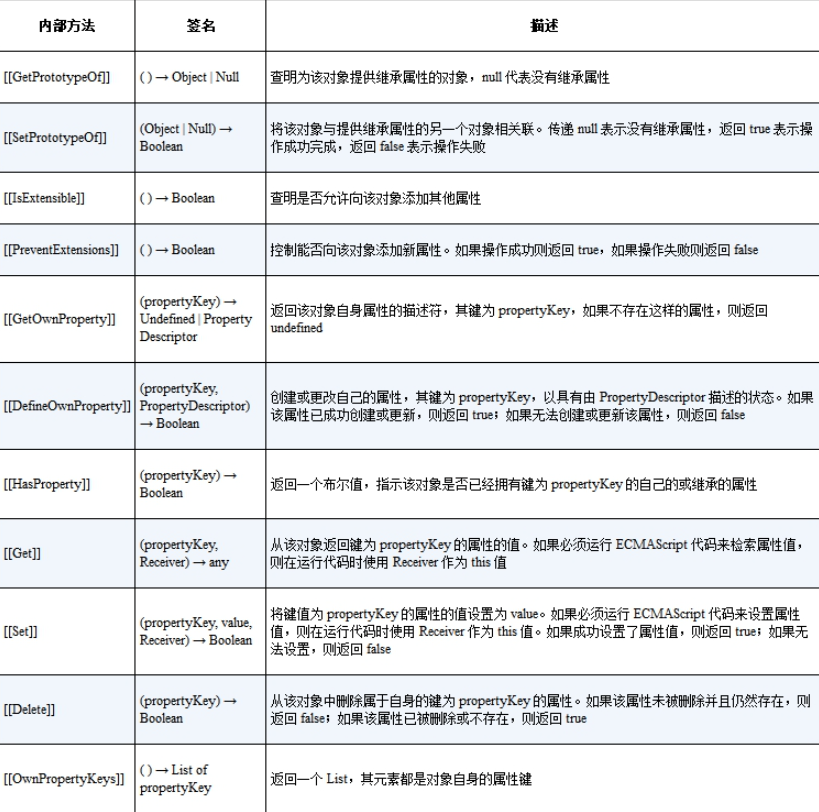
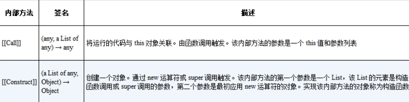
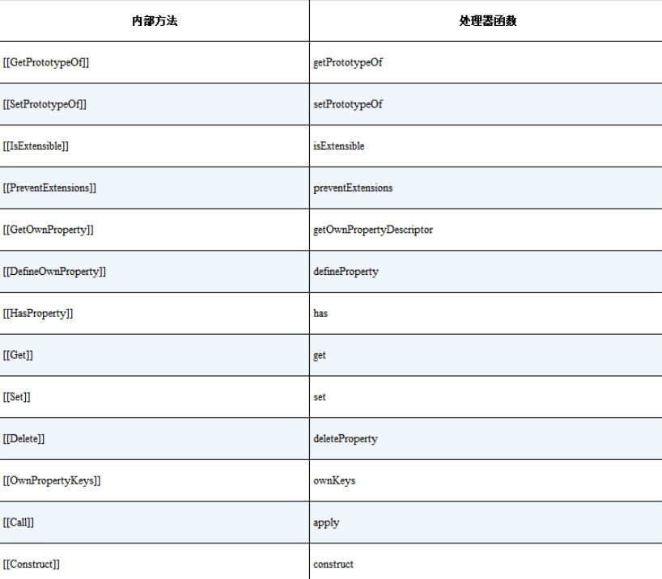

我们经常听到这样的说法：“JavaScript 中一切皆对象。”那么，到底什么是对象呢？这个问题需要我们查阅 ECMAScript 规范才能得到答案。

实际上，根据 ECMAScript 规范，在 JavaScript 中有两种对象，其中一种叫作常规对象（ordinary object），另一种叫作异质对象（exoticobject）。这两种对象包含了 JavaScript 世界中的所有对象，任何不属于常规对象的对象都是异质对象。那么到底什么是常规对象，什么是异质对象呢？这需要我们先了解对象的内部方法和内部槽。

我们知道，在 JavaScript 中，函数其实也是对象。假设给出一个对象obj，如何区分它是普通对象还是函数呢？实际上，在 JavaScript 中，对象的实际语义是由对象的内部方法（internal method）指定的。所谓内部方法，指的是当我们对一个对象进行操作时在引擎内部调用的方法，这些方法对于 JavaScript 使用者来说是不可见的。举个例子，当我们访问对象属性时：

```javascript
obj.foo;
```

引擎内部会调用 [[Get]] 这个内部方法来读取属性值。这里补充说明一 下，在 ECMAScript 规范中使用 [[xxx]] 来代表内部方法或内部槽。当然，一个对象不仅部署了 [[Get]] 这个内部方法，表 5-1 列出了规范要求的所有必要的内部方法。



由表 5-1 可知，包括 [[Get]] 在内，一个对象必须部署 11 个必要的内部方法。除了表 5-1 所列的内部方法之外，还有两个额外的必要内部方法：[[Call]] 和 [[Construct]]，如表 5-2 所示。



如果一个对象需要作为函数调用，那么这个对象就必须部署内部方法[[Call]]。现在我们就可以回答前面的问题了：如何区分一个对象是普通对象还是函数呢？一个对象在什么情况下才能作为函数调用呢？答案是，通过内部方法和内部槽来区分对象，例如函数对象会部署内部方法[[Call]]，而普通对象则不会。

内部方法具有多态性，这是什么意思呢？这类似于面向对象里多态的概念。这就是说，不同类型的对象可能部署了相同的内部方法，却具有不同的逻辑。例如，普通对象和 Proxy 对象都部署了 [[Get]] 这个内部方法，但它们的逻辑是不同的，普通对象部署的 [[Get]] 内部方法的逻辑是由ECMA 规范的 10.1.8 节定义的，而 Proxy 对象部署的 [[Get]] 内部方法的逻辑是由 ECMA 规范的 10.5.8 节来定义的。

了解了内部方法，就可以解释什么是常规对象，什么是异质对象了。满足以下三点要求的对象就是常规对象：

- 对于表 5-1 列出的内部方法，必须使用 ECMA 规范 10.1.x 节给出的定义实现；
- 对于内部方法 [[Call]]，必须使用 ECMA 规范 10.2.1 节给出的定义实现；
- 对于内部方法 [[Construct]]，必须使用 ECMA 规范 10.2.2 节给出的定义实现。

而所有不符合这三点要求的对象都是异质对象。例如，由于 Proxy 对象的内部方法 [[Get]] 没有使用 ECMA 规范的 10.1.8 节给出的定义实现，所以 Proxy 是一个异质对象。

现在我们对 JavaScript 中的对象有了更加深入的理解。接下来，我们就具体看看 Proxy 对象。既然 Proxy 也是对象，那么它本身也部署了上述必要的内部方法，当我们通过代理对象访问属性值时：

```javascript
const p = new Proxy(obj, {
  /* ... */
});
p.foo;
```

实际上，引擎会调用部署在对象 p 上的内部方法 [[Get]]。到这一步，其实代理对象和普通对象没有太大区别。它们的区别在于对于内部方法[[Get]] 的实现，这里就体现了内部方法的多态性，即不同的对象部署相同的内部方法，但它们的行为可能不同。具体的不同体现在，如果在创建代理对象时没有指定对应的拦截函数，例如没有指定 get() 拦截函数，那么当我们通过代理对象访问属性值时，代理对象的内部方法 [[Get]] 会调用原始对象的内部方法 [[Get]] 来获取属性值，这其实就是代理透明性质。

现在相信你已经明白了，创建代理对象时指定的拦截函数，实际上是用来自定义代理对象本身的内部方法和行为的，而不是用来指定被代理对象的内部方法和行为的。表 5-3 列出了 Proxy 对象部署的所有内部方法以及用来自定义内部方法和行为的拦截函数名字。



当然，其中 [[Call]] 和 [[Construct]] 这两个内部方法只有当被代理的对象是函数和构造函数时才会部署。

由表 5-3 可知，当我们要拦截删除属性操作时，可以使用deleteProperty 拦截函数实现：

```javascript
const obj = { foo: 1 };
const p = new Proxy(obj, {
  deleteProperty(target, key) {
    return Reflect.deleteProperty(target, key);
  },
});

console.log(p.foo); // 1
delete p.foo;
console.log(p.foo); // 未定义
```

这里需要强调的是，deleteProperty 实现的是代理对象 p 的内部方法和行为，所以为了删除被代理对象上的属性值，我们需要使用Reflect.deleteProperty(target, key) 来完成。
