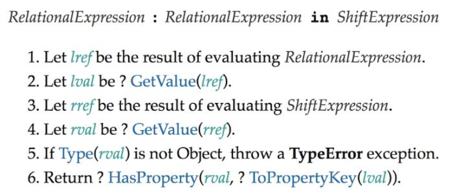
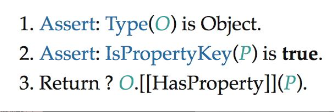
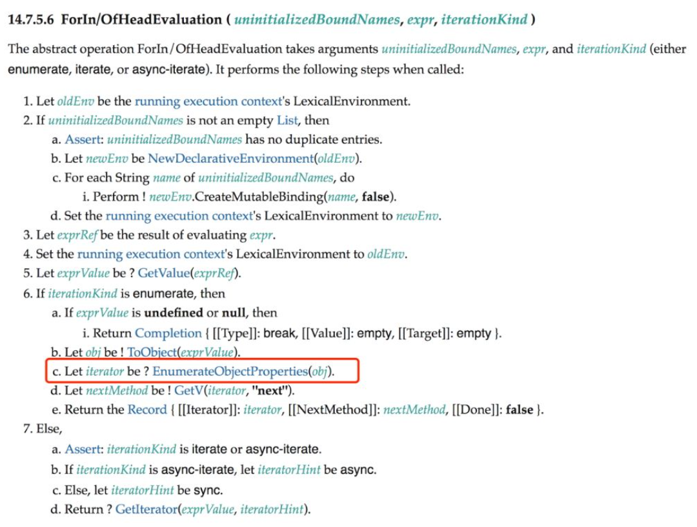
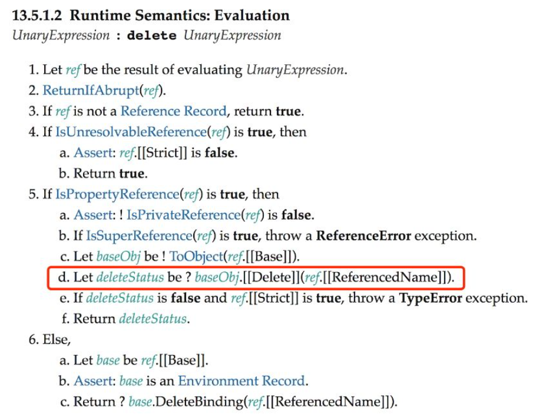

从本节开始，我们将着手实现响应式数据。前面我们使用 get 拦截函数去拦截对属性的读取操作。但在响应系统中，“读取”是一个很宽泛的概念，例如使用 in 操作符检查对象上是否具有给定的 key 也属于“读取”操作，如下面的代码所示：

```javascript
effect(() => {
  "foo" in obj;
});
```

这本质上也是在进行“读取”操作。响应系统应该拦截一切读取操作，以便当数据变化时能够正确地触发响应。下面列出了对一个普通对象的所有可能的读取操作。

- 访问属性：obj.foo。
- 判断对象或原型上是否存在给定的 key：key in obj。
- 使用 for...in 循环遍历对象：for (const key in obj){}。

接下来，我们逐步讨论如何拦截这些读取操作。首先是对于属性的读取，例如 obj.foo，我们知道这可以通过 get 拦截函数实现：

```javascript
const obj = { foo: 1 };

const p = new Proxy(obj, {
  get(target, key, receiver) {
    // 建立联系
    track(target, key);
    // 返回属性值
    return Reflect.get(target, key, receiver);
  },
});
```

对于 in 操作符，应该如何拦截呢？我们可以先查看表 5-3，尝试寻找与in 操作符对应的拦截函数，但表 5-3 中没有与 in 操作符相关的内容。怎么办呢？这时我们就需要查看关于 in 操作符的相关规范。在 ECMA-262规范的 13.10.1 节中，明确定义了 in 操作符的运行时逻辑，如图 5-1 所示。



图 5-1 描述的内容如下。

1. 让 lref 的值为 RelationalExpression 的执行结果。
2. 让 lval 的值为 ? GetValue(lref)。
3. 让 rref 的值为 ShiftExpression 的执行结果。
4. 让 rval 的值为 ? GetValue(rref)。
5. 如果 Type(rval) 不是对象，则抛出 TypeError 异常。
6. 返回 ? HasProperty(rval, ? ToPropertyKey(lval))。

关键点在第 6 步，可以发现，in 操作符的运算结果是通过调用一个叫作 HasProperty 的抽象方法得到的。关于 HasProperty 抽象方法，可以在ECMA-262 规范的 7.3.11 节中找到，它的操作如图 5-2 所示。



图 5-2 描述的内容如下。

1. 断言：Type(O) 是 Object。
2. 断言：IsPropertyKey(P) 是 true。
3. 返回 ? O.[[HasProperty]](P)。

在第 3 步中，可以看到 HasProperty 抽象方法的返回值是通过调用对象的内部方法 [[HasProperty]] 得到的。而 [[HasProperty]] 内部方法可以在表 5-3 中找到，它对应的拦截函数名叫 has，因此我们可以通过 has 拦截函数实现对 in 操作符的代理：

```javascript
const obj = { foo: 1 };
const p = new Proxy(obj, {
  has(target, key) {
    track(target, key);
    return Reflect.has(target, key);
  },
});
```

这样，当我们在副作用函数中通过 in 操作符操作响应式数据时，就能够 建立依赖关系：

```javascript
effect(() => {
  "foo" in p; // 将会建立依赖关系
});
```

再来看看如何拦截 for...in 循环。同样，我们能够拦截的所有方法都在表5-3 中，而表 5-3 列出的是一个对象的所有基本语义方法，也就是说，任何操作其实都是由这些基本语义方法及其组合实现的，for...in 循环也不例外。为了搞清楚 for...in 循环依赖哪些基本语义方法，还需要看规范。

由于这部分规范内容较多，因此这里只截取关键部分。在规范的 14.7.5.6节中定义了 for...in 头部的执行规则，如图 5-3 所示。



图 5-3 中第 6 步描述的内容如下。

6.如果 iterationKind 是枚举（enumerate），则

- a. 如果 exprValue 是 undefined 或 null，那么　　i. 返回 Completion { [[Type]]: break, [[Value]]: empty, [[Target]]:empty }。
- b. 让 obj 的值为 ! ToObject(exprValue)。
- c. 让 iterator 的值为 ? EnumerateObjectProperties(obj)。
- d. 让 nextMethod 的值为 ! GetV(iterator, "next")。
- e. 返回 Record{ [[Iterator]]: iterator, [[NextMethod]]: nextMethod,[[Done]]: false }。

仔细观察第 6 步的第 c 子步骤：

让 iterator 的值为 ? EnumerateObjectProperties(obj)。

其中的关键点在于 EnumerateObjectProperties(obj)。这里的EnumerateObjectProperties 是一个抽象方法，该方法返回一个迭代器对象，规范的 14.7.5.9 节给出了满足该抽象方法的示例实现，如下面的代码所示：

```javascript
function* EnumerateObjectProperties(obj) {
  const visited = new Set();
  for (const key of Reflect.ownKeys(obj)) {
    if (typeof key === "symbol") continue;
    const desc = Reflect.getOwnPropertyDescriptor(obj, key);
    if (desc) {
      visited.add(key);
      if (desc.enumerable) yield key;
    }
  }
  const proto = Reflect.getPrototypeOf(obj);
  if (proto === null) return;
  for (const protoKey of EnumerateObjectProperties(proto)) {
    if (!visited.has(protoKey)) yield protoKey;
  }
}
```

可以看到，该方法是一个 generator 函数，接收一个参数 obj。实际上，obj 就是被 for...in 循环遍历的对象，其关键点在于使用Reflect.ownKeys(obj) 来获取只属于对象自身拥有的键。有了这个线索，如何拦截 for...in 循环的答案已经很明显了，我们可以使用 ownKeys拦截函数来拦截 Reflect.ownKeys 操作：

```javascript
const obj = { foo: 1 };
const ITERATE_KEY = Symbol();

const p = new Proxy(obj, {
  ownKeys(target) {
    // 将副作用函数与 ITERATE_KEY 关联
    track(target, ITERATE_KEY);
    return Reflect.ownKeys(target);
  },
});
```

如上面的代码所示，拦截 ownKeys 操作即可间接拦截 for...in 循环。但相信大家已经注意到了，我们在使用 track 函数进行追踪的时候，将 ITERATE_KEY 作为追踪的 key，为什么这么做呢？这是因为 ownKeys 拦截函数与 get/set 拦截函数不同，在 set/get 中，我们可以得到具体操作的 key，但是在 ownKeys 中，我们只能拿到目标对象 target。这也很符合直觉，因为在读写属性值时，总是能够明确地知道当前正在操作哪一个属性，所以只需要在该属性与副作用函数之间建立联系即可。而ownKeys 用来获取一个对象的所有属于自己的键值，这个操作明显不与任何具体的键进行绑定，因此我们只能够构造唯一的 key 作为标识，即ITERATE_KEY。

既然追踪的是 ITERATE_KEY，那么相应地，在触发响应的时候也应该触发它才行：

```javascript
trigger(target, ITERATE_KEY);
```

但是在什么情况下，对数据的操作需要触发与 ITERATE_KEY 相关联的副作用函数重新执行呢？为了搞清楚这个问题，我们用一段代码来说明。假设副作用函数内有一段 for...in 循环：

```javascript
const obj = { foo: 1 };
const p = new Proxy(obj, {
  /* ... */
});

effect(() => {
  // for...in 循环
  for (const key in p) {
    console.log(key); // foo
  }
});
```

副作用函数执行后，会与 ITERATE_KEY 之间建立响应联系，接下来我们尝试为对象 p 添加新的属性 bar：

```javascript
p.bar = 2;
```

由于对象 p 原本只有 foo 属性，因此 for...in 循环只会执行一次。现在为它添加了新的属性 bar，所以 for...in 循环就会由执行一次变成执行两次。也就是说，当为对象添加新属性时，会对 for...in 循环产生影响，所以需要触发与 ITERATE_KEY 相关联的副作用函数重新执行。但目前的实现还做不到这一点。当我们为对象 p 添加新的属性 bar 时，并没有触发副作用函数重新执行，这是为什么呢？我们来看一下现在的 set 拦截函数的实现：

```javascript
const p = new Proxy(obj, {
  // 拦截设置操作
  set(target, key, newVal, receiver) {
    // 设置属性值
    const res = Reflect.set(target, key, newVal, receiver);
    // 把副作用函数从桶里取出并执行
    trigger(target, key);

    return res;
  },
  // 省略其他拦截函数
});
```

当为对象 p 添加新的 bar 属性时，会触发 set 拦截函数执行。此时 set拦截函数接收到的 key 就是字符串 'bar'，因此最终调用 trigger 函数时也只是触发了与 'bar' 相关联的副作用函数重新执行。但根据前文的介绍，我们知道 for...in 循环是在副作用函数与 ITERATE_KEY 之间建立联系，这和 'bar' 一点儿关系都没有，因此当我们尝试执行 p.bar = 2 操作时，并不能正确地触发响应。

弄清楚了问题在哪里，解决方案也就随之而来了。当添加属性时，我们将那些与 ITERATE_KEY 相关联的副作用函数也取出来执行就可以了：

```javascript
function trigger(target, key) {
  const depsMap = bucket.get(target);
  if (!depsMap) return;
  // 取得与 key 相关联的副作用函数
  const effects = depsMap.get(key);
  // 取得与 ITERATE_KEY 相关联的副作用函数
  const iterateEffects = depsMap.get(ITERATE_KEY);

  const effectsToRun = new Set();
  // 将与 key 相关联的副作用函数添加到 effectsToRun
  effects &&
    effects.forEach((effectFn) => {
      if (effectFn !== activeEffect) {
        effectsToRun.add(effectFn);
      }
    });
  // 将与 ITERATE_KEY 相关联的副作用函数也添加到 effectsToRun
  iterateEffects &&
    iterateEffects.forEach((effectFn) => {
      if (effectFn !== activeEffect) {
        effectsToRun.add(effectFn);
      }
    });

  effectsToRun.forEach((effectFn) => {
    if (effectFn.options.scheduler) {
      effectFn.options.scheduler(effectFn);
    } else {
      effectFn();
    }
  });
}
```

如以上代码所示，当 trigger 函数执行时，除了把那些直接与具体操作的key 相关联的副作用函数取出来执行外，还要把那些与 ITERATE_KEY 相关联的副作用函数取出来执行。

但相信细心的你已经发现了，对于添加新的属性来说，这么做没有什么问题，但如果仅仅修改已有属性的值，而不是添加新属性，那么问题就来了。看如下代码：

```javascript
const obj = { foo: 1 };
const p = new Proxy(obj, {
  /* ... */
});

effect(() => {
  // for...in 循环
  for (const key in p) {
    console.log(key); // foo
  }
});
```

当我们修改 p.foo 的值时：

```javascript
p.foo = 2;
```

与添加新属性不同，修改属性不会对 for...in 循环产生影响。因为无论怎么修改一个属性的值，对于 for...in 循环来说都只会循环一次。所以在这种情况下，我们不需要触发副作用函数重新执行，否则会造成不必要的性能开销。然而无论是添加新属性，还是修改已有的属性值，其基本语义都是 [[Set]]，我们都是通过 set 拦截函数来实现拦截的，如以下代码所示：

```javascript
const p = new Proxy(obj, {
  // 拦截设置操作
  set(target, key, newVal, receiver) {
    // 设置属性值
    const res = Reflect.set(target, key, newVal, receiver);
    // 把副作用函数从桶里取出并执行
    trigger(target, key);

    return res;
  },
  // 省略其他拦截函数
});
```

所以要想解决上述问题，当设置属性操作发生时，就需要我们在 set 拦截函数内能够区分操作的类型，到底是添加新属性还是设置已有属性：

```javascript
const p = new Proxy(obj, {
  // 拦截设置操作
  set(target, key, newVal, receiver) {
    // 如果属性不存在，则说明是在添加新属性，否则是设置已有属性
    const type = Object.prototype.hasOwnProperty.call(target, key)
      ? "SET"
      : "ADD";

    // 设置属性值
    const res = Reflect.set(target, key, newVal, receiver);

    // 将 type 作为第三个参数传递给 trigger 函数
    trigger(target, key, type);

    return res;
  },
  // 省略其他拦截函数
});
```

如以上代码所示，我们优先使用 Object.prototype.hasOwnProperty 检查当前操作的属性是否已经存在于目标对象上，如果存在，则说明当前操作类型为 'SET'，即修改属性值；否则认为当前操作类型为 'ADD'，即添加新属性。最后，我们把类型结果 type 作为第三个参数传递给 trigger函数。

在 trigger 函数内就可以通过类型 type 来区分当前的操作类型，并且只有当操作类型 type 为 'ADD' 时，才会触发与 ITERATE_KEY 相关联的副作用函数重新执行，这样就避免了不必要的性能损耗：

```javascript
function trigger(target, key, type) {
  const depsMap = bucket.get(target);
  if (!depsMap) return;
  const effects = depsMap.get(key);

  const effectsToRun = new Set();
  effects &&
    effects.forEach((effectFn) => {
      if (effectFn !== activeEffect) {
        effectsToRun.add(effectFn);
      }
    });

  console.log(type, key);
  // 只有当操作类型为 'ADD' 时，才触发与 ITERATE_KEY 相关联的副作用函数重新执行
  if (type === "ADD") {
    const iterateEffects = depsMap.get(ITERATE_KEY);
    iterateEffects &&
      iterateEffects.forEach((effectFn) => {
        if (effectFn !== activeEffect) {
          effectsToRun.add(effectFn);
        }
      });
  }

  effectsToRun.forEach((effectFn) => {
    if (effectFn.options.scheduler) {
      effectFn.options.scheduler(effectFn);
    } else {
      effectFn();
    }
  });
}
```

通常我们会将操作类型封装为一个枚举值，例如：

```javascript
const TriggerType = {
  SET: "SET",
  ADD: "ADD",
};
```

这样无论是对后期代码的维护，还是对代码的清晰度，都是非常有帮助的。但这里我们就不讨论这些细枝末节了。

关于对象的代理，还剩下最后一项工作需要做，即删除属性操作的代理：

```javascript
delete p.foo;
```

如何代理 delete 操作符呢？还是看规范，规范的 13.5.1.2 节中明确定义了 delete 操作符的行为，如图 5-4 所示。



图 5-4 中的第 5 步描述的内容如下。

5.如果 IsPropertyReference(ref) 是 true，那么

- a. 断言：! IsPrivateReference(ref) 是 false。
- b. 如果 IsSuperReference(ref) 也是 true，则抛出 ReferenceError 异常。
- c. 让 baseObj 的值为 ! ToObject(ref,[[Base]])。
- d. 让 deleteStatus 的值为 ? baseObj.[[Delete]](ref.[[ReferencedName]])。
- e. 如果 deleteStatus 的值为 false 并且 ref.[[Strict]] 的值是 true，则抛出 TypeError 异常。
- f. 返回 deleteStatus。

由第 5 步中的 d 子步骤可知，delete 操作符的行为依赖 [[Delete]] 内部方法。接着查看表 5-3 可知，该内部方法可以使用 deleteProperty 拦截：

```javascript
const p = new Proxy(obj, {
  deleteProperty(target, key) {
    // 检查被操作的属性是否是对象自己的属性
    const hadKey = Object.prototype.hasOwnProperty.call(target, key);
    // 使用 Reflect.deleteProperty 完成属性的删除
    const res = Reflect.deleteProperty(target, key);

    if (res && hadKey) {
      // 只有当被删除的属性是对象自己的属性并且成功删除时，才触发更新
      trigger(target, key, "DELETE");
    }

    return res;
  },
});
```

如以上代码所示，首先检查被删除的属性是否属于对象自身，然后调用Reflect.deleteProperty 函数完成属性的删除工作，只有当这两步的结果都满足条件时，才调用 trigger 函数触发副作用函数重新执行。需要注意的是，在调用 trigger 函数时，我们传递了新的操作类型 'DELETE'。由于删除操作会使得对象的键变少，它会影响 for...in 循环的次数，因此当操作类型为 'DELETE' 时，我们也应该触发那些与 ITERATE_KEY 相关联的副作用函数重新执行：

```javascript
function trigger(target, key, type) {
  const depsMap = bucket.get(target);
  if (!depsMap) return;
  const effects = depsMap.get(key);

  const effectsToRun = new Set();
  effects &&
    effects.forEach((effectFn) => {
      if (effectFn !== activeEffect) {
        effectsToRun.add(effectFn);
      }
    });

  // 当操作类型为 ADD 或 DELETE 时，需要触发与 ITERATE_KEY 相关联的副作用函数重新执行
  if (type === "ADD" || type === "DELETE") {
    const iterateEffects = depsMap.get(ITERATE_KEY);
    iterateEffects &&
      iterateEffects.forEach((effectFn) => {
        if (effectFn !== activeEffect) {
          effectsToRun.add(effectFn);
        }
      });
  }

  effectsToRun.forEach((effectFn) => {
    if (effectFn.options.scheduler) {
      effectFn.options.scheduler(effectFn);
    } else {
      effectFn();
    }
  });
}
```

在这段代码中，我们添加了 type === 'DELETE' 判断，使得删除属性操作能够触发与 ITERATE_KEY 相关联的副作用函数重新执行。
