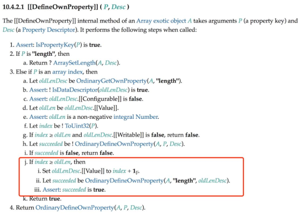

从本节开始，我们讲解如何代理数组。实际上，在 JavaScript 中，数组只是一个特殊的对象而已，因此想要更好地实现对数组的代理，就有必要了解相比普通对象，数组到底有何特殊之处。

在 5.2 节中，我们深入讲解了 JavaScript 中的对象。我们知道，在JavaScript 中有两种对象：常规对象和异质对象。我们还讨论了两者的差异。而本节中我们要介绍的数组就是一个异质对象，这是因为数组对象的 [[DefineOwnProperty]] 内部方法与常规对象不同。换句话说，数组对象除了 [[DefineOwnProperty]] 这个内部方法之外，其他内部方法的逻辑都与常规对象相同。因此，当实现对数组的代理时，用于代理普通对象的大部分代码可以继续使用，如下所示：

```javascript
const arr = reactive(["foo"]);

effect(() => {
  console.log(arr[0]); // 'foo'
});

arr[0] = "bar"; // 能够触发响应
```

上面这段代码能够按预期工作。实际上，当我们通过索引读取或设置数组元素的值时，代理对象的 get/set 拦截函数也会执行，因此我们不需要做任何额外的工作，就能够让数组索引的读取和设置操作是响应式的了。

但对数组的操作与对普通对象的操作仍然存在不同，下面总结了所有对数组元素或属性的“读取”操作。

- 通过索引访问数组元素值：arr[0]。
- 访问数组的长度：arr.length。
- 把数组作为对象，使用 for...in 循环遍历。
- 使用 for...of 迭代遍历数组。
- 数组的原型方法，如
   - concat/join/every/some/find/findIndex/includes 等，以及其他所有不改变原数组的原型方法。

可以看到，对数组的读取操作要比普通对象丰富得多。我们再来看看对数组元素或属性的设置操作有哪些。

- 通过索引修改数组元素值：arr[1] = 3。
- 修改数组长度：arr.length = 0。
- 数组的栈方法：push/pop/shift/unshift。
- 修改原数组的原型方法：splice/fill/sort 等。

除了通过数组索引修改数组元素值这种基本操作之外，数组本身还有很多会修改原数组的原型方法。调用这些方法也属于对数组的操作，有些方法的操作语义是“读取”，而有些方法的操作语义是“设置”。因此，当这些操作发生时，也应该正确地建立响应联系或触发响应。

从上面列出的这些对数组的操作来看，似乎代理数组的难度要比代理普通对象的难度大很多。但事实并非如此，这是因为数组本身也是对象，只不过它是异质对象罢了，它与常规对象的差异并不大。因此，大部分用来代理常规对象的代码对于数组也是生效的。接下来，我们就从通过索引读取或设置数组的元素值说起。

## 5.7.1 数组的索引与 length

拿本节开头的例子来说，当通过数组的索引访问元素的值时，已经能够建立响应联系了：

```javascript
const arr = reactive(["foo"]);

effect(() => {
  console.log(arr[0]); // 'foo'
});

arr[0] = "bar"; // 能够触发响应
```

但通过索引设置数组的元素值与设置对象的属性值仍然存在根本上的不同，这是因为数组对象部署的内部方法[[DefineOwnProperty]] 不同于常规对象。实际上，当我们通过索引设置数组元素的值时，会执行数组对象所部署的内部方法[[Set]]，这一步与设置常规对象的属性值一样。根据规范可知，内部方法 [[Set]] 其实依赖于 [[DefineOwnProperty]]，到了这里就体现出了差异。数组对象所部署的内部方法[[DefineOwnProperty]] 的逻辑定义在规范的 10.4.2.1 节，如图 5-7 所示。



图 5-7 中第 3 步的 j 子步骤描述的内容如下。

- j. 如果 index >= oldLen，那么
   - I. 将 oldLenDesc.[[Value]] 设置为 index + 1。
   - II. 让 succeeded 的值为 OrdinaryDefineOwnProperty(A, ''length'', oldLenDesc)。
   - III. 断言：succeeded 是 true。

可以看到，规范中明确说明，如果设置的索引值大于数组当前的长度，那么要更新数组的 length 属性。所以当通过索引设置元素值时，可能会隐式地修改 length 的属性值。因此在触发响应时，也应该触发与 length 属性相关联的副作用函数重新执行，如下面的代码所示：

```javascript
const arr = reactive(["foo"]); // 数组的原长度为 1

effect(() => {
  console.log(arr.length); // 1
});
// 设置索引 1 的值，会导致数组的长度变为 2
arr[1] = "bar";
```

在这段代码中，数组的原长度为 1，并且在副作用函数中访问了 length 属性。然后设置数组索引为 1 的元素值，这会导致数组的长度变为 2，因此应该触发副作用函数重新执行。但目前的实现还做不到这一点，为了实现目标，我们需要修改 set 拦截函数，如下面的代码所示：

```javascript
function createReactive(obj, isShallow = false, isReadonly = false) {
  return new Proxy(obj, {
    // 拦截设置操作
    set(target, key, newVal, receiver) {
      if (isReadonly) {
        console.warn(`属性 ${key} 是只读的`);
        return true;
      }
      const oldVal = target[key];
      // 如果属性不存在，则说明是在添加新的属性，否则是设置已有属性
      const type = Array.isArray(target)
        ? // 如果代理目标是数组，则检测被设置的索引值是否小于数组长度，
          // 如果是，则视作 SET 操作，否则是 ADD 操作
          Number(key) < target.length
          ? "SET"
          : "ADD"
        : Object.prototype.hasOwnProperty.call(target, key)
        ? "SET"
        : "ADD";

      const res = Reflect.set(target, key, newVal, receiver);
      if (target === receiver.raw) {
        if (oldVal !== newVal && (oldVal === oldVal || newVal === newVal)) {
          trigger(target, key, type);
        }
      }

      return res;
    },
    // 省略其他拦截函数
  });
}
```

我们在判断操作类型时，新增了对数组类型的判断。如果代理的目标对象是数组，那么对于操作类型的判断会有所区别。即被设置的索引值如果小于数组长度，就视作 SET 操作，因为它不会改变数组长度；如果设置的索引值大于数组的当前长度，则视作 ADD 操作，因为这会隐式地改变数组的 length 属性值。有了这些信息，我们就可以在 trigger 函数中正确地触发与数组对象的 length 属性相关联的副作用函数重新执行了：

```javascript
function trigger(target, key, type) {
  const depsMap = bucket.get(target);
  if (!depsMap) return;
  // 省略部分内容

  // 当操作类型为 ADD 并且目标对象是数组时，应该取出并执行那些与 length属性相关联的副作用函数
  if (type === "ADD" && Array.isArray(target)) {
    // 取出与 length 相关联的副作用函数
    const lengthEffects = depsMap.get("length");
    // 将这些副作用函数添加到 effectsToRun 中，待执行
    lengthEffects &&
      lengthEffects.forEach((effectFn) => {
        if (effectFn !== activeEffect) {
          effectsToRun.add(effectFn);
        }
      });
  }

  effectsToRun.forEach((effectFn) => {
    if (effectFn.options.scheduler) {
      effectFn.options.scheduler(effectFn);
    } else {
      effectFn();
    }
  });
}
```

但是反过来思考，其实修改数组的 length 属性也会隐式地影响数组元素，例如：

```javascript
const arr = reactive(["foo"]);

effect(() => {
  // 访问数组的第 0 个元素
  console.log(arr[0]); // foo
});
// 将数组的长度修改为 0，导致第 0 个元素被删除，因此应该触发响应
arr.length = 0;
```

如上面的代码所示，在副作用函数内访问了数组的第 0 个元素，接着将数组的 length 属性修改为 0。我们知道这会隐式地影响数组元素，即所有元素都被删除，所以应该触发副作用函数重新执行。然而并非所有对 length 属性的修改都会影响数组中的已有元素，拿上例来说，如果我们将 length 属性设置为 100，这并不会影响第 0 个元素，所以也就不需要触发副作用函数重新执行。这让我们意识到，当修改 length 属性值时，只有那些索引值大于或等于新的 length属性值的元素才需要触发响应。但无论如何，目前的实现还做不到这一点，为了实现目标，我们需要修改 set 拦截函数。在调用 trigger函数触发响应时，应该把新的属性值传递过去：

```javascript
function createReactive(obj, isShallow = false, isReadonly = false) {
  return new Proxy(obj, {
    // 拦截设置操作
    set(target, key, newVal, receiver) {
      if (isReadonly) {
        console.warn(`属性 ${key} 是只读的`);
        return true;
      }
      const oldVal = target[key];

      const type = Array.isArray(target)
        ? Number(key) < target.length
          ? "SET"
          : "ADD"
        : Object.prototype.hasOwnProperty.call(target, key)
        ? "SET"
        : "ADD";

      const res = Reflect.set(target, key, newVal, receiver);
      if (target === receiver.raw) {
        if (oldVal !== newVal && (oldVal === oldVal || newVal === newVal)) {
          // 增加第四个参数，即触发响应的新值
          trigger(target, key, type, newVal);
        }
      }

      return res;
    },
  });
}
```

接着，我们还需要修改 trigger 函数：

```javascript
// 为 trigger 函数增加第四个参数，newVal，即新值
function trigger(target, key, type, newVal) {
  const depsMap = bucket.get(target);
  if (!depsMap) return;
  // 省略其他代码

  // 如果操作目标是数组，并且修改了数组的 length 属性
  if (Array.isArray(target) && key === "length") {
    // 对于索引大于或等于新的 length 值的元素，
    // 需要把所有相关联的副作用函数取出并添加到 effectsToRun 中待执行
    depsMap.forEach((effects, key) => {
      if (key >= newVal) {
        effects.forEach((effectFn) => {
          if (effectFn !== activeEffect) {
            effectsToRun.add(effectFn);
          }
        });
      }
    });
  }

  effectsToRun.forEach((effectFn) => {
    if (effectFn.options.scheduler) {
      effectFn.options.scheduler(effectFn);
    } else {
      effectFn();
    }
  });
}
```

如上面的代码所示，为 trigger 函数增加了第四个参数，即触发响应时的新值。在本例中，新值指的是新的 length 属性值，它代表新的数组长度。接着，我们判断操作的目标是否是数组，如果是，则需要找到所有索引值大于或等于新的 length 值的元素，然后把与它们相关联的副作用函数取出并执行。
