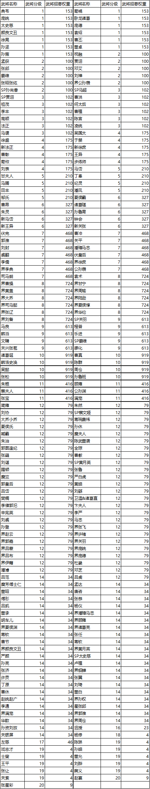

## 未拥有的招募武将

| 武将名称 | 武将权重 |
| --- | --- |
| 卧龙诸葛 | 153 |
| 张郃 | 100 |
| 姜维 | 100 |
| 曹洪 | 102 |
| 何太后 | 102 |
| 李丰 | 102 | 
| 曹植 | 102 |
| 高顺 | 102 |
| 陈宫 | 102 |
| 凌统 | 102 |
| 马谡 | 102 |
| 吴国太 | 175 |
| 新徐庶 | 175 |
| 刘表 | 175 |
| 丁奉 | 210 |
| 马腾 | 210 |
| 纪灵 | 210 |
| 田丰 | 210 |
| 潘凤 | 210 |
| 邹氏 | 210 |
| 夏侯霸 | 327 |
| 朱灵 | 327 |
| 钟会 | 327 |
| 关张 | 327 |
| 伏完 | 468 |
| 曹冲 | 468 |
| 关平 | 468 |
| 刘封 | 468 |
| 虞翻 | 468 |
| 界徐庶 | 468 |
| 界李典 | 468 |
| 司马朗 | 468 |
| 界曹操 | 724 |
| 界大乔 | 724 |
| 界夏侯惇 | 724 |
| 界刘备 | 724 |
| SP关羽 | 613 |
| 马良 | 613 |
| SP姜维 | 613 |
| 关兴张苞 | 613 |
| 廖化 | 613 |
| 诸葛诞 | 919 |
| 朱桓 | 416 |
| 顾雍 | 416 |
| 蔡夫人 | 416 |
| 张宝 | 416 | 
| 满宠 | 416 |
| 朱然 | 79 |
| 刘协 | 79 |
| SP蔡文姬 | 79 |
| 大乔小乔 | 79 |
| 蒋琬费祎 | 79 |
| 夏侯氏 | 79 |
| 孙休 | 79 |
| 臧霸 | 79 |
| 糜夫人 | 79 |
| 朱治 | 79 |
| 陈武董袭 | 79 |
| 郭图逢纪 | 79 |
| 全琮 | 79 |
| 张嶷 | 79 |
| 曹睿 | 79 |
| 刘谌 | 79 | 
| SP黄月英 | 79 |
| 蹋顿 | 79 |
| 张鲁 | 79 |
| 糜竺 | 79 |
| 严白虎 | 79 |
| 郭皇后 | 79 |
| 黄皓 | 79 |
| 吕岱 | 79 | 
| 刘繇 | 79 |
| 樊稠 | 79 |
| 卫温&诸葛直 | 79 |
| 李傕郭汜 | 79 |
| 卞夫人 | 79 |
| 辛宪英 | 79 |
| 李严 | 79 |
| 刘虞 | 79 |
| 马忠 | 79 |
| 孙登 | 79 |
| 界张飞 | 79 |
| 界赵云 | 79 | 
| 界许褚 | 79 |
| 界郭嘉 | 79 |
| 界关羽 | 79 |
| 界吕蒙 | 79 |
| 界庞统 | 79 |
| 界吕布 | 79 |
| 界庞德 | 79 |
| 界伊籍 | 79 |
| 杜畿 | 79 |
| 潘睿 | 79 |
| 邓芝 | 79 |
| 吕范 | 34 |
| 吕虔  79 |
| 糜芳傅士仁 | 34 |
| 孟达 | 34 |
| 董昭 | 34 |
| 唐咨 | 34 |
| 傅肜 | 34 |
| 张恭 | 34 |
| 吕凯 | 34 |
| 杨仪 | 34 |
| 董承 | 34 |
| 胡车儿 | 34 |
| 界夏侯渊 | 34 |
| 界诸葛亮 | 34 |
| 蒋钦 | 34 |
| 张任 | 34 |
| 曹节 | 34 |
| 界颜良文丑 | 34 |
| 界黄月英 | 34 |
| 严颜 | 34 |
| SP太史慈 | 34 |
| 孙亮 | 34 |
| 卢植 | 34 |
| 张济 | 34 |
| 许贡 | 34 |
| 丁原 | 34 |
| 董白 | 34 |
| 赵统赵广 | 34 |
| 界孙权 | 34 |
| 李通 | 34 |
| 星张郃 | 34 |
| 界满宠 | 34 |
| 界郭淮 | 34 |
| 华歆 | 34 |
| 界周仓 | 34 |
| 孙资刘放 | 34 |
| 沮授 | 23 |
| 关银屏 | 34 |
| 杨修 | 4 |
| 左慈 | 46 |
| 陈琳 | 4 |
| 戏志才 | 4 |
| 孙皓 | 4 |
| 士 | 4 |
| 董允 | 4 |
| 王平 | 4 |
| 刘烨 | 4 |
| 张让 | 4 |
| 白马 | 4 |
| 关索 | 4 |
| 赵襄 | 9 |
| 张星彩 | 9 |

