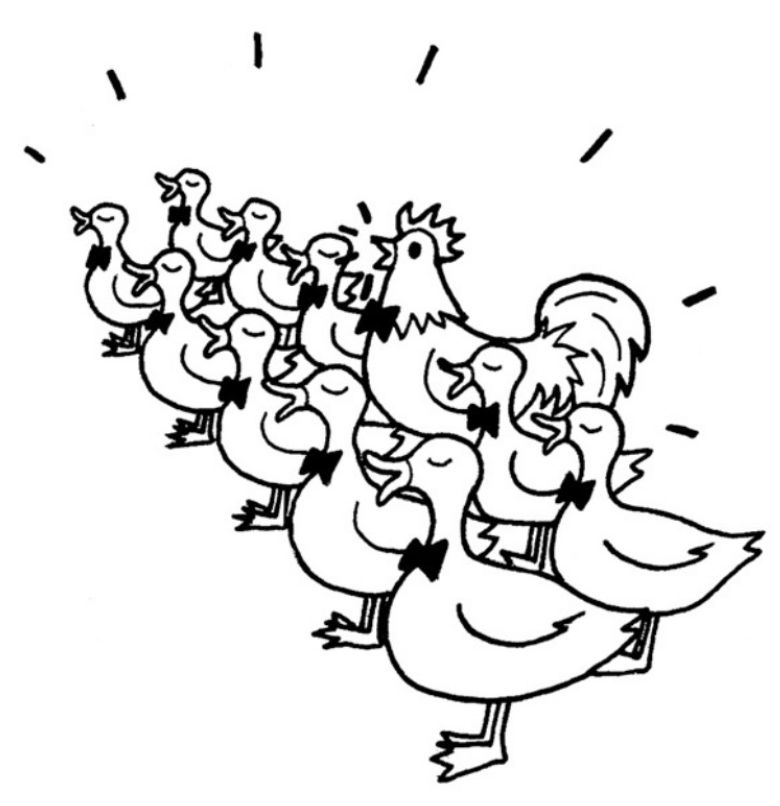

编程语言按照数据类型大体可以分为两类，一类是静态类型语言，另一类是动态类型语言。

静态类型语言在编译时便已确定变量的类型，而动态类型语言的变量类型要到程序运行的时候，待变量被赋予某个值之后，才会具有某种类型。

静态类型语言的优点首先是在编译时就能发现类型不匹配的错误，编辑器可以帮助我们提前避免程序在运行期间有可能发生的一些错误。其次，如果在程序中明确地规定了数据类型，编译器还可以针对这些信息对程序进行一些优化工作，提高程序执行速度。

静态类型语言的缺点首先是迫使程序员依照强契约来编写程序，为每个变量规定数据类型，归根结底只是辅助我们编写可靠性高程序的一种手段，而不是编写程序的目的，毕竟大部分人编写程序的目的是为了完成需求交付生产。其次，类型的声明也会增加更多的代码，在程序编写过程中，这些细节会让程序员的精力从思考业务逻辑上分散开来。

动态类型语言的优点是编写的代码数量更少，看起来也更加简洁，程序员可以把精力更多地放在业务逻辑上面。虽然不区分类型在某些情况下会让程序变得难以理解，但整体而言，代码量越少，越专注于逻辑表达，对阅读程序是越有帮助的。

动态类型语言的缺点是无法保证变量的类型，从而在程序的运行期有可能发生跟类型相关的错误。这好像在商店买了一包牛肉辣条，但是要真正吃到嘴里才知道是不是牛肉味。

在JavaScript中，当我们对一个变量赋值时，显然不需要考虑它的类型，因此，JavaScript是一门典型的动态类型语言。

动态类型语言对变量类型的宽容给实际编码带来了很大的灵活性。由于无需进行类型检测，我们可以尝试调用任何对象的任意方法，而无需去考虑它原本是否被设计为拥有该方法。

这一切都建立在鸭子类型（duck typing）的概念上，鸭子类型的通俗说法是：“如果它走起路来像鸭子，叫起来也是鸭子，那么它就是鸭子。”

我们可以通过一个小故事来更深刻地了解鸭子类型。

从前在JavaScript王国里，有一个国王，他觉得世界上最美妙的声音就是鸭子的叫声，于是国王召集大臣，要组建一个1000只鸭子组成的合唱团。大臣们找遍了全国，终于找到999只鸭子，但是始终还差一只，最后大臣发现有一只非常特别的鸡，它的叫声跟鸭子一模一样，于是这只鸡就成为了合唱团的最后一员。



这个故事告诉我们，国王要听的只是鸭子的叫声，这个声音的主人到底是鸡还是鸭并不重要。鸭子类型指导我们只关注对象的行为，而不关注对象本身，也就是关注HAS-A，而不是IS-A。

下面我们用代码来模拟这个故事。

```javascript
var duck = {
  duckSinging: function () {
    console.log("嘎嘎嘎");
  },
};

var chicken = {
  duckSinging: function () {
    console.log("嘎嘎嘎");
  },
};

var choir = []; //合唱团

var joinChoir = function (animal) {
  if (animal && typeof animal.duckSinging === "function") {
    choir.push(animal);
    console.log("恭喜加入合唱团");
    console.log("合唱团已有成员数量" + choir.length);
  }
};

joinChoir(duck); //恭喜加入合唱团
joinChoir(chicken); //恭喜加入合唱团
```

我们看到，对于加入合唱团的动物，大臣们根本无需检查它们的类型，而是只需要保证它们拥有duckSinging方法。如果下次期望加入合唱团的是一只小狗，而这只小狗刚好也会鸭子叫，我相信这只小狗也能顺利加入。

在动态类型语言的面向对象设计中，鸭子类型的概念至关重要。利用鸭子类型的思想，我们不必借助超类型的帮助，就能轻松地在动态类型语言中实现一个原则：“面向接口编程，而不是面向实现编程”。例如，一个对象若有push和pop方法，并且这些方法提供了正确的实现，它就可以被当作栈来使用。一个对象如果有length属性，也可以依照下标来存取属性（最好还要拥有slice和splice等方法），这个对象就可以被当作数组来使用。

在静态类型语言中，要实现“面向接口编程”并不是一件容易的事情，往往要通过抽象类或者接口等将对象进行向上转型。当对象的真正类型被隐藏在它的超类型身后，这些对象才能在类型检查系统的“监视”之下互相被替换使用。只有当对象能够被互相替换使用，才能体现出对象多态性的价值。

“面向接口编程”是设计模式中最重要的思想，但在JavaScript语言中，“面向接口编程”的过程跟主流的静态类型语言不一样，因此，在JavaScript中实现设计模式的过程与在一些我们熟悉的语言中实现的过程会大相径庭。
