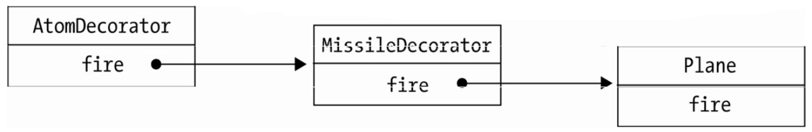

首先要提出来的是，作为一门解释执行的语言，给 JavaScript 中的对象动态添加或者改变职责是一件再简单不过的事情，虽然这种做法改动了对象自身，跟传统定义中的装饰者模式并不一样，但这无疑更符合 JavaScript 的语言特色。代码如下：

```javascript
var obj = {
  name: "sven",
  address: "深圳市",
};

obj.address = obj.address + "福田区";
```

传统面向对象语言中的装饰者模式在 JavaScript 中适用的场景并不多，如上面代码所示，通常我们并不太介意改动对象自身。尽管如此，本节我们还是稍微模拟一下传统面向对象语言中的装饰者模式实现。

假设我们在编写一个飞机大战的游戏，随着经验值的增加，我们操作的飞机对象可以升级成更厉害的飞机，一开始这些飞机只能发射普通的子弹，升到第二级时可以发射导弹，升到第三级时可以发射原子弹。

下面来看代码实现，首先是原始的飞机类：

```javascript
var Plane = function () {};

Plane.prototype.fire = function () {
  console.log("发射普通子弹");
};
```

接下来增加两个装饰类，分别是导弹和原子弹：

```javascript
var MissileDecorator = function (plane) {
  this.plane = plane;
};

MissileDecorator.prototype.fire = function () {
  this.plane.fire();
  console.log("发射导弹");
};

var AtomDecorator = function (plane) {
  this.plane = plane;
};

AtomDecorator.prototype.fire = function () {
  this.plane.fire();
  console.log("发射原子弹");
};
```

导弹类和原子弹类的构造函数都接受参数 plane 对象，并且保存好这个参数，在它们的 fire 方法中，除了执行自身的操作之外，还调用 plane 对象的 fire 方法。

这种给对象动态增加职责的方式，并没有真正地改动对象自身，而是将对象放入另一个对象之中，这些对象以一条链的方式进行引用，形成一个聚合对象。这些对象都拥有相同的接口（fire 方法），当请求达到链中的某个对象时，这个对象会执行自身的操作，随后把请求转发给链中的下一个对象。

因为装饰者对象和它所装饰的对象拥有一致的接口，所以它们对使用该对象的客户来说是透明的，被装饰的对象也并不需要了解它曾经被装饰过，这种透明性使得我们可以递归地嵌套任意多个装饰者对象，如图 15-1 所示。



最后看看测试结果：

```javascript
var plane = new Plane();
plane = new MissileDecorator(plane);
plane = new AtomDecorator(plane);

plane.fire();
// 分别输出：发射普通子弹、发射导弹、发射原子弹
```
