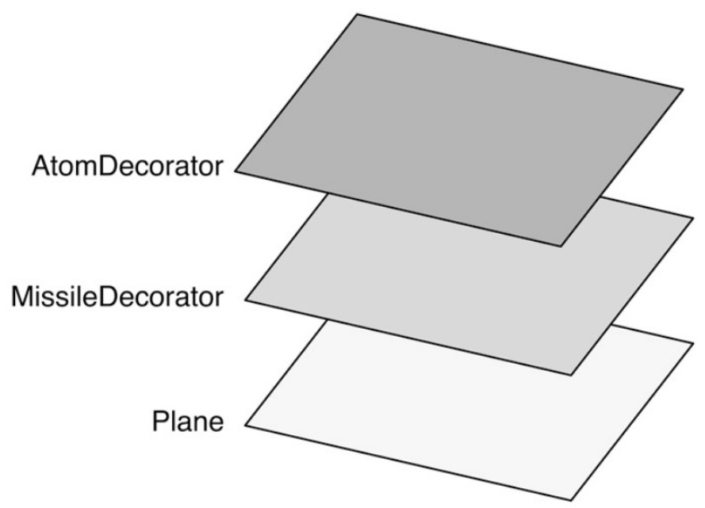

在《设计模式》成书之前，GoF 原想把装饰者（decorator）模式称为包装器（wrapper）模式。

从功能上而言， decorator 能很好地描述这个模式，但从结构上看， wrapper 的说法更加贴切。装饰者模式将一个对象嵌入另一个对象之中，实际上相当于这个对象被另一个对象包装起来，形成一条包装链。请求随着这条链依次传递到所有的对象，每个对象都有处理这条请求的机会，如图 15-2 所示。

