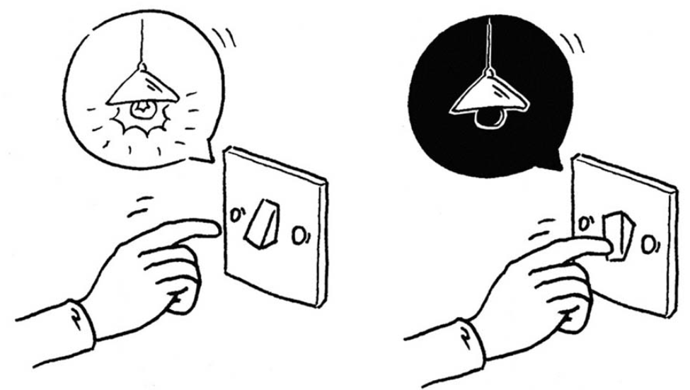
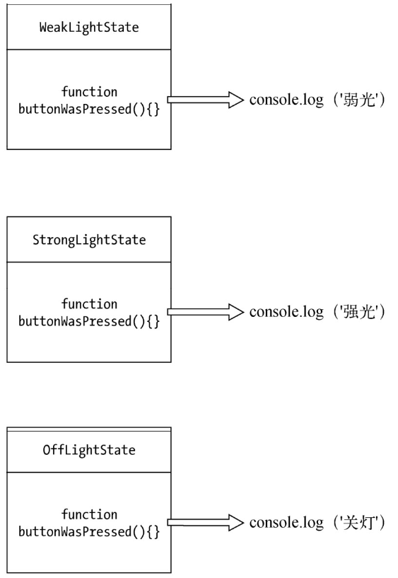
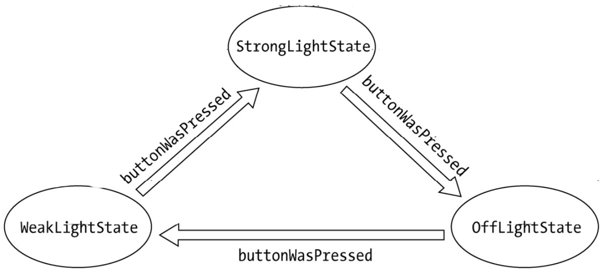
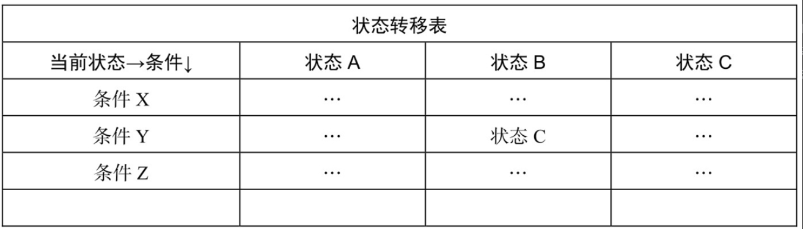

状态模式是一种非同寻常的优秀模式，它也许是解决某些需求场景的最好方法。虽然状态模式并不是一种简单到一目了然的模式（它往往还会带来代码量的增加），但你一旦明白了状态模式的精髓，以后一定会感谢它带给你的无与伦比的好处。

状态模式的关键是区分事物内部的状态，事物内部状态的改变往往会带来事物的行为改变。

## 16.1 初识状态模式

我们来想象这样一个场景：有一个电灯，电灯上面只有一个开关。当电灯开着的时候，此时按下开关，电灯会切换到关闭状态；再按一次开关，电灯又将被打开。同一个开关按钮，在不同的状态下，表现出来的行为是不一样的。



现在用代码来描述这个场景，首先定义一个Light类，可以预见，电灯对象light将从Light类创建而出，light对象将拥有两个属性，我们用state来记录电灯当前的状态，用button表示具体的开关按钮。下面来编写这个电灯程序的例子。

```javascript
var Light = function () {
  this.state = "off"; // 给电灯设置初始状态off
  this.button = null; // 电灯开关按钮
};
```

接下来定义Light.prototype.init方法，该方法负责在页面中创建一个真实的button节点，假设这个button就是电灯的开关按钮，当button的onclick事件被触发时，就是电灯开关被按下的时候，代码如下：

```javascript
Light.prototype.init = function () {
  var button = document.createElement("button"),
    self = this;

  button.innerHTML = "开关";
  this.button = document.body.appendChild(button);
  this.button.onclick = function () {
    self.buttonWasPressed();
  };
};
```

当开关被按下时，程序会调用self.buttonWasPressed方法，开关按下之后的所有行为，都将被封装在这个方法里，代码如下：

```javascript
Light.prototype.buttonWasPressed = function () {
  if (this.state === "off") {
    console.log("开灯");
    this.state = "on";
  } else if (this.state === "on") {
    console.log("关灯");
    this.state = "off";
  }
};

var light = new Light();
light.init();
```

OK，现在可以看到，我们已经编写了一个强壮的状态机，这个状态机的逻辑既简单又缜密，看起来这段代码设计得无懈可击，这个程序没有任何bug。实际上这种代码我们已经编写过无数遍，比如要交替切换一个button的class，跟此例一样，往往先用一个变量state来记录按钮的当前状态，在事件发生时，再根据这个状态来决定下一步的行为。

令人遗憾的是，这个世界上的电灯并非只有一种。许多酒店里有另外一种电灯，这种电灯也只有一个开关，但它的表现是：第一次按下打开弱光，第二次按下打开强光，第三次才是关闭电灯。现在必须改造上面的代码来完成这种新型电灯的制造：

```javascript
Light.prototype.buttonWasPressed = function () {
  if (this.state === "off") {
    console.log("弱光");
    this.state = "weakLight";
  } else if (this.state === "weakLight") {
    console.log("强光");
    this.state = "strongLight";
  } else if (this.state === "strongLight") {
    console.log("关灯");
    this.state = "off";
  }
};
```

现在这个反例先告一段落，我们来考虑一下上述程序的缺点。

- 很明显buttonWasPressed方法是违反开放-封闭原则的，每次新增或者修改light的状态，都需要改动buttonWasPressed方法中的代码，这使得buttonWasPressed成为了一个非常不稳定的方法。
- 所有跟状态有关的行为，都被封装在buttonWasPressed方法里，如果以后这个电灯又增加了强强光、超强光和终极强光，那我们将无法预计这个方法将膨胀到什么地步。当然为了简化示例，此处在状态发生改变的时候，只是简单地打印一条log和改变button的innerHTML。在实际开发中，要处理的事情可能比这多得多，也就是说，buttonWasPressed方法要比现在庞大得多。
- 状态的切换非常不明显，仅仅表现为对state变量赋值，比如this.state = 'weakLight'。在实际开发中，这样的操作很容易被程序员不小心漏掉。我们也没有办法一目了然地明白电灯一共有多少种状态，除非耐心地读完buttonWasPressed方法里的所有代码。当状态的种类多起来的时候，某一次切换的过程就好像被埋藏在一个巨大方法的某个阴暗角落里。
- 状态之间的切换关系，不过是往buttonWasPressed方法里堆砌if、else语句，增加或者修改一个状态可能需要改变若干个操作，这使buttonWasPressed更加难以阅读和维护。

### 16.1.2 状态模式改进电灯程序

现在我们学习使用状态模式改进电灯的程序。有意思的是，通常我们谈到封装，一般都会优先封装对象的行为，而不是对象的状态。但在状态模式中刚好相反，状态模式的关键是把事物的每种状态都封装成单独的类，跟此种状态有关的行为都被封装在这个类的内部，所以button被按下的的时候，只需要在上下文中，把这个请求委托给当前的状态对象即可，该状态对象会负责渲染它自身的行为，如图16-1所示。



同时我们还可以把状态的切换规则事先分布在状态类中，这样就有效地消除了原本存在的大量条件分支语句，如图16-2所示。



下面进入状态模式的代码编写阶段，首先将定义3个状态类，分别是OffLightState、WeakLightState、StrongLightState。这3个类都有一个原型方法buttonWasPressed，代表在各自状态下，按钮被按下时将发生的行为，代码如下：

```javascript
// OffLightState：

var OffLightState = function (light) {
  this.light = light;
};

OffLightState.prototype.buttonWasPressed = function () {
  console.log("弱光"); // offLightState对应的行为
  this.light.setState(this.light.weakLightState); // 切换状态到weakLightState
};

// WeakLightState：

var WeakLightState = function (light) {
  this.light = light;
};

WeakLightState.prototype.buttonWasPressed = function () {
  console.log("强光"); // weakLightState对应的行为
  this.light.setState(this.light.strongLightState); // 切换状态到strongLightState
};

// StrongLightState：

var StrongLightState = function (light) {
  this.light = light;
};

StrongLightState.prototype.buttonWasPressed = function () {
  console.log("关灯"); // strongLightState对应的行为
  this.light.setState(this.light.offLightState); // 切换状态到offLightState
};
```

接下来改写Light类，现在不再使用一个字符串来记录当前的状态，而是使用更加立体化的状态对象。我们在Light类的构造函数里为每个状态类都创建一个状态对象，这样一来我们可以很明显地看到电灯一共有多少种状态，代码如下：

```javascript
var Light = function () {
  this.offLightState = new OffLightState(this);
  this.weakLightState = new WeakLightState(this);
  this.strongLightState = new StrongLightState(this);
  this.button = null;
};
```

在button按钮被按下的事件里，Context也不再直接进行任何实质性的操作，而是通过self.currState.buttonWasPressed()将请求委托给当前持有的状态对象去执行，代码如下：

```javascript
Light.prototype.init = function () {
  var button = document.createElement("button"),
    self = this;
  this.button = document.body.appendChild(button);
  this.button.innerHTML = "开关";

  this.currState = this.offLightState; // 设置当前状态

  this.button.onclick = function () {
    self.currState.buttonWasPressed();
  };
};
```

最后还要提供一个Light.prototype.setState方法，状态对象可以通过这个方法来切换light对象的状态。前面已经说过，状态的切换规律事先被完好定义在各个状态类中。在Context中再也找不到任何一个跟状态切换相关的条件分支语句：

```javascript
Light.prototype.setState = function (newState) {
  this.currState = newState;
};
```

现在可以进行一些测试：

```javascript
var light = new Light();
light.init();
```

不出意外的话，执行结果跟之前的代码一致，但是使用状态模式的好处很明显，它可以使每一种状态和它对应的行为之间的关系局部化，这些行为被分散和封装在各自对应的状态类之中，便于阅读和管理代码。

另外，状态之间的切换都被分布在状态类内部，这使得我们无需编写过多的if、else条件分支语言来控制状态之间的转换。

当我们需要为light对象增加一种新的状态时，只需要增加一个新的状态类，再稍稍改变一些现有的代码即可。假设现在light对象多了一种超强光的状态，那就先增加SuperStrongLightState类：

```javascript
var SuperStrongLightState = function (light) {
  this.light = light;
};

SuperStrongLightState.prototype.buttonWasPressed = function () {
  console.log("关灯");
  this.light.setState(this.light.offLightState);
};
```

然后在Light构造函数里新增一个superStrongLightState对象：

```javascript
var Light = function () {
  this.offLightState = new OffLightState(this);
  this.weakLightState = new WeakLightState(this);
  this.strongLightState = new StrongLightState(this);
  this.superStrongLightState = new SuperStrongLightState(this); // 新增superStrongLightState对象

  this.button = null;
};
```

最后改变状态类之间的切换规则，从StrongLightState---->OffLightState变为StrongLight-State---->SuperStrongLightState ---->OffLightState：

```javascript
StrongLightState.prototype.buttonWasPressed = function () {
  console.log("超强光"); // strongLightState对应的行为
  this.light.setState(this.light.superStrongLightState); // 切换状态到superStrongLightState
};
```

## 16.2 状态模式的定义

通过电灯的例子，相信我们对于状态模式已经有了一定程度的了解。现在回头来看GoF中对状态模式的定义：

允许一个对象在其内部状态改变时改变它的行为，对象看起来似乎修改了它的类。

我们以逗号分割，把这句话分为两部分来看。第一部分的意思是将状态封装成独立的类，并将请求委托给当前的状态对象，当对象的内部状态改变时，会带来不同的行为变化。电灯的例子足以说明这一点，在off和on这两种不同的状态下，我们点击同一个按钮，得到的行为反馈是截然不同的。

第二部分是从客户的角度来看，我们使用的对象，在不同的状态下具有截然不同的行为，这个对象看起来是从不同的类中实例化而来的，实际上这是使用了委托的效果。

## 16.3 状态模式的通用结构

在前面的电灯例子中，我们完成了一个状态模式程序的编写。首先定义了Light类，Light类在这里也被称为上下文（Context）。随后在Light的构造函数中，我们要创建每一个状态类的实例对象，Context将持有这些状态对象的引用，以便把请求委托给状态对象。用户的请求，即点击button的动作也是实现在Context中的，代码如下：

```javascript
var Light = function () {
  this.offLightState = new OffLightState(this); // 持有状态对象的引用
  this.weakLightState = new WeakLightState(this);
  this.strongLightState = new StrongLightState(this);
  this.superStrongLightState = new SuperStrongLightState(this);
  this.button = null;
};

Light.prototype.init = function () {
  var button = document.createElement("button"),
    self = this;

  this.button = document.body.appendChild(button);
  this.button.innerHTML = "开关";
  this.currState = this.offLightState; // 设置默认初始状态

  this.button.onclick = function () {
    // 定义用户的请求动作
    self.currState.buttonWasPressed();
  };
};
```

接下来可能是个苦力活，我们要编写各种状态类，light对象被传入状态类的构造函数，状态对象也需要持有light对象的引用，以便调用light中的方法或者直接操作light对象：

```javascript
var OffLightState = function (light) {
  this.light = light;
};

OffLightState.prototype.buttonWasPressed = function () {
  console.log("弱光");
  this.light.setState(this.light.weakLightState);
};
```

## 16.4 缺少抽象类的变通方式

我们看到，在状态类中将定义一些共同的行为方法，Context最终会将请求委托给状态对象的这些方法，在这个例子里，这个方法就是buttonWasPressed。无论增加了多少种状态类，它们都必须实现buttonWasPressed方法。

在Java中，所有的状态类必须继承自一个State抽象父类，当然如果没有共同的功能值得放入抽象父类中，也可以选择实现State接口。这样做的原因一方面是我们曾多次提过的向上转型，另一方面是保证所有的状态子类都实现了buttonWasPressed方法。遗憾的是，JavaScript既不支持抽象类，也没有接口的概念。所以在使用状态模式的时候要格外小心，如果我们编写一个状态子类时，忘记了给这个状态子类实现buttonWasPressed方法，则会在状态切换的时候抛出异常。因为Context总是把请求委托给状态对象的buttonWasPressed方法。

不论怎样严格要求程序员，也许都避免不了犯错的那一天，毕竟如果没有编译器的帮助，只依靠程序员的自觉以及一点好运气，是不靠谱的。这里建议的解决方案跟《模板方法模式》中一致，让抽象父类的抽象方法直接抛出一个异常，这个异常至少会在程序运行期间就被发现：

```javascript
var State = function () {};

State.prototype.buttonWasPressed = function () {
  throw new Error("父类的buttonWasPressed方法必须被重写");
};

var SuperStrongLightState = function (light) {
  this.light = light;
};

SuperStrongLightState.prototype = new State(); // 继承抽象父类

SuperStrongLightState.prototype.buttonWasPressed = function () {
  // 重写buttonWasPressed方法
  console.log("关灯");
  this.light.setState(this.light.offLightState);
};
```

## 16.5 另一个状态模式示例——文件上传

接下来我们要讨论一个复杂一点的例子，这原本是一个真实的项目，是我2013年重构微云上传模块的经历。实际上，不论是文件上传，还是音乐、视频播放器，都可以找到一些明显的状态区分。比如文件上传程序中有扫描、正在上传、暂停、上传成功、上传失败这几种状态，音乐播放器可以分为加载中、正在播放、暂停、播放完毕这几种状态。点击同一个按钮，在上传中和暂停状态下的行为表现是不一样的，同时它们的样式class也不同。下面我们以文件上传为例进行说明。上传中，点击按钮暂停，如图16-3所示。


暂停中，点击按钮继续播放，如图16-4所示。


看到这里，再联系一下电灯的例子和之前对状态模式的了解，我们已经找了使用状态模式的理由。

### 16.5.1 更复杂的切换条件

相对于电灯的例子，文件上传不同的地方在于，现在我们将面临更加复杂的条件切换关系。在电灯的例子中，电灯的状态总是从关到开再到关，或者从关到弱光、弱光到强光、强光再到关。看起来总是循规蹈矩的A→B→C→A，所以即使不使用状态模式来编写电灯的程序，而是使用原始的if、else来控制状态切换，我们也不至于在逻辑编写中迷失自己，因为状态的切换总是遵循一些简单的规律，代码如下：

```javascript
if (this.state === "off") {
  console.log("开弱光");
  this.button.innerHTML = "下一次按我是强光";
  this.state = "weakLight";
} else if (this.state === "weakLight") {
  console.log("开强光");
  this.button.innerHTML = "下一次按我是关灯";
  this.state = "strongLight";
} else if (this.state === "strongLight") {
  console.log("关灯");
  this.button.innerHTML = "下一次按我是弱光";
  this.state = "off";
}
```

而文件上传的状态切换相比要复杂得多，控制文件上传的流程需要两个节点按钮，第一个用于暂停和继续上传，第二个用于删除文件，如图16-5所示。


现在看看文件在不同的状态下，点击这两个按钮将分别发生什么行为。

- 文件在扫描状态中，是不能进行任何操作的，既不能暂停也不能删除文件，只能等待扫描完成。扫描完成之后，根据文件的md5值判断，若确认该文件已经存在于服务器，则直接跳到上传完成状态。如果该文件的大小超过允许上传的最大值，或者该文件已经损坏，则跳往上传失败状态。剩下的情况下才进入上传中状态。
- 上传过程中可以点击暂停按钮来暂停上传，暂停后点击同一个按钮会继续上传。
- 扫描和上传过程中，点击删除按钮无效，只有在暂停、上传完成、上传失败之后，才能删除文件。

### 16.5.2 一些准备工作

微云提供了一些浏览器插件来帮助完成文件上传。插件类型根据浏览器的不同，有可能是ActiveObject，也有可能是WebkitPlugin。

上传是一个异步的过程，所以控件会不停地调用JavaScript提供的一个全局函数window.external.upload，来通知JavaScript目前的上传进度，控件会把当前的文件状态作为参数state塞进window.external.upload。在这里无法提供一个完整的上传插件，我们将简单地用setTimeout来模拟文件的上传进度，window.external.upload函数在此例中也只负责打印一些log：

```javascript
window.external.upload = function (state) {
  console.log(state); // 可能为sign、uploading、done、error
};
```

另外我们需要在页面中放置一个用于上传的插件对象：

```javascript
var plugin = (function () {
  var plugin = document.createElement("embed");
  plugin.style.display = "none";

  plugin.type = "application/txftn-webkit";

  plugin.sign = function () {
    console.log("开始文件扫描");
  };
  plugin.pause = function () {
    console.log("暂停文件上传");
  };

  plugin.uploading = function () {
    console.log("开始文件上传");
  };

  plugin.del = function () {
    console.log("删除文件上传");
  };

  plugin.done = function () {
    console.log("文件上传完成");
  };

  document.body.appendChild(plugin);

  return plugin;
})();
```

### 16.5.3 开始编写代码

接下来开始完成其他代码的编写，先定义Upload类，控制上传过程的对象将从Upload类中创建而来：

```javascript
var Upload = function (fileName) {
  this.plugin = plugin;
  this.fileName = fileName;
  this.button1 = null;
  this.button2 = null;
  this.state = "sign"; // 设置初始状态为waiting
};
```

Upload.prototype.init方法会进行一些初始化工作，包括创建页面中的一些节点。在这些节点里，起主要作用的是两个用于控制上传流程的按钮，第一个按钮用于暂停和继续上传，第二个用于删除文件：

```javascript
Upload.prototype.init = function () {
  var that = this;
  this.dom = document.createElement("div");
  this.dom.innerHTML =
    "<span>文件名称：" +
    this.fileName +
    '</span>\
    <button data-action="button1">扫描中</button>\
    <button data-action="button2">删除</button>';

  document.body.appendChild(this.dom);
  this.button1 = this.dom.querySelector('[data-action="button1"]'); // 第一个按钮
  this.button2 = this.dom.querySelector('[data-action="button2"]'); // 第二个按钮
  this.bindEvent();
};
```

接下来需要给两个按钮分别绑定点击事件：

```javascript
Upload.prototype.bindEvent = function () {
  var self = this;
  this.button1.onclick = function () {
    if (self.state === "sign") {
      // 扫描状态下，任何操作无效
      console.log("扫描中，点击无效．..");
    } else if (self.state === "uploading") {
      // 上传中，点击切换到暂停
      self.changeState("pause");
    } else if (self.state === "pause") {
      // 暂停中，点击切换到上传中
      self.changeState("uploading");
    } else if (self.state === "done") {
      console.log("文件已完成上传，点击无效");
    } else if (self.state === "error") {
      console.log("文件上传失败，点击无效");
    }
  };

  this.button2.onclick = function () {
    if (
      self.state === "done" ||
      self.state === "error" ||
      self.state === "pause"
    ) {
      // 上传完成、上传失败和暂停状态下可以删除
      self.changeState("del");
    } else if (self.state === "sign") {
      console.log("文件正在扫描中，不能删除");
    } else if (self.state === "uploading") {
      console.log("文件正在上传中，不能删除");
    }
  };
};
```

再接下来是Upload.prototype.changeState方法，它负责切换状态之后的具体行为，包括改变按钮的innerHTML，以及调用插件开始一些“真正”的操作：

```javascript
Upload.prototype.changeState = function (state) {
  switch (state) {
    case "sign":
      this.plugin.sign();
      this.button1.innerHTML = "扫描中，任何操作无效";
      break;
    case "uploading":
      this.plugin.uploading();
      this.button1.innerHTML = "正在上传，点击暂停";
      break;
    case "pause":
      this.plugin.pause();
      this.button1.innerHTML = "已暂停，点击继续上传";
      break;
    case "done":
      this.plugin.done();
      this.button1.innerHTML = "上传完成";
      break;
    case "error":
      this.button1.innerHTML = "上传失败";
      break;
    case "del":
      this.plugin.del();
      this.dom.parentNode.removeChild(this.dom);
      console.log("删除完成");
      break;
  }

  this.state = state;
};
```

最后我们来进行一些测试工作：

```javascript
var uploadObj = new Upload("JavaScript设计模式与开发实践");

uploadObj.init();

window.external.upload = function (state) {
  // 插件调用JavaScript的方法
  uploadObj.changeState(state);
};

window.external.upload("sign"); // 文件开始扫描

setTimeout(function () {
  window.external.upload("uploading"); // 1秒后开始上传
}, 1000);

setTimeout(function () {
  window.external.upload("done"); // 5秒后上传完成
}, 5000);
```

至此就完成了一个简单的文件上传程序的编写。当然这仍然是一个反例，这里的缺点跟电灯例子中的第一段代码一样，程序中充斥着if、else条件分支，状态和行为都被耦合在一个巨大的方法里，我们很难修改和扩展这个状态机。文件状态之间的联系如此复杂，这个问题显得更加严重了。

### 16.5.4 状态模式重构文件上传程序

状态模式在文件上传的程序中，是最优雅的解决办法之一。通过电灯的例子，我们已经熟知状态模式的结构了，下面就开始一步步地重构它。

第一步仍然是提供window.external.upload函数，在页面中模拟创建上传插件，这部分代码没有改变：

```javascript
window.external.upload = function (state) {
  console.log(state); // 可能为sign、uploading、done、error
};
var plugin = (function () {
  var plugin = document.createElement("embed");
  plugin.style.display = "none";

  plugin.type = "application/txftn-webkit";

  plugin.sign = function () {
    console.log("开始文件扫描");
  };

  plugin.pause = function () {
    console.log("暂停文件上传");
  };

  plugin.uploading = function () {
    console.log("开始文件上传");
  };
  plugin.del = function () {
    console.log("删除文件上传");
  };

  plugin.done = function () {
    console.log("文件上传完成");
  };

  document.body.appendChild(plugin);

  return plugin;
})();
```

第二步，改造Upload构造函数，在构造函数中为每种状态子类都创建一个实例对象：

```javascript
var Upload = function (fileName) {
  this.plugin = plugin;
  this.fileName = fileName;
  this.button1 = null;
  this.button2 = null;
  this.signState = new SignState(this); // 设置初始状态为waiting
  this.uploadingState = new UploadingState(this);
  this.pauseState = new PauseState(this);
  this.doneState = new DoneState(this);
  this.errorState = new ErrorState(this);
  this.currState = this.signState; // 设置当前状态
};
```

第三步，Upload.prototype.init方法无需改变，仍然负责往页面中创建跟上传流程有关的DOM节点，并开始绑定按钮的事件：

```javascript
Upload.prototype.init = function () {
  var that = this;

  this.dom = document.createElement("div");
  this.dom.innerHTML =
    "<span>文件名称：" +
    this.fileName +
    '</span>\
    <button data-action="button1">扫描中</button>\
    <button data-action="button2">删除</button>';

  document.body.appendChild(this.dom);

  this.button1 = this.dom.querySelector('[data-action="button1"]');
  this.button2 = this.dom.querySelector('[data-action="button2"]');

  this.bindEvent();
};
```

第四步，负责具体的按钮事件实现，在点击了按钮之后，Context并不做任何具体的操作，而是把请求委托给当前的状态类来执行：

```javascript
Upload.prototype.bindEvent = function () {
  var self = this;
  this.button1.onclick = function () {
    self.currState.clickHandler1();
  };
  this.button2.onclick = function () {
    self.currState.clickHandler2();
  };
};
```

第四步中的代码有一些变化，我们把状态对应的逻辑行为放在Upload类中：

```javascript
Upload.prototype.sign = function () {
  this.plugin.sign();
  this.currState = this.signState;
};

Upload.prototype.uploading = function () {
  this.button1.innerHTML = "正在上传，点击暂停";
  this.plugin.uploading();
  this.currState = this.uploadingState;
};

Upload.prototype.pause = function () {
  this.button1.innerHTML = "已暂停，点击继续上传";
  this.plugin.pause();
  this.currState = this.pauseState;
};

Upload.prototype.done = function () {
  this.button1.innerHTML = "上传完成";
  this.plugin.done();
  this.currState = this.doneState;
};

Upload.prototype.error = function () {
  this.button1.innerHTML = "上传失败";
  this.currState = this.errorState;
};

Upload.prototype.del = function () {
  this.plugin.del();
  this.dom.parentNode.removeChild(this.dom);
};
```

第五步，工作略显乏味，我们要编写各个状态类的实现。值得注意的是，我们使用了StateFactory，从而避免因为JavaScript中没有抽象类所带来的问题。

```javascript
var StateFactory = (function () {
  var State = function () {};

  State.prototype.clickHandler1 = function () {
    throw new Error("子类必须重写父类的clickHandler1方法");
  };

  State.prototype.clickHandler2 = function () {
    throw new Error("子类必须重写父类的clickHandler2方法");
  };

  return function (param) {
    var F = function (uploadObj) {
      this.uploadObj = uploadObj;
    };

    F.prototype = new State();

    for (var i in param) {
      F.prototype[i] = param[i];
    }

    return F;
  };
})();

var SignState = StateFactory({
  clickHandler1: function () {
    console.log("扫描中，点击无效．..");
  },
  clickHandler2: function () {
    console.log("文件正在上传中，不能删除");
  },
});

var UploadingState = StateFactory({
  clickHandler1: function () {
    this.uploadObj.pause();
  },
  clickHandler2: function () {
    console.log("文件正在上传中，不能删除");
  },
});

var PauseState = StateFactory({
  clickHandler1: function () {
    this.uploadObj.uploading();
  },
  clickHandler2: function () {
    this.uploadObj.del();
  },
});

var DoneState = StateFactory({
  clickHandler1: function () {
    console.log("文件已完成上传，点击无效");
  },
  clickHandler2: function () {
    this.uploadObj.del();
  },
});

var ErrorState = StateFactory({
  clickHandler1: function () {
    console.log("文件上传失败，点击无效");
  },
  clickHandler2: function () {
    this.uploadObj.del();
  },
});
```

最后是测试时间：

```javascript
var uploadObj = new Upload("JavaScript设计模式与开发实践");
uploadObj.init();

window.external.upload = function (state) {
  uploadObj[state]();
};

window.external.upload("sign");
setTimeout(function () {
  window.external.upload("uploading"); // 1秒后开始上传
}, 1000);

setTimeout(function () {
  window.external.upload("done"); // 5秒后上传完成
}, 5000);
```

## 16.6 状态模式的优缺点

到这里我们已经学习了两个状态模式的例子，现在是时候来总结状态模式的优缺点了。状态模式的优点如下。

- 状态模式定义了状态与行为之间的关系，并将它们封装在一个类里。通过增加新的状态类，很容易增加新的状态和转换。
- 避免Context无限膨胀，状态切换的逻辑被分布在状态类中，也去掉了Context中原本过多的条件分支。
- 用对象代替字符串来记录当前状态，使得状态的切换更加一目了然。
- Context中的请求动作和状态类中封装的行为可以非常容易地独立变化而互不影响。

状态模式的缺点是会在系统中定义许多状态类，编写20个状态类是一项枯燥乏味的工作，而且系统中会因此而增加不少对象。另外，由于逻辑分散在状态类中，虽然避开了不受欢迎的条件分支语句，但也造成了逻辑分散的问题，我们无法在一个地方就看出整个状态机的逻辑。

## 16.7 状态模式中的性能优化点

在这两个例子中，我们并没有太多地从性能方面考虑问题，实际上，这里有一些比较大的优化点。

- 有两种选择来管理state对象的创建和销毁。第一种是仅当state对象被需要时才创建并随后销毁，另一种是一开始就创建好所有的状态对象，并且始终不销毁它们。如果state对象比较庞大，可以用第一种方式来节省内存，这样可以避免创建一些不会用到的对象并及时地回收它们。但如果状态的改变很频繁，最好一开始就把这些state对象都创建出来，也没有必要销毁它们，因为可能很快将再次用到它们。
- 在本章的例子中，我们为每个Context对象都创建了一组state对象，实际上这些state对象之间是可以共享的，各Context对象可以共享一个state对象，这也是享元模式的应用场景之一。

## 16.8 状态模式和策略模式的关系

状态模式和策略模式像一对双胞胎，它们都封装了一系列的算法或者行为，它们的类图看起来几乎一模一样，但在意图上有很大不同，因此它们是两种迥然不同的模式。

策略模式和状态模式的相同点是，它们都有一个上下文、一些策略或者状态类，上下文把请求委托给这些类来执行。

它们之间的区别是策略模式中的各个策略类之间是平等又平行的，它们之间没有任何联系，所以客户必须熟知这些策略类的作用，以便客户可以随时主动切换算法；而在状态模式中，状态和状态对应的行为是早已被封装好的，状态之间的切换也早被规定完成，“改变行为”这件事情发生在状态模式内部。对客户来说，并不需要了解这些细节。这正是状态模式的作用所在。

## 16.9 JavaScript版本的状态机

前面两个示例都是模拟传统面向对象语言的状态模式实现，我们为每种状态都定义一个状态子类，然后在Context中持有这些状态对象的引用，以便把currState设置为当前的状态对象。

状态模式是状态机的实现之一，但在JavaScript这种“无类”语言中，没有规定让状态对象一定要从类中创建而来。另外一点，JavaScript可以非常方便地使用委托技术，并不需要事先让一个对象持有另一个对象。下面的状态机选择了通过Function.prototype.call方法直接把请求委托给某个字面量对象来执行。

下面改写电灯的例子，来展示这种更加轻巧的做法：

```javascript
var Light = function () {
  this.currState = FSM.off; // 设置当前状态
  this.button = null;
};

Light.prototype.init = function () {
  var button = document.createElement("button"),
    self = this;

  button.innerHTML = "已关灯";
  this.button = document.body.appendChild(button);

  this.button.onclick = function () {
    self.currState.buttonWasPressed.call(self); // 把请求委托给FSM状态机
  };
};

var FSM = {
  off: {
    buttonWasPressed: function () {
      console.log("关灯");
      this.button.innerHTML = "下一次按我是开灯";
      this.currState = FSM.on;
    },
  },
  on: {
    buttonWasPressed: function () {
      console.log("开灯");
      this.button.innerHTML = "下一次按我是关灯";
      this.currState = FSM.off;
    },
  },
};

var light = new Light();
light.init();
```

接下来尝试另外一种方法，即利用下面的delegate函数来完成这个状态机编写。这是面向对象设计和闭包互换的一个例子，前者把变量保存为对象的属性，而后者把变量封闭在闭包形成的环境中：

```javascript
var delegate = function (client, delegation) {
  return {
    buttonWasPressed: function () {
      // 将客户的操作委托给delegation对象
      return delegation.buttonWasPressed.apply(client, arguments);
    },
  };
};

var FSM = {
  off: {
    buttonWasPressed: function () {
      console.log("关灯");
      this.button.innerHTML = "下一次按我是开灯";
      this.currState = this.onState;
    },
  },
  on: {
    buttonWasPressed: function () {
      console.log("开灯");
      this.button.innerHTML = "下一次按我是关灯";
      this.currState = this.offState;
    },
  },
};

var Light = function () {
  this.offState = delegate(this, FSM.off);
  this.onState = delegate(this, FSM.on);
  this.currState = this.offState; // 设置初始状态为关闭状态
  this.button = null;
};

Light.prototype.init = function () {
  var button = document.createElement("button"),
    self = this;
  button.innerHTML = "已关灯";
  this.button = document.body.appendChild(button);
  this.button.onclick = function () {
    self.currState.buttonWasPressed();
  };
};
var light = new Light();
light.init();
```

## 16.10 表驱动的有限状态机

其实还有另外一种实现状态机的方法，这种方法的核心是基于表驱动的。我们可以在表中很清楚地看到下一个状态是由当前状态和行为共同决定的。这样一来，我们就可以在表中查找状态，而不必定义很多条件分支，如图16-6所示。



刚好GitHub上有一个对应的库实现，通过这个库，可以很方便地创建出FSM：

```javascript
var fsm = StateMachine.create({
  initial: "off",
  events: [
    { name: "buttonWasPressed", from: "off", to: "on" },
    { name: "buttonWasPressed", from: "on", to: "off" },
  ],
  callbacks: {
    onbuttonWasPressed: function (event, from, to) {
      console.log(arguments);
    },
  },
  error: function (eventName, from, to, args, errorCode, errorMessage) {
    console.log(arguments); // 从一种状态试图切换到一种不可能到达的状态的时候
  },
});

button.onclick = function () {
  fsm.buttonWasPressed();
};
```

关于这个库的更多内容这里不再赘述，有兴趣的同学可以前往：https://github.com/jakesgordon/javascript-state-machine学习。

## 16.11 实际项目中的其他状态机

在实际开发中，很多场景都可以用状态机来模拟，比如一个下拉菜单在hover动作下有显示、悬浮、隐藏等状态；一次TCP请求有建立连接、监听、关闭等状态；一个格斗游戏中人物有攻击、防御、跳跃、跌倒等状态。

状态机在游戏开发中也有着广泛的用途，特别是游戏AI的逻辑编写。在我曾经开发的HTML5版街头霸王游戏里，游戏主角Ryu有走动、攻击、防御、跌倒、跳跃等多种状态。这些状态之间既互相联系又互相约束。比如Ryu在走动的过程中如果被攻击，就会由走动状态切换为跌倒状态。在跌倒状态下，Ryu既不能攻击也不能防御。同样，Ryu也不能在跳跃的过程中切换到防御状态，但是可以进行攻击。这种场景就很适合用状态机来描述。代码如下：

```javascript
var FSM = {
  walk: {
    attack: function () {
      console.log("攻击");
    },
    defense: function () {
      console.log("防御");
    },
    jump: function () {
      console.log("跳跃");
    },
  },

  attack: {
    walk: function () {
      console.log("攻击的时候不能行走");
    },
    defense: function () {
      console.log("攻击的时候不能防御");
    },
    jump: function () {
      console.log("攻击的时候不能跳跃");
    },
  },
};
```

## 16.12 小结

这一章通过几个例子，讲解了状态模式在实际开发中的应用。状态模式也许是被大家低估的模式之一。实际上，通过状态模式重构代码之后，很多杂乱无章的代码会变得清晰。虽然状态模式一开始并不是非常容易理解，但我们有必须去好好掌握这种设计模式。
