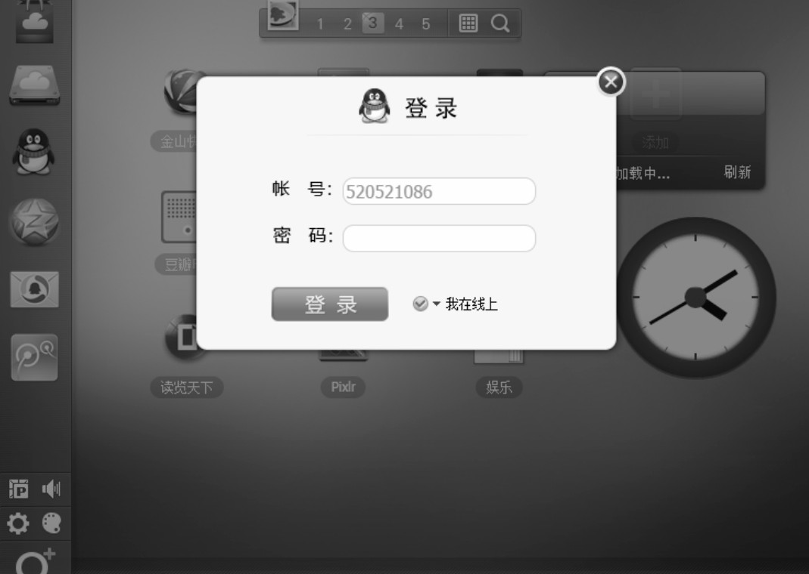

前面我们了解了单例模式的一些实现办法，本节我们来了解惰性单例。

惰性单例指的是在需要的时候才创建对象实例。惰性单例是单例模式的重点，这种技术在实际开发中非常有用，有用的程度可能超出了我们的想象，实际上在本章开头就使用过这种技术，instance 实例对象总是在我们调用 Singleton.getInstance 的时候才被创建，而不是在页面加载好的时候就创建，代码如下：

```javascript
Singleton.getInstance = (function () {
  var instance = null;
  return function (name) {
    if (!instance) {
      instance = new Singleton(name);
    }
    return instance;
  };
})();
```

不过这是基于“类”的单例模式，前面说过，基于“类”的单例模式在 JavaScript 中并不适用，下面我们将以 WebQQ 的登录浮窗为例，介绍与全局变量结合实现惰性的单例。

假设我们是 WebQQ 的开发人员（网址是 web.qq.com），当点击左边导航里 QQ 头像时，会弹出一个登录浮窗（如图 4-1 所示），很明显这个浮窗在页面里总是唯一的，不可能出现同时存在两个登录窗口的情况。图 4-1



第一种解决方案是在页面加载完成的时候便创建好这个 div 浮窗，这个浮窗一开始肯定是隐藏状态的，当用户点击登录按钮的时候，它才开始显示：

```html
<html>
  <body>
    <button id="loginBtn">登录</button>
  </body>

  <script>
    var loginLayer = (function () {
      var div = document.createElement('div');
      div.innerHTML = ’我是登录浮窗’;
      div.style.display = 'none';
      document.body.appendChild(div);
      return div;
    })();

    document.getElementById('loginBtn').onclick = function () {
      loginLayer.style.display = 'block';
    };
  </script>
</html>
```

这种方式有一个问题，也许我们进入 WebQQ 只是玩玩游戏或者看看天气，根本不需要进行登录操作，因为登录浮窗总是一开始就被创建好，那么很有可能将白白浪费一些 DOM 节点。

现在改写一下代码，使用户点击登录按钮的时候才开始创建该浮窗：

```html
<html>
  <body>
    <button id="loginBtn">登录</button>
  </body>

  <script>
    var createLoginLayer = function () {
      var div = document.createElement('div');
      div.innerHTML = ’我是登录浮窗’;
      div.style.display = 'none';
      document.body.appendChild(div);
      return div;
    };

    document.getElementById('loginBtn').onclick = function () {
      var loginLayer = createLoginLayer();
      loginLayer.style.display = 'block';
    };
  </script>
</html>
```

虽然现在达到了惰性的目的，但失去了单例的效果。当我们每次点击登录按钮的时候，都会创建一个新的登录浮窗 div。虽然我们可以在点击浮窗上的关闭按钮时（此处未实现）把这个浮窗从页面中删除掉，但这样频繁地创建和删除节点明显是不合理的，也是不必要的。

也许读者已经想到了，我们可以用一个变量来判断是否已经创建过登录浮窗，这也是本节第一段代码中的做法：

```javascript
var createLoginLayer = (function () {
  var div;
  return function () {
    if (!div) {
      div = document.createElement("div");
      div.innerHTML = "我是登录浮窗";
      div.style.display = "none";
      document.body.appendChild(div);
    }

    return div;
  };
})();
document.getElementById("loginBtn").onclick = function () {
  var loginLayer = createLoginLayer();
  loginLayer.style.display = "block";
};
```
