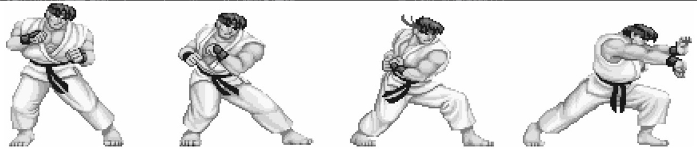

如果让一些不太了解前端开发的程序员来投票，选出他们眼中 JavaScript 语言在 Web 开发中的两大用途，我想结果很有可能是这样的：

- 编写一些让 div 飞来飞去的动画
- 验证表单

虽然这只是一句玩笑话，但从中可以看到动画在 Web 前端开发中的地位。一些别出心裁的动画效果可以让网站增色不少。

有一段时间网页游戏非常流行，HTML5 版本的游戏可以达到不逊于 Flash 游戏的效果。我曾经编写过 HTML5 版本的街头霸王游戏，让游戏的主角跳跃或是移动，实际上只是让这个 div 按照一定的缓动算法进行运动而已。

如果我们明白了怎样让一个小球运动起来，那么离编写一个完整的游戏就不遥远了，剩下的只是一些把逻辑组织起来的体力活。本节并不会从头到尾地编写一个完整的游戏，我们首先要做的是让一个小球按照不同的算法进行运动。

用 JavaScript 实现动画效果的原理跟动画片的制作一样，动画片是把一些差距不大的原画以较快的帧数播放，来达到视觉上的动画效果。在 JavaScript 中，可以通过连续改变元素的某个 CSS 属性，比如 left、top、background-position 来实现动画效果。图 5-1 就是通过改变节点的 background-position，让人物动起来的。



## 5.4.2 思路和一些准备工作

我们目标是编写一个动画类和一些缓动算法，让小球以各种各样的缓动效果在页面中运动。

现在来分析实现这个程序的思路。在运动开始之前，需要提前记录一些有用的信息，至少包括以下信息：

- 动画开始时，小球所在的原始位置；
- 小球移动的目标位置；
- 动画开始时的准确时间点；
- 小球运动持续的时间。

随后，我们会用 setInterval 创建一个定时器，定时器每隔 19ms 循环一次。在定时器的每一帧里，我们会把动画已消耗的时间、小球原始位置、小球目标位置和动画持续的总时间等信息传入缓动算法。该算法会通过这几个参数，计算出小球当前应该所在的位置。最后再更新该 div 对应的 CSS 属性，小球就能够顺利地运动起来了。

## 5.4.3 让小球运动起来

在实现完整的功能之前，我们先了解一些常见的缓动算法，这些算法最初来自 Flash，但可以非常方便地移植到其他语言中。

这些算法都接受 4 个参数，这 4 个参数的含义分别是动画已消耗的时间、小球原始位置、小球目标位置、动画持续的总时间，返回的值则是动画元素应该处在的当前位置。代码如下：

```javascript
var tween = {
  linear: function (t, b, c, d) {
    return (c * t) / d + b;
  },
  easeIn: function (t, b, c, d) {
    return c * (t /= d) * t + b;
  },
  strongEaseIn: function (t, b, c, d) {
    return c * (t /= d) * t * t * t * t + b;
  },
  strongEaseOut: function (t, b, c, d) {
    return c * ((t = t / d - 1) * t * t * t * t + 1) + b;
  },
  sineaseIn: function (t, b, c, d) {
    return c * (t /= d) * t * t + b;
  },
  sineaseOut: function (t, b, c, d) {
    return c * ((t = t / d - 1) * t * t + 1) + b;
  },
};
```

现在我们开始编写完整的代码，下面代码的思想来自 jQuery 库，由于本节的目标是演示策略模式，而非编写一个完整的动画库，因此我们省去了动画的队列控制等更多完整功能。

现在进入代码实现阶段，首先在页面中放置一个 div：

```xml
<body>
  <div style="position:absolute; background:blue" id="div">我是div</div>
</body>
```

接下来定义 Animate 类，Animate 的构造函数接受一个参数：即将运动起来的 dom 节点。Animate 类的代码如下：

```javascript
var Animate = function (dom) {
  this.dom = dom; // 进行运动的dom节点
  this.startTime = 0; // 动画开始时间
  this.startPos = 0; // 动画开始时，dom节点的位置，即dom的初始位置
  this.endPos = 0; // 动画结束时，dom节点的位置，即dom的目标位置
  this.propertyName = null; // dom节点需要被改变的css属性名
  this.easing = null; // 缓动算法
  this.duration = null; // 动画持续时间
};
```

接下来 Animate.prototype.start 方法负责启动这个动画，在动画被启动的瞬间，要记录一些信息，供缓动算法在以后计算小球当前位置的时候使用。在记录完这些信息之后，此方法还要负责启动定时器。代码如下：

```javascript
Animate.prototype.start = function (propertyName, endPos, duration, easing) {
  this.startTime = +new Date(); // 动画启动时间
  this.startPos = this.dom.getBoundingClientRect()[propertyName]; // dom节点初始位置
  this.propertyName = propertyName; // dom节点需要被改变的CSS属性名
  this.endPos = endPos; // dom节点目标位置
  this.duration = duration; // 动画持续时间
  this.easing = tween[easing]; // 缓动算法

  var self = this;
  var timeId = setInterval(function () {
    // 启动定时器，开始执行动画
    if (self.step() === false) {
      // 如果动画已结束，则清除定时器
      clearInterval(timeId);
    }
  }, 19);
};
```

Animate.prototype.start 方法接受以下 4 个参数。

- propertyName：要改变的 CSS 属性名，比如’left'、'top'，分别表示左右移动和上下移动。
- endPos：小球运动的目标位置。
- duration：动画持续时间。
- easing：缓动算法。

再接下来是 Animate.prototype.step 方法，该方法代表小球运动的每一帧要做的事情。在此处，这个方法负责计算小球的当前位置和调用更新 CSS 属性值的方法 Animate.prototype.update。代码如下：

```javascript
Animate.prototype.step = function () {
  var t = +new Date(); // 取得当前时间
  if (t >= this.startTime + this.duration) {
    // (1)
    this.update(this.endPos); // 更新小球的CSS属性值
    return false;
  }
  var pos = this.easing(
    t - this.startTime,
    this.startPos,
    this.endPos - this.startPos,
    this.duration
  );
  // pos为小球当前位置
  this.update(pos); // 更新小球的CSS属性值
};
```

在这段代码中，(1)处的意思是，如果当前时间大于动画开始时间加上动画持续时间之和，说明动画已经结束，此时要修正小球的位置。因为在这一帧开始之后，小球的位置已经接近了目标位置，但很可能不完全等于目标位置。此时我们要主动修正小球的当前位置为最终的目标位置。此外让 Animate.prototype.step 方法返回 false，可以通知 Animate.prototype.start 方法清除定时器。

最后是负责更新小球 CSS 属性值的 Animate.prototype.update 方法：

```javascript
Animate.prototype.update = function (pos) {
  this.dom.style[this.propertyName] = pos + "px";
};
```

如果不嫌麻烦，我们可以进行一些小小的测试：

```javascript
var div = document.getElementById("div");
var animate = new Animate(div);

animate.start("left", 500, 1000, "strongEaseOut");
// animate.start( 'top', 1500, 500, 'strongEaseIn' );
```

通过这段代码，可以看到小球按照我们的期望以各种各样的缓动算法在页面中运动。

本节我们学会了怎样编写一个动画类，利用这个动画类和一些缓动算法就可以让小球运动起来。我们使用策略模式把算法传入动画类中，来达到各种不同的缓动效果，这些算法都可以轻易地被替换为另外一个算法，这是策略模式的经典运用之一。策略模式的实现并不复杂，关键是如何从策略模式的实现背后，找到封装变化、委托和多态性这些思想的价值。
