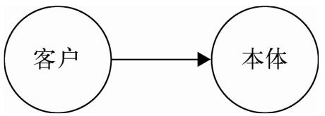
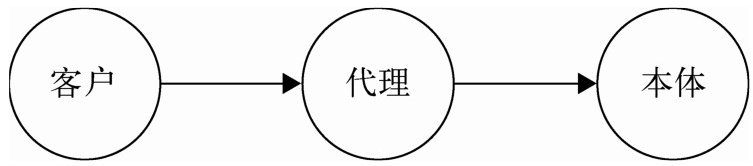

代理模式是为一个对象提供一个代用品或占位符，以便控制对它的访问。

代理模式是一种非常有意义的模式，在生活中可以找到很多代理模式的场景。比如，明星都有经纪人作为代理。如果想请明星来办一场商业演出，只能联系他的经纪人。经纪人会把商业演出的细节和报酬都谈好之后，再把合同交给明星签。

代理模式的关键是，当客户不方便直接访问一个对象或者不满足需要的时候，提供一个替身对象来控制对这个对象的访问，客户实际上访问的是替身对象。替身对象对请求做出一些处理之后，再把请求转交给本体对象。如图 6-1 和图 6-2 所示。

下面我们通过几个例子来详细说明。
