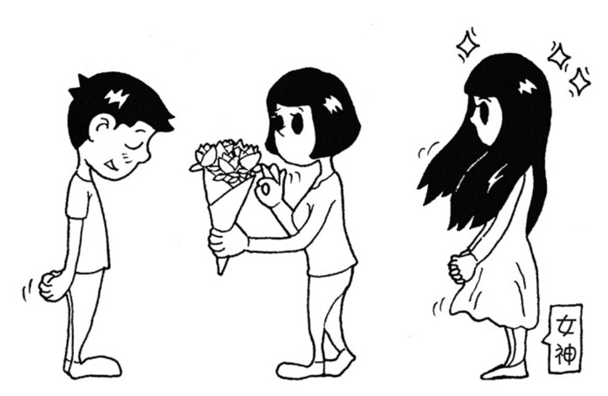

下面我们从一个小例子开始熟悉代理模式的结构。

在四月一个晴朗的早晨，小明遇见了他的百分百女孩，我们暂且称呼小明的女神为 A。两天之后，小明决定给 A 送一束花来表白。刚好小明打听到 A 和他有一个共同的朋友 B，于是内向的小明决定让 B 来代替自己完成送花这件事情。



虽然小明的故事必然以悲剧收场，因为追 MM 更好的方式是送一辆宝马。不管怎样，我们还是先用代码来描述一下小明追女神的过程，先看看不用代理模式的情况：

```javascript
var Flower = function () {};

var xiaoming = {
  sendFlower: function (target) {
    var flower = new Flower();
    target.receiveFlower(flower);
  },
};

var A = {
  receiveFlower: function (flower) {
    console.log("收到花 " + flower);
  },
};

xiaoming.sendFlower(A);
```

接下来，我们引入代理 B，即小明通过 B 来给 A 送花：

```javascript
var Flower = function () {};

var xiaoming = {
  sendFlower: function (target) {
    var flower = new Flower();
    target.receiveFlower(flower);
  },
};

var B = {
  receiveFlower: function (flower) {
    A.receiveFlower(flower);
  },
};

var A = {
  receiveFlower: function (flower) {
    console.log("收到花 " + flower);
  },
};

xiaoming.sendFlower(B);
```

很显然，执行结果跟第一段代码一致，至此我们就完成了一个最简单的代理模式的编写。

也许读者会疑惑，小明自己去送花和代理 B 帮小明送花，二者看起来并没有本质的区别，引入一个代理对象看起来只是把事情搞复杂了而已。

的确，此处的代理模式毫无用处，它所做的只是把请求简单地转交给本体。但不管怎样，我们开始引入了代理，这是一个不错的起点。

现在我们改变故事的背景设定，假设当 A 在心情好的时候收到花，小明表白成功的几率有 60%，而当 A 在心情差的时候收到花，小明表白的成功率无限趋近于 0。

小明跟 A 刚刚认识两天，还无法辨别 A 什么时候心情好。如果不合时宜地把花送给 A，花被直接扔掉的可能性很大，这束花可是小明吃了 7 天泡面换来的。

但是 A 的朋友 B 却很了解 A，所以小明只管把花交给 B, B 会监听 A 的心情变化，然后选择 A 心情好的时候把花转交给 A，代码如下：

```javascript
var Flower = function () {};

var xiaoming = {
  sendFlower: function (target) {
    var flower = new Flower();
    target.receiveFlower(flower);
  },
};

var B = {
  receiveFlower: function (flower) {
    A.listenGoodMood(function () {
      // 监听A的好心情
      A.receiveFlower(flower);
    });
  },
};

var A = {
  receiveFlower: function (flower) {
    console.log("收到花 " + flower);
  },
  listenGoodMood: function (fn) {
    setTimeout(function () {
      // 假设10秒之后A的心情变好
      fn();
    }, 10000);
  },
};

xiaoming.sendFlower(B);
```
