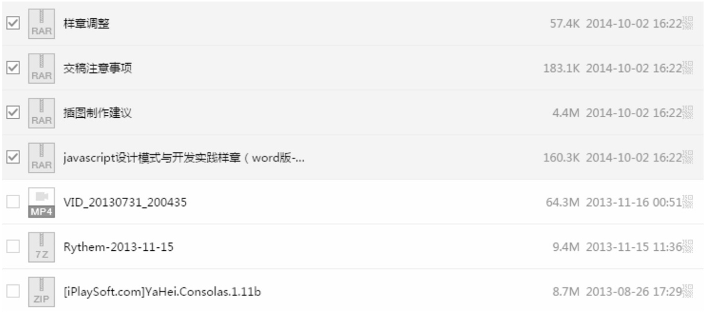

先想象这样一个场景：每周我们都要写一份工作周报，周报要交给总监批阅。总监手下管理着 150 个员工，如果我们每个人直接把周报发给总监，那总监可能要把一整周的时间都花在查看邮件上面。

现在我们把周报发给各自的组长，组长作为代理，把组内成员的周报合并提炼成一份后一次性地发给总监。这样一来，总监的邮箱便清净多了。

这个例子在程序世界里很容易引起共鸣，在 Web 开发中，也许最大的开销就是网络请求。假设我们在做一个文件同步的功能，当我们选中一个 checkbox 的时候，它对应的文件就会被同步到另外一台备用服务器上面，如图 6-3 所示。



我们先在页面中放置好这些 checkbox 节点：

```html
<body>
  <input type="checkbox" id="1"></input>1
  <input type="checkbox" id="2"></input>2
  <input type="checkbox" id="3"></input>3
  <input type="checkbox" id="4"></input>4
  <input type="checkbox" id="5"></input>5
  <input type="checkbox" id="6"></input>6
  <input type="checkbox" id="7"></input>7
  <input type="checkbox" id="8"></input>8
  <input type="checkbox" id="9"></input>9
</body>
```

接下来，给这些 checkbox 绑定点击事件，并且在点击的同时往另一台服务器同步文件：

```javascript
var synchronousFile = function (id) {
  console.log("开始同步文件，id为： " + id);
};

var checkbox = document.getElementsByTagName("input");

for (var i = 0, c; (c = checkbox[i++]); ) {
  c.onclick = function () {
    if (this.checked === true) {
      synchronousFile(this.id);
    }
  };
}
```

当我们选中 3 个 checkbox 的时候，依次往服务器发送了 3 次同步文件的请求。而点击一个 checkbox 并不是很复杂的操作，作为 APM250+的资深 Dota 玩家，我有把握一秒钟之内点中 4 个 checkbox。可以预见，如此频繁的网络请求将会带来相当大的开销。

解决方案是，我们可以通过一个代理函数 proxySynchronousFile 来收集一段时间之内的请求，最后一次性发送给服务器。比如我们等待 2 秒之后才把这 2 秒之内要同步的文件 ID 打包发给服务器，如果不是对实时性要求非常高的系统，2 秒的延迟不会带来太大副作用，却能大大减轻服务器的压力。代码如下：

```javascript
var synchronousFile = function (id) {
  console.log("开始同步文件，id为： " + id);
};

var proxySynchronousFile = (function () {
  var cache = [], // 保存一段时间内需要同步的ID
    timer; // 定时器

  return function (id) {
    cache.push(id);
    if (timer) {
      // 保证不会覆盖已经启动的定时器
      return;
    }

    timer = setTimeout(function () {
      synchronousFile(cache.join(", ")); // 2秒后向本体发送需要同步的ID集合
      clearTimeout(timer); // 清空定时器
      timer = null;
      cache.length = 0; // 清空ID集合
    }, 2000);
  };
})();

var checkbox = document.getElementsByTagName("input");

for (var i = 0, c; (c = checkbox[i++]); ) {
  c.onclick = function () {
    if (this.checked === true) {
      proxySynchronousFile(this.id);
    }
  };
}
```
