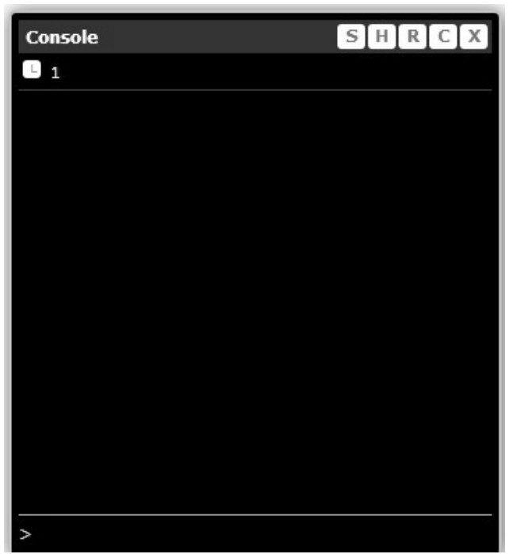

我曾经写过一个 mini 控制台的开源项目 miniConsole.js，这个控制台可以帮助开发者在 IE 浏览器以及移动端浏览器上进行一些简单的调试工作。调用方式很简单：

```javascript
miniConsole.log(1);
```

这句话会在页面中创建一个 div，并且把 log 显示在 div 里面，如图 6-4 所示。



miniConsole.js 的代码量大概有 1000 行左右，也许我们并不想一开始就加载这么大的 JS 文件，因为也许并不是每个用户都需要打印 log。我们希望在有必要的时候才开始加载它，比如当用户按下 F2 来主动唤出控制台的时候。

在 miniConsole.js 加载之前，为了能够让用户正常地使用里面的 API，通常我们的解决方案是用一个占位的 miniConsole 代理对象来给用户提前使用，这个代理对象提供给用户的接口，跟实际的 miniConsole 是一样的。

用户使用这个代理对象来打印 log 的时候，并不会真正在控制台内打印日志，更不会在页面中创建任何 DOM 节点。即使我们想这样做也无能为力，因为真正的 miniConsole.js 还没有被加载。

于是，我们可以把打印 log 的请求都包裹在一个函数里面，这个包装了请求的函数就相当于其他语言中命令模式中的 Command 对象。随后这些函数将全部被放到缓存队列中，这些逻辑都是在 miniConsole 代理对象中完成实现的。等用户按下 F2 唤出控制台的时候，才开始加载真正的 miniConsole.js 的代码，加载完成之后将遍历 miniConsole 代理对象中的缓存函数队列，同时依次执行它们。

当然，请求的到底是什么对用户来说是不透明的，用户并不清楚它请求的是代理对象，所以他可以在任何时候放心地使用 miniConsole 对象。

未加载真正的 miniConsole.js 之前的代码如下：

```javascript
var cache = [];

var miniConsole = {
  log: function () {
    var args = arguments;
    cache.push(function () {
      return miniConsole.log.apply(miniConsole, args);
    });
  },
};

miniConsole.log(1);
```

当用户按下 F2 时，开始加载真正的 miniConsole.js，代码如下：

```javascript
var handler = function (ev) {
  if (ev.keyCode === 113) {
    var script = document.createElement("script");
    script.onload = function () {
      for (var i = 0, fn; (fn = cache[i++]); ) {
        fn();
      }
    };
    script.src = "miniConsole.js";
    document.getElementsByTagName("head")[0].appendChild(script);
  }
};

document.body.addEventListener("keydown", handler, false);

// miniConsole.js代码：

miniConsole = {
  log: function () {
    // 真正代码略
    console.log(Array.prototype.join.call(arguments));
  },
};
```

虽然我们没有给出 miniConsole.js 的真正代码，但这不影响我们理解其中的逻辑。当然这里还要注意一个问题，就是我们要保证在 F2 被重复按下的时候，miniConsole.js 只被加载一次。另外我们整理一下 miniConsole 代理对象的代码，使它成为一个标准的虚拟代理对象，代码如下：

```javascript
var miniConsole = (function () {
  var cache = [];
  var handler = function (ev) {
    if (ev.keyCode === 113) {
      var script = document.createElement("script");
      script.onload = function () {
        for (var i = 0, fn; (fn = cache[i++]); ) {
          fn();
        }
      };
      script.src = "miniConsole.js";
      document.getElementsByTagName("head")[0].appendChild(script);
      document.body.removeEventListener("keydown", handler); // 只加载一次miniConsole.js
    }
  };

  document.body.addEventListener("keydown", handler, false);

  return {
    log: function () {
      var args = arguments;
      cache.push(function () {
        return miniConsole.log.apply(miniConsole, args);
      });
    },
  };
})();

miniConsole.log(11); // 开始打印log

// miniConsole.js代码

miniConsole = {
  log: function () {
    // 真正代码略
    console.log(Array.prototype.join.call(arguments));
  },
};
```
