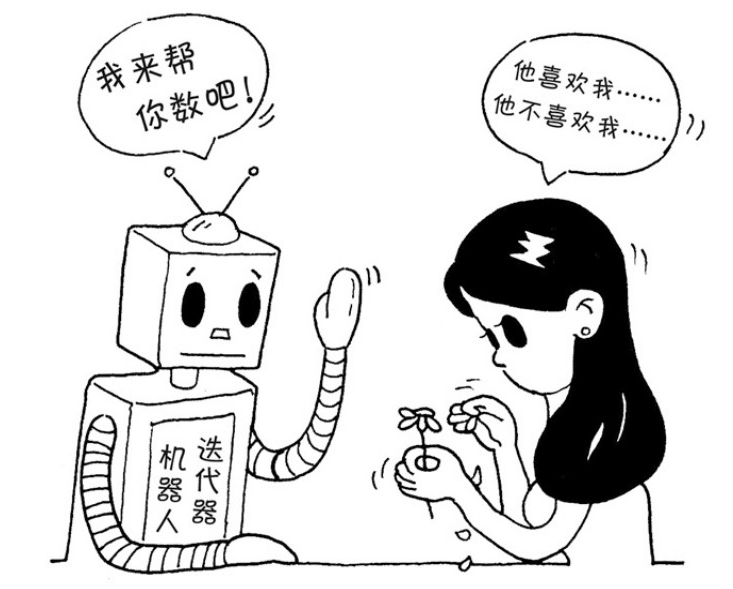

迭代器模式是指提供一种方法顺序访问一个聚合对象中的各个元素，而又不需要暴露该对象的内部表示。迭代器模式可以把迭代的过程从业务逻辑中分离出来，在使用迭代器模式之后，即使不关心对象的内部构造，也可以按顺序访问其中的每个元素。

目前，恐怕只有在一些“古董级”的语言中才会为实现一个迭代器模式而烦恼，现在流行的大部分语言如 Java、Ruby 等都已经有了内置的迭代器实现，许多浏览器也支持 JavaScript 的 Array.prototype.forEach。
