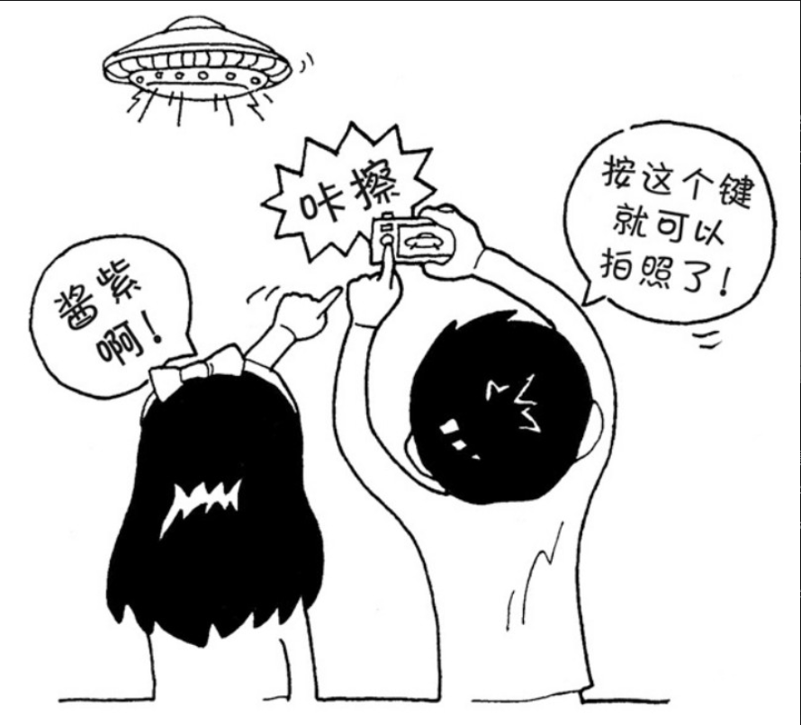
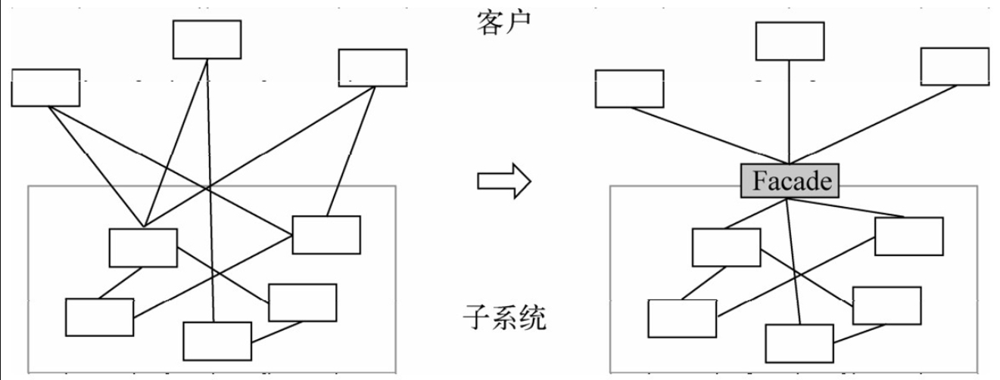

最少知识原则在设计模式中体现得最多的地方是中介者模式和外观模式，下面我们分别进行介绍。

## 1．中介者模式

在第14章我们曾讲过一个博彩公司的例子。

在世界杯期间购买足球彩票，如果没有博彩公司作为中介，上千万的人一起计算赔率和输赢绝对是不可能的事情。博彩公司作为中介，每个人都只和博彩公司发生关联，博彩公司会根据所有人的投注情况计算好赔率，彩民们赢了钱就从博彩公司拿，输了钱就赔给博彩公司。

中介者模式很好地体现了最少知识原则。通过增加一个中介者对象，让所有的相关对象都通过中介者对象来通信，而不是互相引用。所以，当一个对象发生改变时，只需要通知中介者对象即可。

## 2．外观模式



我们在第二部分没有提到外观模式，是因为外观模式在JavaScript中的使用场景并不多。外观模式主要是为子系统中的一组接口提供一个一致的界面，外观模式定义了一个高层接口，这个接口使子系统更加容易使用，如图19-1所示。



外观模式的作用是对客户屏蔽一组子系统的复杂性。外观模式对客户提供一个简单易用的高层接口，高层接口会把客户的请求转发给子系统来完成具体的功能实现。大多数客户都可以通过请求外观接口来达到访问子系统的目的。但在一段使用了外观模式的程序中，请求外观并不是强制的。如果外观不能满足客户的个性化需求，那么客户也可以选择越过外观来直接访问子系统。

拿全自动洗衣机的一键洗衣按钮举例，这个一键洗衣按钮就是一个外观。如果是老式洗衣机，客户要手动选择浸泡、洗衣、漂洗、脱水这4个步骤。如果这种洗衣机被淘汰了，新式洗衣机的漂洗方式发生了改变，那我们还得学习新的漂洗方式。而全自动洗衣机的好处很明显，不管洗衣机内部如何进化，客户要操作的，始终只是一个一键洗衣的按钮。这个按钮就是为一组子系统所创建的外观。但如果一键洗衣程序设定的默认漂洗时间是20分钟，而客户希望这个漂洗时间是30分钟，那么客户自然可以选择越过一键洗衣程序，自己手动来控制这些“子系统”运转。

外观模式容易跟普通的封装实现混淆。这两者都封装了一些事物，但外观模式的关键是定义一个高层接口去封装一组“子系统”。子系统在C++或者Java中指的是一组类的集合，这些类相互协作可以组成系统中一个相对独立的部分。在JavaScript中我们通常不会过多地考虑“类”，如果将外观模式映射到JavaScript中，这个子系统至少应该指的是一组函数的集合。

```javascript
var A = function () {
  a1();
  a2();
};

var B = function () {
  b1();
  b2();
};

var facade = function () {
  A();
  B();
};

facade();
```

许多JavaScript设计模式的图书或者文章喜欢把jQuery的$.ajax函数当作外观模式的实现，这是不合适的。如果$.ajax函数属于外观模式，那几乎所有的函数都可以被称为“外观模式”。问题是我们根本没有办法越过$.ajax“外观”去直接使用该函数中的某一段语句。

现在再来看看外观模式和最少知识原则之间的关系。外观模式的作用主要有两点。

- 为一组子系统提供一个简单便利的访问入口。
- 隔离客户与复杂子系统之间的联系，客户不用去了解子系统的细节。

从第二点来，外观模式是符合最少知识原则的。比如全自动洗衣机的一键洗衣按钮，隔开了客户和浸泡、洗衣、漂洗、脱水这些子系统的直接联系，客户不用去了解这些子系统的具体实现。

假设我们在编写这个老式洗衣机的程序，客户至少要和浸泡、洗衣、漂洗、脱水这4个子系统打交道。如果其中的一个子系统发生了改变，那么客户的调用代码就得发生改变。而通过外观将客户和这些子系统隔开之后，如果修改子系统内部，只要外观不变，就不会影响客户的调用。同样，对外观的修改也不会影响到子系统，它们可以分别变化而互不影响。
