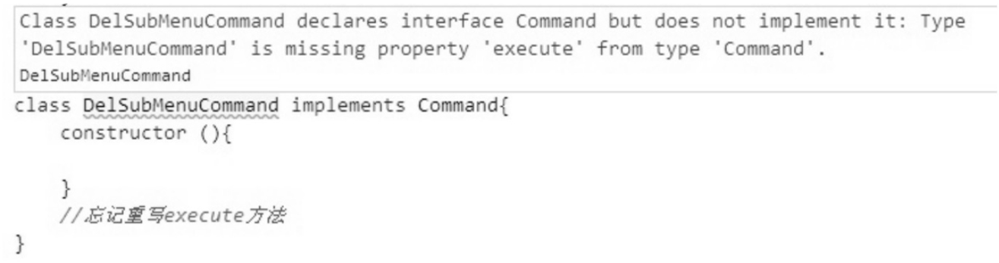

虽然在大多数时候interface给JavaScript开发带来的价值并不像在静态类型语言中那么大，但如果我们正在编写一个复杂的应用，还是会经常怀念接口的帮助。

下面我们以基于命令模式的示例来说明interface如何规范程序员的代码编写，这段代码本身并没有什么实用价值，在JavaScript中，我们一般用闭包和高阶函数来实现命令模式。

假设我们正在编写一个用户界面程序，页面中有成百上千个子菜单。因为项目很复杂，我们决定让整个程序都基于命令模式来编写，即编写菜单集合界面的是某个程序员，而负责实现每个子菜单具体功能的工作交给了另外一些程序员。

那些负责实现子菜单功能的程序员，在完成自己的工作之后，会把子菜单封装成一个命令对象，然后把这个命令对象交给编写菜单集合界面的程序员。他们已经约定好，当调用子菜单对象的execute方法时，会执行对应的子菜单命令。

虽然在开发文档中详细注明了每个子菜单对象都必须有自己的execute方法，但还是有一个粗心的JavaScript程序员忘记给他负责的子菜单对象实现execute方法，于是当执行这个命令的时候，便会报出错误，代码如下：

```html
<html>

<body>
  <button id="exeCommand">执行菜单命令</button>
  <script>
    var RefreshMenuBarCommand = function () { };

    RefreshMenuBarCommand.prototype.execute = function () {
      console.log('刷新菜单界面');
    };

    var AddSubMenuCommand = function () { };

    AddSubMenuCommand.prototype.execute = function () {
      console.log('增加子菜单');
    };

    var DelSubMenuCommand = function () { };

    /*****没有实现DelSubMenuCommand.prototype.execute *****/
    // DelSubMenuCommand.prototype.execute = function(){

    // };

    var refreshMenuBarCommand = new RefreshMenuBarCommand(),
      addSubMenuCommand = new AddSubMenuCommand(),
      delSubMenuCommand = new DelSubMenuCommand();

    var setCommand = function (command) {
      document.getElementById('exeCommand').onclick = function () {
        command.execute();
      }
    };

    setCommand(refreshMenuBarCommand);
    // 点击按钮后输出："刷新菜单界面"
    setCommand(addSubMenuCommand);
    // 点击按钮后输出："增加子菜单"
    setCommand(delSubMenuCommand);
    // 点击按钮后报错。Uncaught TypeError: undefined is not a function

  </script>
</body>

</html>
```

为了防止粗心的程序员忘记给某个子命令对象实现execute方法，我们只能在高层函数里添加一些防御性的代码，这样当程序在最终被执行的时候，有可能抛出异常来提醒我们，代码如下：

```javascript
var setCommand = function (command) {
  document.getElementById("exeCommand").onclick = function () {
    if (typeof command.execute !== "function") {
      throw new Error("command对象必须实现execute方法");
    }
    command.execute();
  };
};
```

如果确实不喜欢重复编写这些防御性代码，我们还可以尝试使用TypeScript来编写这个程序。

TypeScript是微软开发的一种编程语言，是JavaScript的一个超集。跟CoffeeScript类似，TypeScript代码最终会被编译成原生的JavaScript代码执行。通过TypeScript，我们可以使用静态语言的方式来编写JavaScript程序。用TypeScript来实现一些设计模式，显得更加原汁原味。

TypeScript目前的版本还没有提供对抽象类的支持，但是提供了interface。下面我们就来编写一个TypeScript版本的命令模式。

首先定义Command接口：

```typescript
        interface Command{
            execute: Function;
        }
```

接下来定义RefreshMenuBarCommand、AddSubMenuCommand和DelSubMenuCommand这3个类，它们分别都实现了Command接口，这可以保证它们都拥有execute方法：

```typescript
class RefreshMenuBarCommand implements Command {
  constructor() {}
  execute() {
    console.log("刷新菜单界面");
  }
}

class AddSubMenuCommand implements Command {
  constructor() {}
  execute() {
    console.log("增加子菜单");
  }
}

class DelSubMenuCommand implements Command {
  constructor() {}
  // 忘记重写execute方法
}

var refreshMenuBarCommand = new RefreshMenuBarCommand(),
  addSubMenuCommand = new AddSubMenuCommand(),
  delSubMenuCommand = new DelSubMenuCommand();

refreshMenuBarCommand.execute(); // 输出：刷新菜单界面
addSubMenuCommand.execute(); // 输出：增加子菜单
delSubMenuCommand.execute(); // 输出：Uncaught TypeError: undefined is not a function
```

如图21-1所示，当我们忘记在DelSubMenuCommand类中重写execute方法时，TypeScript提供的编译器及时给出了错误提示。



这段TypeScript代码翻译过来的JavaScript代码如下：

```javascript
var RefreshMenuBarCommand = (function () {
  function RefreshMenuBarCommand() {}
  RefreshMenuBarCommand.prototype.execute = function () {
    console.log("刷新菜单界面");
  };
  return RefreshMenuBarCommand;
})();

var AddSubMenuCommand = (function () {
  function AddSubMenuCommand() {}
  AddSubMenuCommand.prototype.execute = function () {
    console.log("增加子菜单");
  };
  return AddSubMenuCommand;
})();
var DelSubMenuCommand = (function () {
  function DelSubMenuCommand() {}
  return DelSubMenuCommand;
})();
var refreshMenuBarCommand = new RefreshMenuBarCommand(),
  addSubMenuCommand = new AddSubMenuCommand(),
  delSubMenuCommand = new DelSubMenuCommand();
refreshMenuBarCommand.execute();
addSubMenuCommand.execute();
delSubMenuCommand.execute();
```


