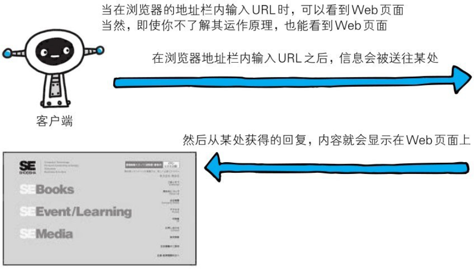

你知道当我们在网页浏览器(Web browser)的地址栏中输入URL时，Web页面是如何呈现的吗？

Web页面当然不能凭空显示出来。根据Web浏览器地址栏中指定的URL,Web浏览器从Web服务器端获取文件资源(resource)等信息，从而显示出Web页面。

像这种通过发送请求获取服务器资源的Web浏览器等，都可称为客户端(client)。

Web使用一种名为HTTP（HyperText Transfer Protocol，超文本传输协议）的协议作为规范，完成从客户端到服务器端等一系列运作流程。而协议是指规则的约定。可以说，Web是建立在HTTP协议上通信的。
