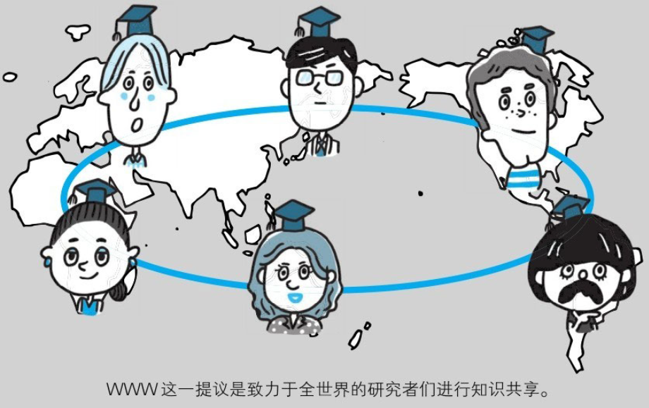

在深入学习HTTP之前，我们先来介绍一下HTTP诞生的背景。了解背景的同时也能了解当初制定HTTP的初衷，这样有助于我们更好地理解。

## 1.2.1　为知识共享而规划Web

1989年3月，互联网还只属于少数人。在这一互联网的黎明期，HTTP诞生了。

CERN（欧洲核子研究组织）的蒂姆·伯纳斯-李(Tim Berners-Lee)博士提出了一种能让远隔两地的研究者们共享知识的设想。

最初设想的基本理念是：借助多文档之间相互关联形成的超文本(HyperText)，连成可相互参阅的WWW（World Wide Web，万维网）。

现在已提出了3项WWW构建技术，分别是：把SGML（StandardGeneralized Markup Language，标准通用标记语言）作为页面的文本标记语言的HTML（HyperText Markup Language，超文本标记语言）；作为文档传递协议的HTTP；指定文档所在地址的URL（UniformResource Locator，统一资源定位符）。

WWW这一名称，是Web浏览器当年用来浏览超文本的客户端应用程序时的名称。现在则用来表示这一系列的集合，也可简称为Web。

## 1.2.2　Web成长时代

1990年11月，CERN成功研发了世界上第一台Web服务器和Web浏览器。两年后的1992年9月，日本第一个网站的主页上线了。

### 日本第一个主页

http://www.ibarakiken.gr.jp/www/

1990年，大家针对HTML 1.0草案进行了讨论，因HTML 1.0中存在多处模糊不清的部分，草案被直接废弃了。

### HTML1.0

1993年1月，现代浏览器的祖先NCSA（National Center forSupercomputer Applications，美国国家超级计算机应用中心）研发的Mosaic问世了。它以in-line（内联）等形式显示HTML的图像，在图像方面出色的表现使它迅速在世界范围内流行开来。

同年秋天，Mosaic的Windows版和Macintosh版面世。使用CGI技术的NCSA Web服务器、NCSA HTTPd 1.0也差不多是在这个时期出现的。

### NCSA Mosaic bounce page

http://archive.ncsa.illinois.edu/mosaic.html

###  The NCSA HTTPd Home Page（存档）

http://web.archive.org/web/20090426182129/http://hoohoo.ncsa.illinois.edu/（原址已失效）

1994年的12月，网景通信公司发布了Netscape Navigator 1.0,1995年微软公司发布Internet Explorer 1.0和2.0。

紧随其后的是现在已然成为Web服务器标准之一的Apache，当时它以Apache 0.2的姿态出现在世人眼前。而HTML也发布了2.0版本。那一年，Web技术的发展突飞猛进。

时光流转，从1995年左右起，微软公司与网景通信公司之间爆发的浏览器大战愈演愈烈。两家公司都各自对HTML做了扩展，于是导致在写HTML页面时，必须考虑兼容他们两家公司的浏览器。时至今日，这个问题仍令那些写前端页面的工程师感到棘手。

在这场浏览器供应商之间的竞争中，他们不仅对当时发展中的各种Web标准化视而不见，还屡次出现新增功能没有对应说明文档的情况。

2000年前后，这场浏览器战争随着网景通信公司的衰落而暂告一段落。但就在2004年，Mozilla基金会发布了Firefox浏览器，第二次浏览器大战随即爆发。

Internet Explorer浏览器的版本从6升到7前后花费了5年时间。之后接连不断地发布了8、9、10版本。另外，Chrome、Opera、Safari等浏览器也纷纷抢占市场份额。

## 1.2.3　驻足不前的HTTP

### HTTP/0.9

HTTP于1990年问世。那时的HTTP并没有作为正式的标准被建立。这时的HTTP其实含有HTTP/1.0之前版本的意思，因此被称为HTTP/0.9。

### HTTP/1.0

HTTP正式作为标准被公布是在1996年的5月，版本被命名为HTTP/1.0，并记载于RFC1945。虽说是初期标准，但该协议标准至今仍被广泛使用在服务器端。

**RFC1945- Hypertext Transfer Protocol -- HTTP/1.0**

http://www.ietf.org/rfc/rfc1945.txt

### HTTP/1.1

1997年1月公布的HTTP/1.1是目前主流的HTTP协议版本。当初的标准是RFC2068，之后发布的修订版RFC2616就是当前的最新版本。

**RFC2616- Hypertext Transfer Protocol -- HTTP/1.1**

http://www.ietf.org/rfc/rfc2616.txt

可见，作为Web文档传输协议的HTTP，它的版本几乎没有更新。新一代HTTP/2.0正在制订中，但要达到较高的使用覆盖率，仍需假以时日。

当年HTTP协议的出现主要是为了解决文本传输的难题。由于协议本身非常简单，于是在此基础上设想了很多应用方法并投入了实际使用。现在HTTP协议已经超出了Web这个框架的局限，被运用到了各种场景里。
