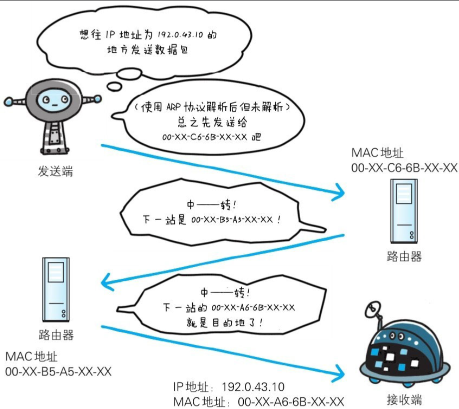
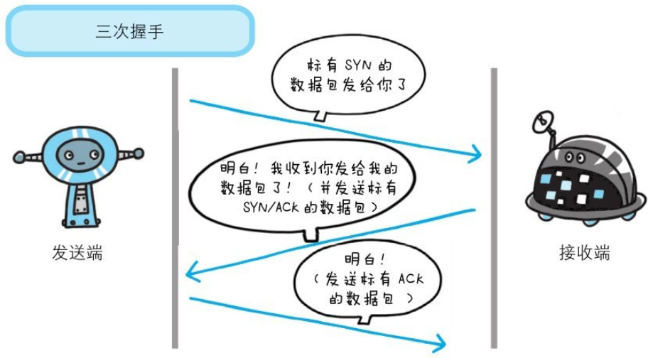

下面我们分别针对在TCP/IP协议族中与HTTP密不可分的3个协议（IP、TCP和DNS）进行说明。

## 1.4.1　负责传输的IP协议

按层次分，IP(Internet Protocol)网际协议位于网络层。Internet Protocol这个名称可能听起来有点夸张，但事实正是如此，因为几乎所有使用网络的系统都会用到IP协议。TCP/IP协议族中的IP指的就是网际协议，协议名称中占据了一半位置，其重要性可见一斑。可能有人会把“IP”和“IP地址”搞混，“IP”其实是一种协议的名称。

IP协议的作用是把各种数据包传送给对方。而要保证确实传送到对方那里，则需要满足各类条件。其中两个重要的条件是IP地址和MAC地址(Media Access Control Address)。

IP地址指明了节点被分配到的地址，MAC地址是指网卡所属的固定地址。IP地址可以和MAC地址进行配对。IP地址可变换，但MAC地址基本上不会更改。

### 使用ARP协议凭借MAC地址进行通信

IP间的通信依赖MAC地址。在网络上，通信的双方在同一局域网(LAN)内的情况是很少的，通常是经过多台计算机和网络设备中转才能连接到对方。而在进行中转时，会利用下一站中转设备的MAC地址来搜索下一个中转目标。这时，会采用ARP协议(Address Resolution Protocol)。ARP是一种用以解析地址的协议，根据通信方的IP地址就可以反查出对应的MAC地址。

### 没有人能够全面掌握互联网中的传输状况

在到达通信目标前的中转过程中，那些计算机和路由器等网络设备只能获悉很粗略的传输路线。

这种机制称为路由选择(routing)，有点像快递公司的送货过程。想要寄快递的人，只要将自己的货物送到集散中心，就可以知道快递公司是否肯收件发货，该快递公司的集散中心检查货物的送达地址，明确下站该送往哪个区域的集散中心。接着，那个区域的集散中心自会判断是否能送到对方的家中。

我们是想通过这个比喻说明，无论哪台计算机、哪台网络设备，它们都无法全面掌握互联网中的细节。

## 1.4.2　确保可靠性的TCP协议

按层次分，TCP位于传输层，提供可靠的字节流服务。

所谓的字节流服务(Byte Stream Service)是指，为了方便传输，将大块数据分割成以报文段(segment)为单位的数据包进行管理。而可靠的传输服务是指，能够把数据准确可靠地传给对方。一言以蔽之，TCP协议为了更容易传送大数据才把数据分割，而且TCP协议能够确认数据最终是否送达到对方。

### 确保数据能到达目标

为了准确无误地将数据送达目标处，TCP协议采用了三次握手(three-wayhandshaking)策略。用TCP协议把数据包送出去后，TCP不会对传送后的情况置之不理，它一定会向对方确认是否成功送达。握手过程中使用了TCP的标志(flag)——SYN(synchronize)和ACK(acknowledgement)。

发送端首先发送一个带SYN标志的数据包给对方。接收端收到后，回传一个带有SYN/ACK标志的数据包以示传达确认信息。最后，发送端再回传一个带ACK标志的数据包，代表“握手”结束。

若在握手过程中某个阶段莫名中断，TCP协议会再次以相同的顺序发送相同的数据包。

除了上述三次握手，TCP协议还有其他各种手段来保证通信的可靠性。
