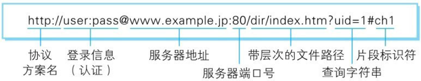

与URI（统一资源标识符）相比，我们更熟悉URL（Uniform ResourceLocator，统一资源定位符）。URL正是使用Web浏览器等访问Web页面时需要输入的网页地址。比如，下图的http://hackr.jp/就是URL。


## 1.7.1　统一资源标识符

URI是Uniform Resource Identifier的缩写。RFC2396分别对这3个单词进行了如下定义。

### Uniform

规定统一的格式可方便处理多种不同类型的资源，而不用根据上下文环境来识别资源指定的访问方式。另外，加入新增的协议方案（如http：或ftp:）也更容易。

### Resource

资源的定义是“可标识的任何东西”。不仅是文档文件，图像或服务（例如当天的天气预报）等能够区别于其他类型的，全都可作为资源。另外，资源不仅可以是单一的，也可以是多数的集合体。

### Identifier

表示可标识的对象。也称为标识符。

综上所述，URI就是由某个协议方案表示的资源的定位标识符。协议方案是指访问资源所使用的协议类型名称。

采用HTTP协议时，协议方案就是http。除此之外，还有ftp、mailto、telnet、file等。标准的URI协议方案有30种左右，由隶属于国际互联网资源管理的非营利社团ICANN（Internet Corporation for AssignedNames and Numbers，互联网名称与数字地址分配机构）的IANA（Internet Assigned Numbers Authority，互联网号码分配局）管理颁布。

### IANA - Uniform Resource Identifier (URI) SCHEMES（统一资源标识符方案）

http://www.iana.org/assignments/uri-schemes

URI用字符串标识某一互联网资源，而URL表示资源的地点（互联网上所处的位置）。可见URL是URI的子集。

“RFC3986：统一资源标识符(URI)通用语法”中列举了几种URI例子，如下所示。

```
    ftp://ftp.is.co.za/rfc/rfc1808.txt
    http://www.ietf.org/rfc/rfc2396.txt
    ldap://[2001:db8::7]/c=GB?objectClass?one
    mailto:John.Doe@example.com
    news:comp.infosystems.www.servers.unix
    tel:+1-816-555-1212
    telnet://192.0.2.16:80/
    urn:oasis:names:specification:docbook:dtd:xml:4.1.2
```

本书接下来的章节中会频繁出现URI这个术语，在充分理解的基础上，也可用URL替换URI。

## 1.7.2　URI格式

表示指定的URI，要使用涵盖全部必要信息的绝对URI、绝对URL以及相对URL。相对URL，是指从浏览器中基本URI处指定的URL，形如

/image/logo.gif。

让我们先来了解一下绝对URI的格式。



使用http：或https：等协议方案名获取访问资源时要指定协议类型。不区分字母大小写，最后附一个冒号(:)。

也可使用data：或javascript：这类指定数据或脚本程序的方案名。

### 登录信息（认证）

指定用户名和密码作为从服务器端获取资源时必要的登录信息（身份认证）。此项是可选项。

### 服务器地址

使用绝对URI必须指定待访问的服务器地址。地址可以是类似hackr.jp这种DNS可解析的名称，或是192.168.1.1这类IPv4地址名，还可以是[0:0:0:0:0:0:0:1]这样用方括号括起来的IPv6地址名。

### 服务器端口号

指定服务器连接的网络端口号。此项也是可选项，若用户省略则自动使用默认端口号。

### 带层次的文件路径

指定服务器上的文件路径来定位特指的资源。这与UNIX系统的文件目录结构相似。

### 查询字符串

针对已指定的文件路径内的资源，可以使用查询字符串传入任意参数。此项可选。

### 片段标识符

使用片段标识符通常可标记出已获取资源中的子资源（文档内的某个位置）。但在RFC中并没有明确规定其使用方法。该项也为可选项。

```
并不是所有的应用程序都符合RFC

有一些用来制定HTTP协议技术标准的文档，它们被称为RFC（Request for Comments，征求修正意见书）。

通常，应用程序会遵照由RFC确定的标准实现。可以说，RFC是互联网的设计文档，要是不按照RFC标准执行，就有可能导致无法通信的状况。比如，有一台Web服务器内的应用服务没有遵照RFC的标准实现，那Web浏览器就很可能无法访问这台服务器了。

由于不遵照RFC标准实现就无法进行HTTP协议通信，所以基本上客户端和服务器端都会以RFC为标准来实现HTTP协议。但也存在某些应用程序因客户端或服务器端的不同，而未遵照RFC标准，反而将自成一套的“标准”扩展的情况。
```

不按RFC标准来实现，当然也不必劳心费力让自己的“标准”符合其他所有的客户端和服务器端。但设想一下，如果这款应用程序的使用者非常多，那会发生什么情况？不难想象，其他的客户端或服务器端必然都不得不去配合它。

实际在互联网上，已经实现了HTTP协议的一些服务器端和客户端里就存在上述情况。说不定它们会与本书介绍的HTTP协议的实现情况不一样。

本书接下来要介绍的HTTP协议内容，除去部分例外，基本上都以RFC的标准为准。
