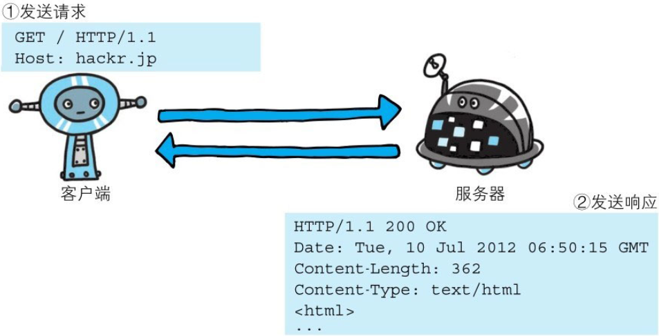
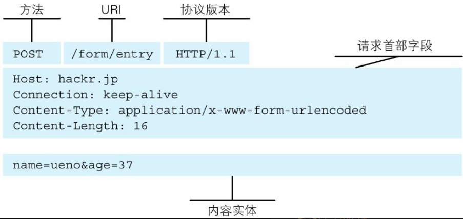
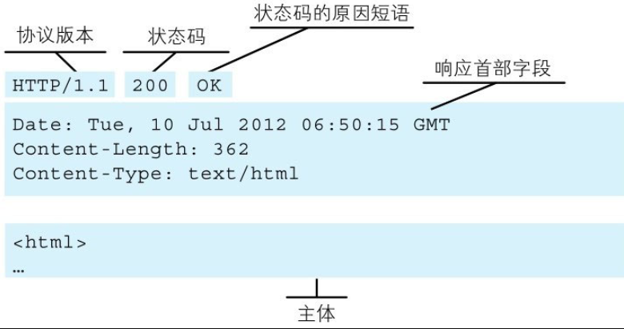

HTTP协议规定，请求从客户端发出，最后服务器端响应该请求并返回。换句话说，肯定是先从客户端开始建立通信的，服务器端在没有接收到请求之前不会发送响应。

下面，我们来看一个具体的示例。



下面则是从客户端发送给某个HTTP服务器端的请求报文中的内容。

```
    GET /index.htm HTTP/1.1
    Host:hackr.jp
```

起始行开头的GET表示请求访问服务器的类型，称为方法(method)。随后的字符串/index.htm指明了请求访问的资源对象，也叫做请求URI(request-URI)。最后的HTTP/1.1，即HTTP的版本号，用来提示客户端使用的HTTP协议功能。

综合来看，这段请求内容的意思是：请求访问某台HTTP服务器上的/index.htm页面资源。

请求报文是由请求方法、请求URI、协议版本、可选的请求首部字段和内容实体构成的。



请求首部字段及内容实体稍后会作详细说明。接下来，我们继续讲解。接收到请求的服务器，会将请求内容的处理结果以响应的形式返回。

```ruby
    HTTP/1.1200 OK
    Date:Tue,10 Jul 2012 06:50:15 GMT
    Content-Length:362
    Content-Type:text/html
    <html>
    ……
```

在起始行开头的HTTP/1.1表示服务器对应的HTTP版本。

紧挨着的200 OK表示请求的处理结果的状态码(status code)和原因短语(reason-phrase)。下一行显示了创建响应的日期时间，是首部字段(header field)内的一个属性。

接着以一空行分隔，之后的内容称为资源实体的主体(entity body)。

响应报文基本上由协议版本、状态码（表示请求成功或失败的数字代码）、用以解释状态码的原因短语、可选的响应首部字段以及实体主体构成。稍后我们会对这些内容进行详细说明。


