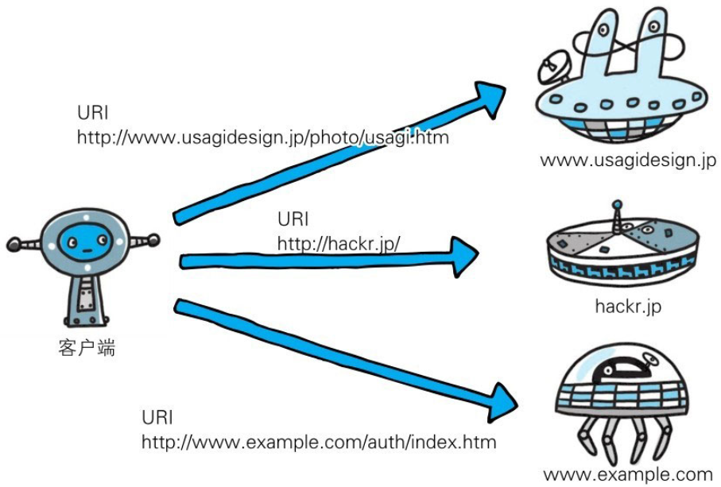
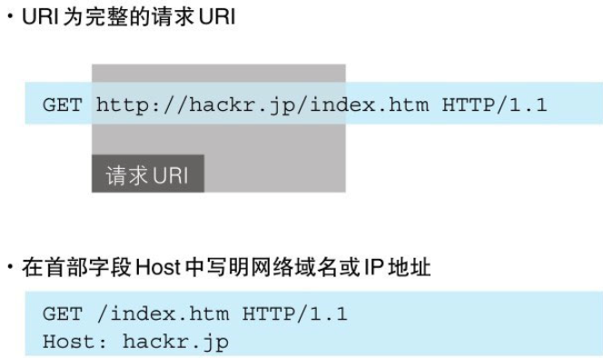

HTTP协议使用URI定位互联网上的资源。正是因为URI的特定功能，在互联网上任意位置的资源都能访问到。



当客户端请求访问资源而发送请求时，URI需要将作为请求报文中的请求URI包含在内。指定请求URI的方式有很多。



除此之外，如果不是访问特定资源而是对服务器本身发起请求，可以用一个*来代替请求URI。下面这个例子是查询HTTP服务器端支持的HTTP方法种类。

```
    OPTIONS ＊ HTTP/1.1
```
