下面，我们介绍HTTP/1.1中可使用的方法。

## GET：获取资源

GET方法用来请求访问已被URI识别的资源。指定的资源经服务器端解析后返回响应内容。也就是说，如果请求的资源是文本，那就保持原样返回；如果是像CGI（Common Gateway Interface，通用网关接口）那样的程序，则返回经过执行后的输出结果。

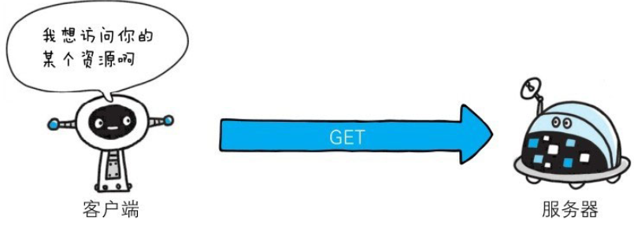

使用GET方法的请求·响应的例子

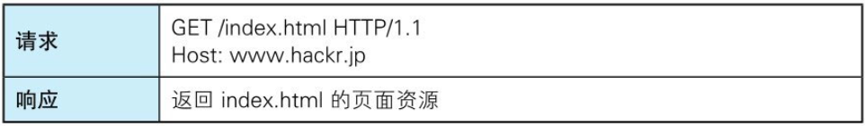

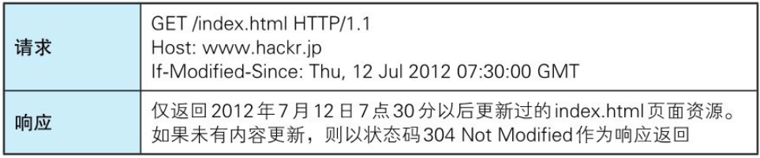

## POST：传输实体主体

POST方法用来传输实体的主体。

虽然用GET方法也可以传输实体的主体，但一般不用GET方法进行传输，而是用POST方法。虽说POST的功能与GET很相似，但POST的主要目的并不是获取响应的主体内容。

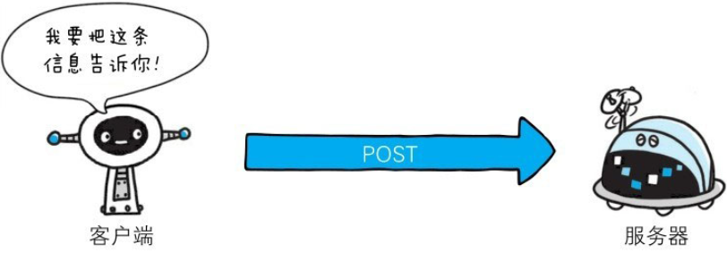

使用POST方法的请求·响应的例子

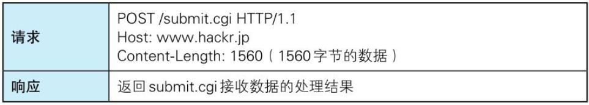

## PUT：传输文件

PUT方法用来传输文件。就像FTP协议的文件上传一样，要求在请求报文的主体中包含文件内容，然后保存到请求URI指定的位置。

但是，鉴于HTTP/1.1的PUT方法自身不带验证机制，任何人都可以上传文件，存在安全性问题，因此一般的Web网站不使用该方法。若配合Web应用程序的验证机制，或架构设计采用REST（RepresentationalState Transfer，表征状态转移）标准的同类Web网站，就可能会开放使用PUT方法。

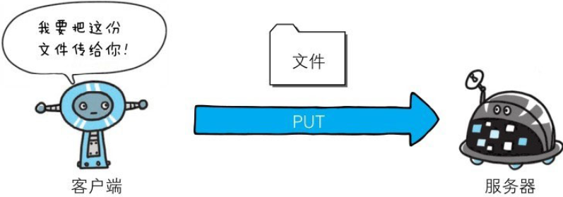

使用PUT方法的请求·响应的例子

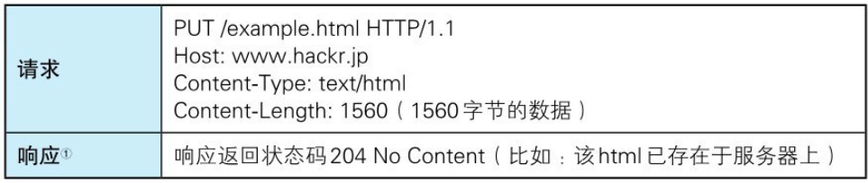

## HEAD：获得报文首部

HEAD方法和GET方法一样，只是不返回报文主体部分。用于确认URI的有效性及资源更新的日期时间等。

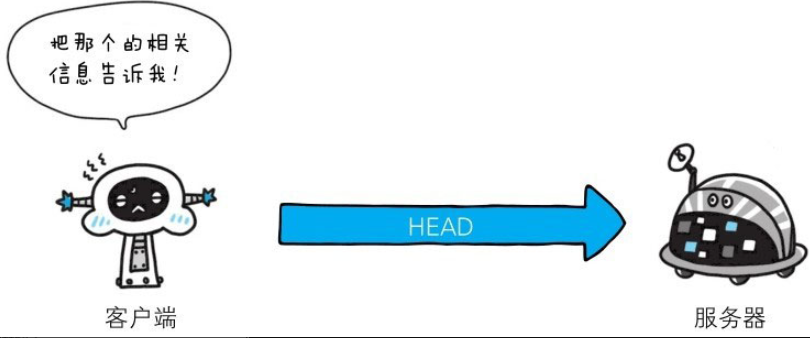

使用HEAD方法的请求·响应的例子

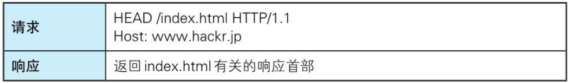

## DELETE：删除文件

DELETE方法用来删除文件，是与PUT相反的方法。DELETE方法按请求URI删除指定的资源。

但是，HTTP/1.1的DELETE方法本身和PUT方法一样不带验证机制，所以一般的Web网站也不使用DELETE方法。当配合Web应用程序的验证机制，或遵守REST标准时还是有可能会开放使用的。

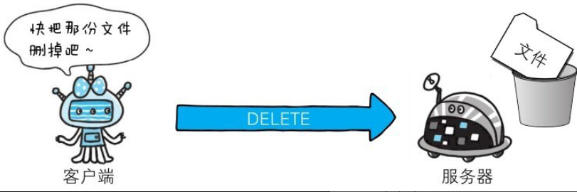

使用DELETE方法的请求·响应的例子

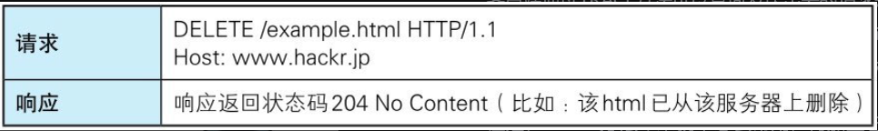

## OPTIONS：询问支持的方法

OPTIONS方法用来查询针对请求URI指定的资源支持的方法。


使用OPTIONS方法的请求·响应的例子

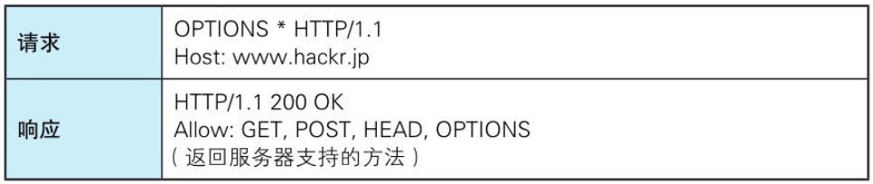

## TRACE：追踪路径

TRACE方法是让Web服务器端将之前的请求通信环回给客户端的方法。

发送请求时，在Max-Forwards首部字段中填入数值，每经过一个服务器端就将该数字减1，当数值刚好减到0时，就停止继续传输，最后接收到请求的服务器端则返回状态码200 OK的响应。

客户端通过TRACE方法可以查询发送出去的请求是怎样被加工修改/篡改的。这是因为，请求想要连接到源目标服务器可能会通过代理中转，TRACE方法就是用来确认连接过程中发生的一系列操作。

但是，TRACE方法本来就不怎么常用，再加上它容易引发XST（Cross-Site Tracing，跨站追踪）攻击，通常就更不会用到了。

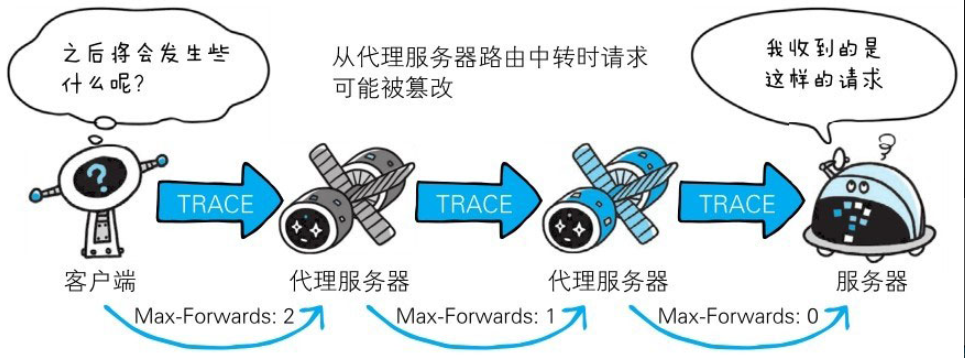

使用TRACE方法的请求·响应的例子

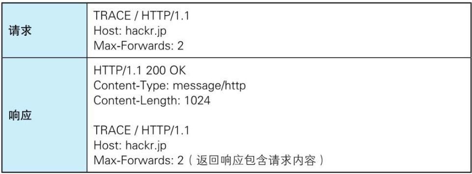

## CONNECT：要求用隧道协议连接代理

CONNECT方法要求在与代理服务器通信时建立隧道，实现用隧道协议进行TCP通信。主要使用SSL（Secure Sockets Layer，安全套接层）和TLS（Transport Layer Security，传输层安全）协议把通信内容加密后经网络隧道传输。

CONNECT方法的格式如下所示。

```
    CONNECT代理服务器名：端口号HTTP版本
```

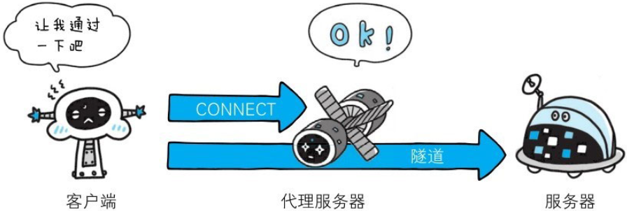

使用CONNECT方法的请求·响应的例子

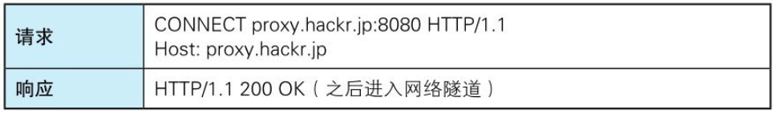
