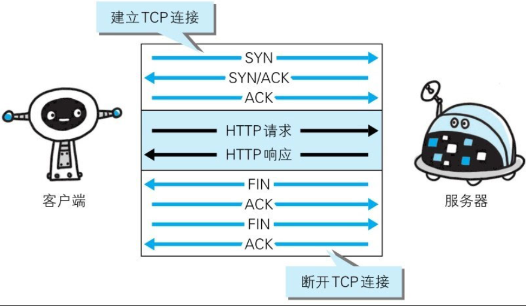
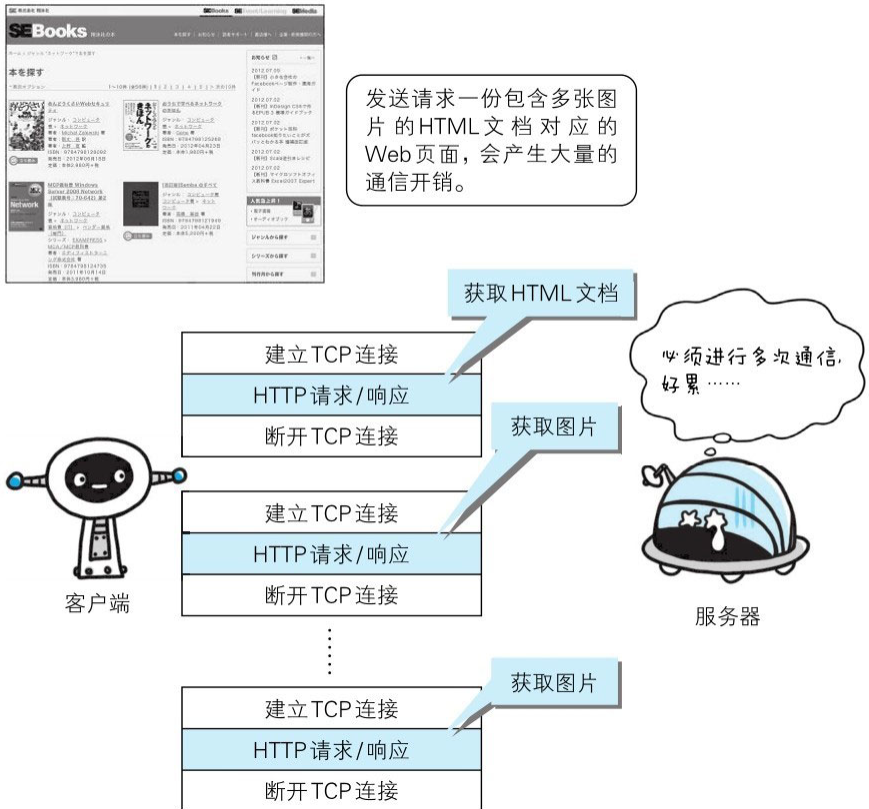
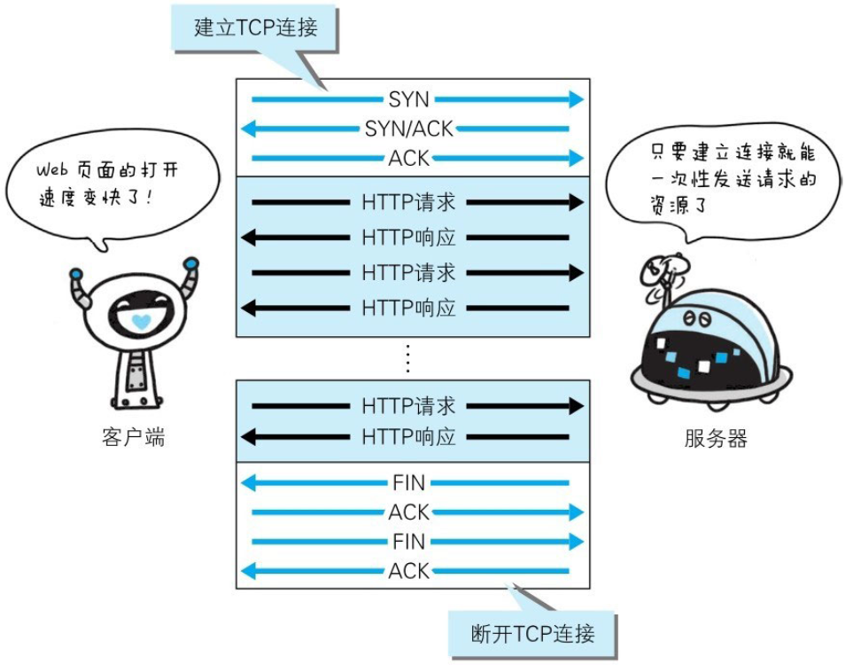
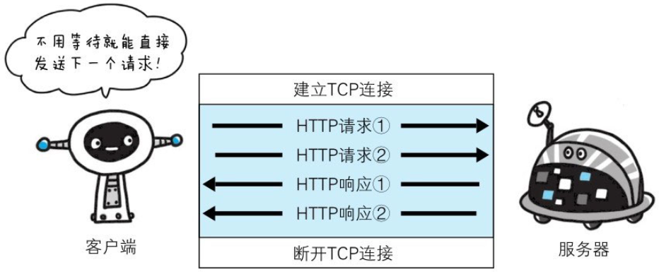

HTTP协议的初始版本中，每进行一次HTTP通信就要断开一次TCP连接。

以当年的通信情况来说，因为都是些容量很小的文本传输，所以即使这样也没有多大问题。可随着HTTP的普及，文档中包含大量图片的情况多了起来。

比如，使用浏览器浏览一个包含多张图片的HTML页面时，在发送请求访问HTML页面资源的同时，也会请求该HTML页面里包含的其他资源。因此，每次的请求都会造成无谓的TCP连接建立和断开，增加通信量的开销。

## 2.7.1　持久连接

为解决上述TCP连接的问题，HTTP/1.1和一部分的HTTP/1.0想出了持久连接（HTTP Persistent Connections，也称为HTTP keep-alive或HTTPconnection reuse）的方法。持久连接的特点是，只要任意一端没有明确提出断开连接，则保持TCP连接状态。

持久连接的好处在于减少了TCP连接的重复建立和断开所造成的额外开销，减轻了服务器端的负载。另外，减少开销的那部分时间，使HTTP请求和响应能够更早地结束，这样Web页面的显示速度也就相应提高了。

在HTTP/1.1中，所有的连接默认都是持久连接，但在HTTP/1.0内并未标准化。虽然有一部分服务器通过非标准的手段实现了持久连接，但服务器端不一定能够支持持久连接。毫无疑问，除了服务器端，客户端也需要支持持久连接。

## 2.7.2　管线化

持久连接使得多数请求以管线化(pipelining)方式发送成为可能。从前发送请求后需等待并收到响应，才能发送下一个请求。管线化技术出现后，不用等待响应亦可直接发送下一个请求。

这样就能够做到同时并行发送多个请求，而不需要一个接一个地等待响应了。

比如，当请求一个包含10张图片的HTML Web页面，与挨个连接相比，用持久连接可以让请求更快结束。而管线化技术则比持久连接还要快。请求数越多，时间差就越明显。
