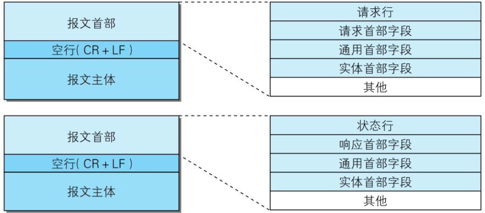
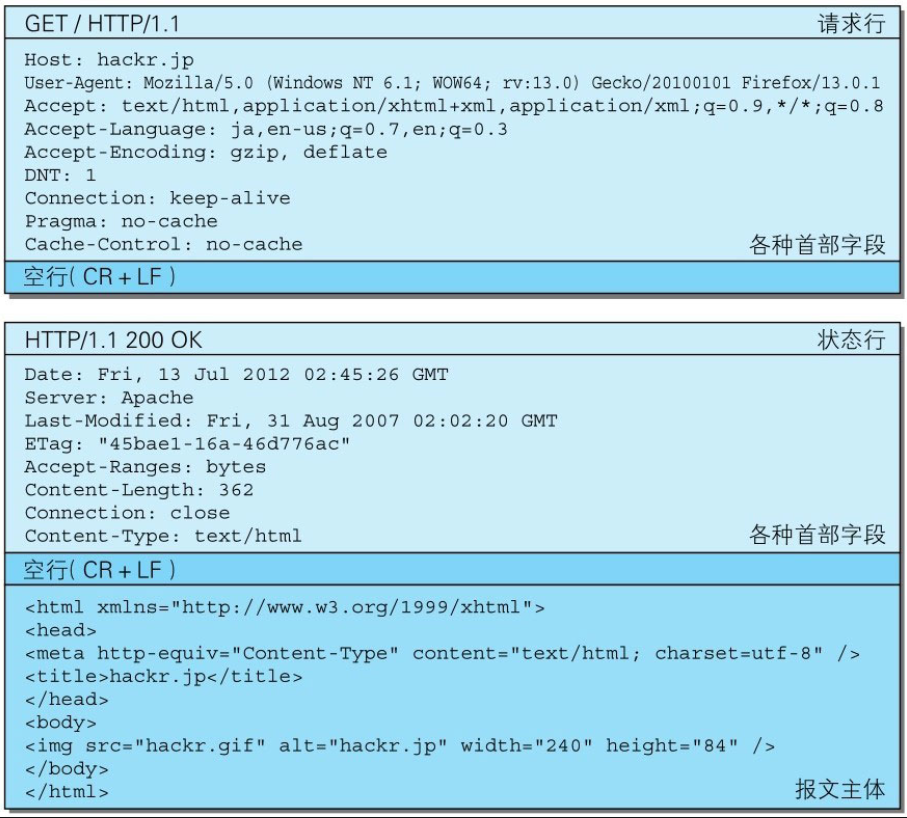

我们来看一下请求报文和响应报文的结构。

请求报文和响应报文的首部内容由以下数据组成。现在出现的各种首部字段及状态码稍后会进行阐述。

## 请求行

包含用于请求的方法，请求URI和HTTP版本。

## 状态行

包含表明响应结果的状态码，原因短语和HTTP版本。

## 首部字段

包含表示请求和响应的各种条件和属性的各类首部。

一般有4种首部，分别是：通用首部、请求首部、响应首部和实体首部。

## 其他

可能包含HTTP的RFC里未定义的首部（Cookie等）。
