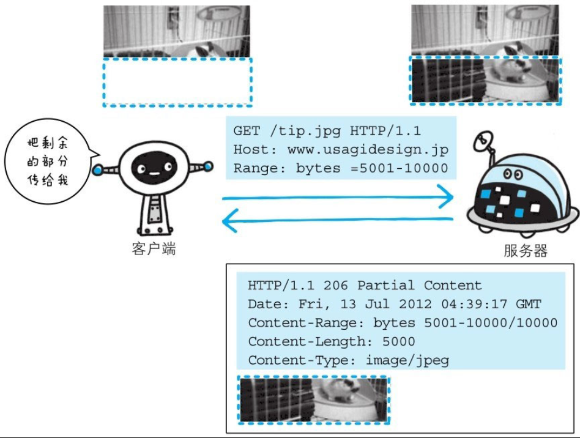

以前，用户不能使用现在这种高速的带宽访问互联网，当时，下载一个尺寸稍大的图片或文件就已经很吃力了。如果下载过程中遇到网络中断的情况，那就必须重头开始。为了解决上述问题，需要一种可恢复的机制。所谓恢复是指能从之前下载中断处恢复下载。

要实现该功能需要指定下载的实体范围。像这样，指定范围发送的请求叫做范围请求(Range Request)。

对一份10000字节大小的资源，如果使用范围请求，可以只请求5001～10000字节内的资源。



执行范围请求时，会用到首部字段Range来指定资源的byte范围。byte范围的指定形式如下。

- 5001～10000字节

```
    Range:bytes=5001-10000
```

- 从5001字节之后全部的

```
    Range:bytes=5001-
```

- 从一开始到3000字节和5000～7000字节的多重范围

```
    Range:bytes=-3000,5000-7000
```

针对范围请求，响应会返回状态码为206 Partial Content的响应报文。另外，对于多重范围的范围请求，响应会在首部字段Content-Type标明multipart/byteranges后返回响应报文。

如果服务器端无法响应范围请求，则会返回状态码200 OK和完整的实体内容。

