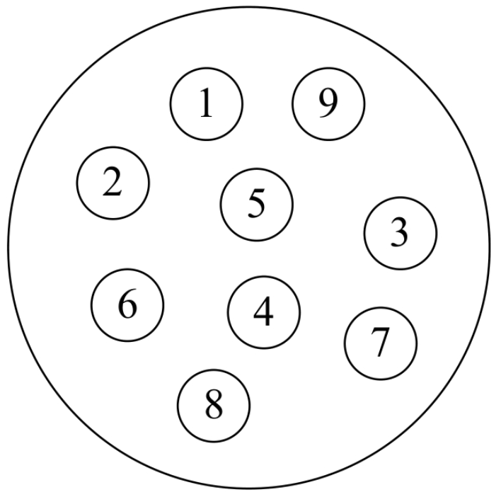
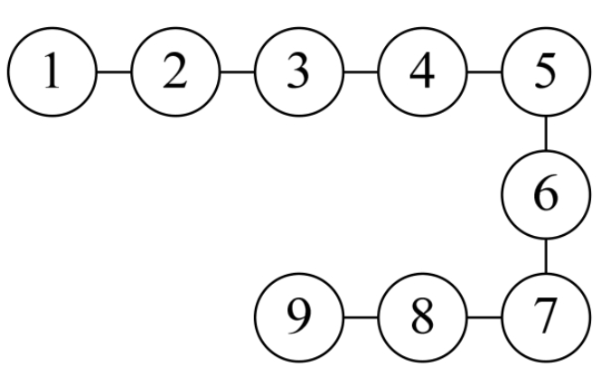
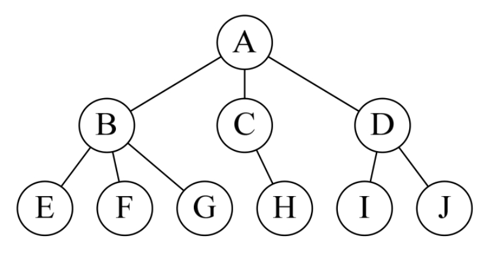
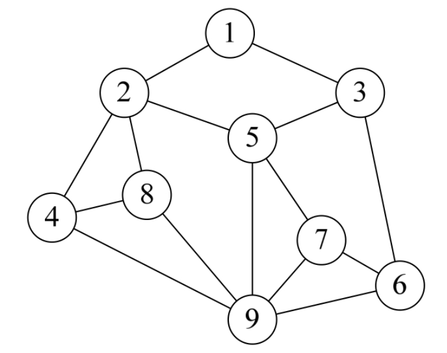
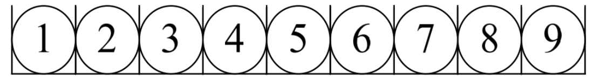
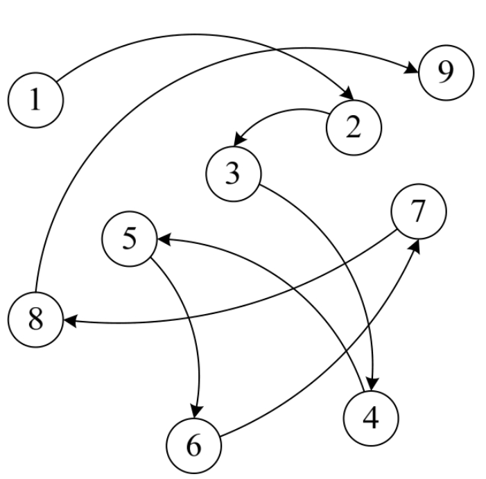

按照视点的不同，我们把数据结构分为逻辑结构和物理结构。

## 1.5.1　逻辑结构

逻辑结构：是指数据对象中数据元素之间的相互关系。其实这也是我们今后最需要关注的问题。逻辑结构分为以下四种：

1. 集合结构
   - 集合结构：集合结构中的数据元素除了同属于一个集合外，它们之间没有其他关系。各个数据元素是“平等”的，它们的共同属性是“同属于一个集合”。数据结构中的集合关系就类似于数学中的集合（如图1-5-1所示）。

   
   
2. 线性结构   
   - 线性结构：线性结构中的数据元素之间是一对一的关系（如图1-5-2所示）。
   

3. 树形结构
   - 树形结构：树形结构中的数据元素之间存在一种一对多的层次关系（如图1-5-3所示）。

4. 图形结构
   - 图形结构：图形结构的数据元素是多对多的关系（如图1-5-4所示）。
  

我们在用示意图表示数据的逻辑结构时，要注意两点：

- 将每一个数据元素看做一个结点，用圆圈表示。
- 元素之间的逻辑关系用结点之间的连线表示，如果这个关系是有方向的，那么用带箭头的连线表示。

从之前的例子也可以看出，逻辑结构是针对具体问题的，是为了解决某个问题，在对问题理解的基础上，选择一个合适的数据结构表示数据元素之间的逻辑关系。

## 1.5.2　物理结构

说完了逻辑结构，我们再来说说数据的物理结构（很多书中也叫做存储结构，你只要在理解上把它们当一回事就可以了）。

物理结构：是指数据的逻辑结构在计算机中的存储形式。

数据是数据元素的集合，那么根据物理结构的定义，实际上就是如何把数据元素存储到计算机的存储器中。存储器主要是针对内存而言的，像硬盘、软盘、光盘等外部存储器的数据组织通常用文件结构来描述。

数据的存储结构应正确反映数据元素之间的逻辑关系，这才是最为关键的，如何存储数据元素之间的逻辑关系，是实现物理结构的重点和难点。

**1．顺序存储结构**

顺序存储结构：是把数据元素存放在地址连续的存储单元里，其数据间的逻辑关系和物理关系是一致的（如图1-5-5所示）。

这种存储结构其实很简单，说白了，就是排队占位。大家都按顺序排好，每个人占一小段空间，大家谁也别插谁的队。我们之前学计算机语言时，数组就是这样的顺序存储结构。当你告诉计算机，你要建立一个有9个整型数据的数组时，计算机就在内存中找了片空地，按照一个整型所占位置的大小乘以9，开辟一段连续的空间，于是第一个数组数据就放在第一个位置，第二个数据放在第二个，这样依次摆放。

**2．链式存储结构**

如果就是这么简单和有规律，一切就好办了。可实际上，总会有人插队，也会有人要上厕所、有人会放弃排队。所以这个队伍当中会添加新成员，也有可能会去掉老元素，整个结构时刻都处于变化中。显然，面对这样时常要变化的结构，顺序存储是不科学的。那怎么办呢？

现在如银行、医院等地方，设置了排队系统，也就是每个人去了，先领一个号，等着叫号，叫到时去办理业务或看病。在等待的时候，你爱在哪在哪，可以坐着、站着或者走动，甚至出去逛一圈，只要及时回来就行。你关注的是前一个号有没有被叫到，叫到了，下一个就轮到了。

链式存储结构：是把数据元素存放在任意的存储单元里，这组存储单元可以是连续的，也可以是不连续的。数据元素的存储关系并不能反映其逻辑关系，因此需要用一个指针存放数据元素的地址，这样通过地址就可以找到相关联数据元素的位置（如图1-5-6所示）。

显然，链式存储就灵活多了，数据存在哪里不重要，只要有一个指针存放了相应的地址就能找到它了。

前几年香港有部电影叫《无间道》，大陆还有部电视剧叫《潜伏》，都很火，不知道大家有没有看过。大致说的是，某一方潜伏在敌人的内部，进行一些情报收集工作。为了不暴露每个潜伏人员的真实身份，往往都是单线联系，只有上线知道下线是谁，并且是通过暗号来联络。正常情况下，情报是可以顺利地上传下达的，但是如果某个链条中结点的同志牺牲了，那就麻烦了，因为其他人不知道上线或者下线是谁，后果就很严重。比如在《无间道》中，梁朝伟是警方在黑社会中的卧底，一直是与黄秋生扮演的警官联络，可当黄遇害后，梁就无法证明自己是一个警察。所以影片的结尾，当梁朝伟用枪指着刘德华的头说，“对不起，我是警察。”刘德华马上反问道：“谁知道呢？”是呀，当没有人可以证明你身份的时候，谁知道你是谁呢？影片看到这里，多少让人有些唏嘘感慨。这其实就是链式关系的一个现实样例。
