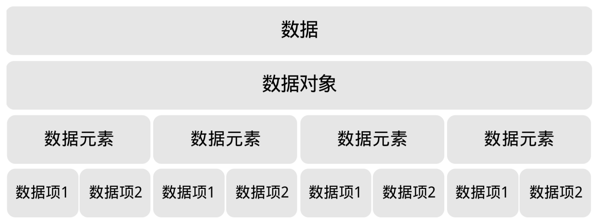
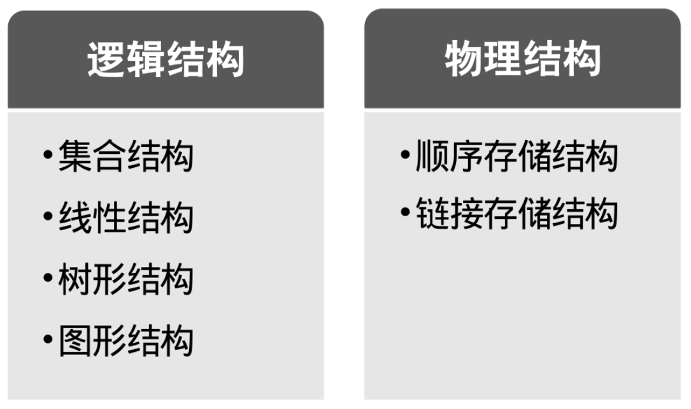

今天首先用我一个不争气的学生为例子，说明数据结构很重要。接着讲了数据结构的起源，说白了，就是一老外，觉得编程这玩意儿不弄得复杂点，不能证明他厉害，所以推出“数据结构”这一课程，让所有学编程的人“享受它带来的乐趣”或者“体验被折磨后无尽的烦恼”。

接着，正式介绍了数据结构的一些相关概念，如图1-7-1所示。

由这些概念，给出了数据结构的定义：数据结构是相互之间存在一种或多种特定关系的数据元素的集合。同样是结构，从不同的角度来讨论，会有不同的分类，如图1-7-2所示。

之后，我们还介绍了抽象数据类型及它的描述方法，为今后的课程打下基础。
