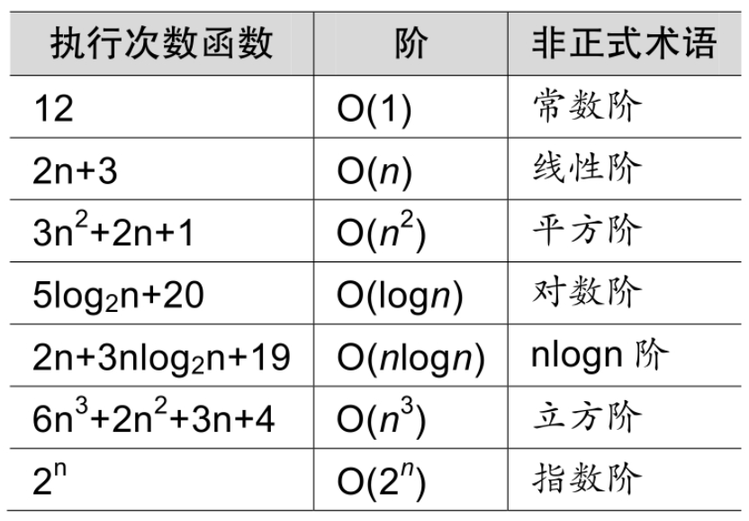

常见的时间复杂度如表2-10-1所示。

常用的时间复杂度所耗费的时间从小到大依次是：

O(1)<O(logn)<O(n)<O(nlogn)<O(n^2)<O(n^3)<O(2^n )<O(n!)<O(nn)

我们前面已经谈到了O(1)常数阶、O(logn)对数阶、O(n)线性阶、O(n^2)平方阶等，至于O(nlogn)我们将会在今后的课程中介绍，而像O(n^3)，过大的n都会使得结果变得不现实。同样指数阶O(2^n)和阶乘阶O(n!)等除非是很小的n值，否则哪怕n只是100，都是噩梦般的运行时间。所以这种不切实际的算法时间复杂度，一般我们都不去讨论它。
