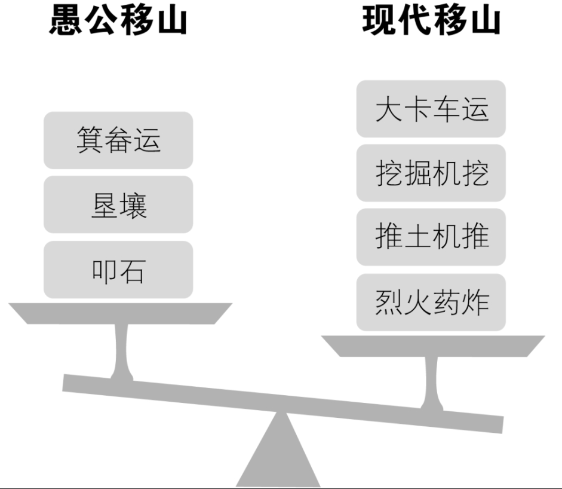

很多学生，学了四年计算机专业，很多程序员，做了很长时间的编程工作，却始终都弄不明白算法的时间复杂度的估算，这是很可悲的一件事。因为弄不清楚，所以也就从不深究自己写的代码是否效率低下，是不是可以通过优化让计算机更加快速高效。

他们通常的借口是，现在CPU越来越快，根本不用考虑算法的优劣，实现功能即可，用户感觉不到算法好坏造成的快慢。可事实真是这样吗？还是让我们用数据来说话吧。

假设CPU在短短几年间，速度提高了100倍，这其实已经很夸张了。而我们的某个算法本可以写出时间复杂度是O(n)的程序，却写出了O(n2)的程序，仅仅因为容易想到，也容易写。即在O(n2)的时间复杂度算法程序下，速度其实只提高了10倍，而对于O(n)时间复杂度的算法来说，那才是真的100倍。

也就是说，一台老式CPU的计算机运行O(n)的程序和一台速度提高100倍新式CPU运行O(n2)的程序。最终效率高的胜利方却是老式CPU的计算机，原因就在于算法的优劣直接决定了程序运行的效率。

也许你就可以深刻的感受到，愚公移山固然可敬，但发明炸药和推土机，可能更加实在和聪明（如图2-14-1所示）。

希望大家在今后的学习中，好好利用算法分析的工具，改进自己的代码，让计算机轻松一点，这样你就更加胜人一筹。

## 读书笔记
