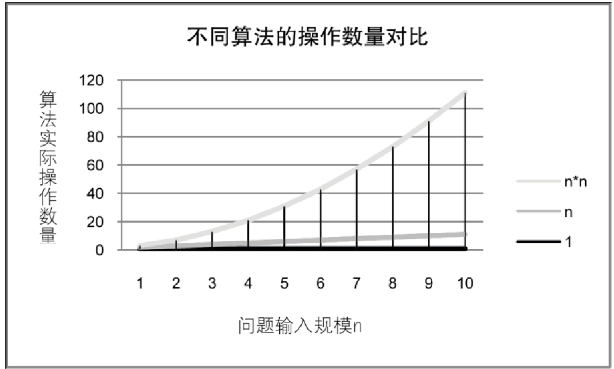

刚才我们提到设计算法要提高效率。这里效率大都指算法的执行时间。那么我们如何度量一个算法的执行时间呢？

正所谓“是骡子是马，拉出来遛遛”。比较容易想到的方法就是，我们通过对算法的数据测试，利用计算机的计时功能，来计算不同算法的效率是高还是低。

## 2.7.1　事后统计方法

事后统计方法：这种方法主要是通过设计好的测试程序和数据，利用计算机计时器对不同算法编制的程序的运行时间进行比较，从而确定算法效率的高低。

但这种方法显然是有很大缺陷的：

- 必须依据算法事先编制好程序，这通常需要花费大量的时间和精力。如果编制出来发现它根本是很糟糕的算法，不是竹篮打水一场空吗？
- 时间的比较依赖计算机硬件和软件等环境因素，有时会掩盖算法本身的优劣。要知道，现在的一台四核处理器的计算机，跟当年286、386、486等老爷爷辈的机器相比，在处理算法的运算速度上，是不能相提并论的；而所用的操作系统、编译器、运行框架等软件的不同，也可以影响它们的结果；就算是同一台机器，CPU使用率和内存占用情况不一样，也会造成细微的差异。
- 算法的测试数据设计困难，并且程序的运行时间往往还与测试数据的规模有很大关系，效率高的算法在小的测试数据面前往往得不到体现。比如10个数字的排序，不管用什么算法，差异几乎是零。而如果有一百万个随机数字排序，那不同算法的差异就非常大了。那么我们为了比较算法，到底用多少数据来测试，这是很难判断的问题。

基于事后统计方法有这样那样的缺陷，我们考虑不予采纳。

## 2.7.2　事前分析估算方法

我们的计算机前辈们，为了对算法的评判更科学，研究出了一种叫做事前分析估算的方法。

事前分析估算方法：在计算机程序编制前，依据统计方法对算法进行估算。

经过分析，我们发现，一个用高级程序语言编写的程序在计算机上运行时所消耗的时间取决于下列因素：

1. 算法采用的策略、方法。
2. 编译产生的代码质量。
3. 问题的输入规模。
4. 机器执行指令的速度。

第1条当然是算法好坏的根本，第2条要由软件来支持，第4条要看硬件性能。也就是说，抛开这些与计算机硬件、软件有关的因素，一个程序的运行时间，依赖于算法的好坏和问题的输入规模。所谓问题输入规模是指输入量的多少。

我们来看看今天刚上课时举的例子，两种求和的算法：

第一种算法：

```c++
    int i, sum = 0,n = 100;         /* 执行1次 */
    for（i = 1; i < = n; i++）      /* 执行了n+1次 */
    {
        sum = sum + i;              /* 执行n次 */
    }
    printf（"%d", sum）;            /* 执行1次 */
```

第二种算法：

```c++
    int sum = 0,n = 100;        /* 执行一次 */
    sum = （1 + n） * n/2;      /* 执行一次 */
    printf（"%d", sum）;        /* 执行一次 */
```

显然，第一种算法，执行了1+（n+1）+n+1次=2n+3次；而第二种算法，是1+1+1=3次。事实上两个算法的第一条和最后一条语句是一样的，所以我们关注的代码其实是中间的那部分，我们把循环看作一个整体，忽略头尾循环判断的开销，那么这两个算法其实就是n次与1次的差距。算法好坏显而易见。

我们再来延伸一下上面这个例子：

```c++
    int i, j, x = 0,sum = 0,n = 100;    /* 执行一次 */
    for（i = 1; i < = n; i++）
    {
        for （j = 1; j < = n; j++）
        {
            x++;                        /* 执行n×n次 */
            sum = sum + x;
        }
    }
    printf（"%d", sum）;                /* 执行一次 */
```

这个例子中，i从1到100，每次都要让j循环100次，而当中的x++和sum=sum+x；其实就是1+2+3+…+10000，也就是1002次，所以这个算法当中，循环部分的代码整体需要执行n^2（忽略循环体头尾的开销）次。显然这个算法的执行次数对于同样的输入规模n=100，要多于前面两种算法，这个算法的执行时间随着n的增加也将远远多于前面两个。

此时你会看到，测定运行时间最可靠的方法就是计算对运行时间有消耗的基本操作的执行次数。运行时间与这个计数成正比。

我们不关心编写程序所用的程序设计语言是什么，也不关心这些程序将跑在什么样的计算机中，我们只关心它所实现的算法。这样，不计那些循环索引的递增和循环终止条件、变量声明、打印结果等操作，最终，在分析程序的运行时间时，最重要的是把程序看成是独立于程序设计语言的算法或一系列步骤。

可以从问题描述中得到启示，同样问题的输入规模是n，求和算法的第一种，求1+2+…+n需要一段代码运行n次。那么这个问题的输入规模使得操作数量是f（n）=n，显然运行100次的同一段代码规模是运算10次的10倍。而第二种，无论n为多少，运行次数都为1，即f（n）=1；第三种，运算100次是运算10次的100倍。因为它是f（n）=n^2。

我们在分析一个算法的运行时间时，重要的是把基本操作的数量与输入规模关联起来，即基本操作的数量必须表示成输入规模的函数（如图2-7-1所示）。



我们可以这样认为，随着n值的越来越大，它们在时间效率上的差异也就越来越大。好比你们当中有些人每天都在学习，我指有用的学习，而不是只为考试的死读书，每天都在进步，而另一些人，打打游戏，睡睡大觉。入校时大家都一样，但毕业时结果可能就大不一样，前者名企争抢着要，后者求职无门。
