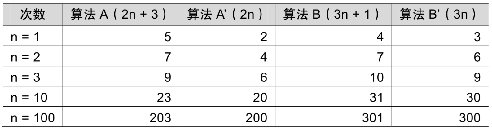
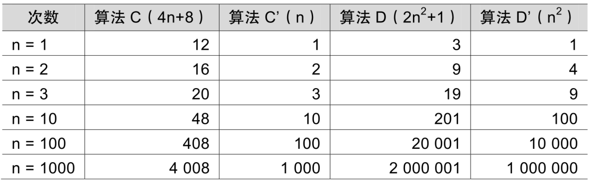
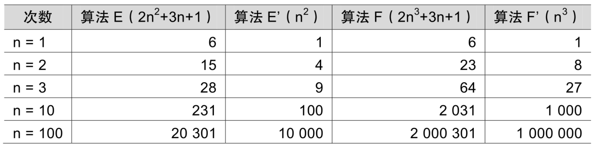
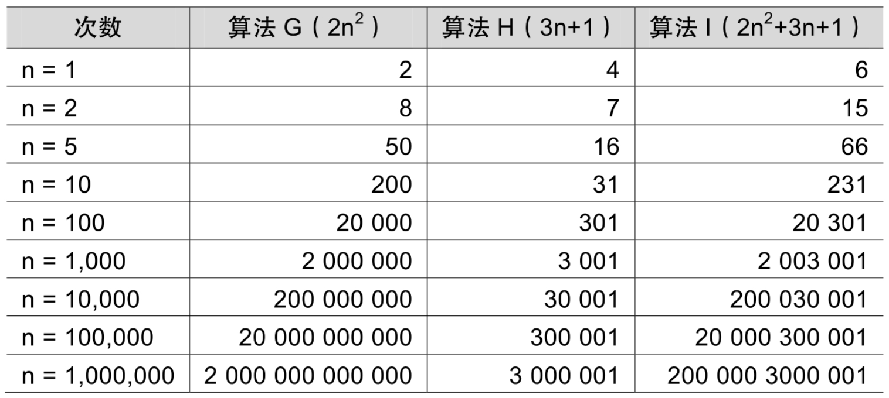

我们现在来判断一下，两个算法A和B哪个更好。假设两个算法的输入规模都是n，算法A要做2n+3次操作，你可以理解为先有一个n次的循环，执行完成后，再有一个n次循环，最后有三次赋值或运算，共2n+3次操作。算法B要做3n+1次操作。你觉得它们谁更快呢？

准确说来，答案是不一定的（如表2-8-1所示）。



当n=1时，算法A效率不如算法B（次数比算法B要多一次）。而当n=2时，两者效率相同；当n > 2时，算法A就开始优于算法B了，随着n的增加，算法A比算法B越来越好了（执行的次数比B要少）。于是我们可以得出结论，算法A总体上要好过算法B。

此时我们给出这样的定义，输入规模n在没有限制的情况下，只要超过一个数值N，这个函数就总是大于另一个函数，我们称函数是渐近增长的。

```
函数的渐近增长：给定两个函数f（n）和g（n），如果存在一个整数N，使得对于所有的n > N，f（n）总是比g（n）大，那么，我们说f（n）的增长渐近快于g（n）。
```

从中我们发现，随着n的增大，后面的+3还是+1其实是不影响最终的算法变化的，例如算法A′与算法B′，所以，我们可以忽略这些加法常数。后面的例子，这样的常数被忽略的意义可能会更加明显。

我们来看第二个例子，算法C是4n+8，算法D是2n2+1（如表2-8-2所示）。



当n≤3的时候，算法C要差于算法D（因为算法C次数比较多），但当n >3后，算法C的优势就越来越优于算法D了，到后来更是远远胜过。而当后面的常数去掉后，我们发现其实结果没有发生改变。甚至我们再观察发现，哪怕去掉与n相乘的常数，这样的结果也没发生改变，算法C′的次数随着n的增长，还是远小于算法D′。也就是说，与最高次项相乘的常数并不重要。

我们再来看第三个例子。算法E是2n2+3n+1，算法F是2n3+3n+1（如表2-8-3所示）。



当n=1的时候，算法E与算法F结果相同，但当n > 1后，算法E的优势就要开始优于算法F，随着n的增大，差异非常明显。通过观察发现，最高次项的指数大的，函数随着n的增长，结果也会变得增长特别快。

我们来看最后一个例子。算法G是2n2，算法H是3n+1，算法I是2n2+3n+1（如表2-8-4所示）。



这组数据应该就看得很清楚。当n的值越来越大时，你会发现，3n+1已经没法和2n2的结果相比较，最终几乎可以忽略不计。也就是说，随着n值变得非常大以后，算法G其实已经很趋近于算法I。于是我们可以得到这样一个结论，判断一个算法的效率时，函数中的常数和其他次要项常常可以忽略，而更应该关注主项（最高阶项）的阶数。

判断一个算法好不好，我们只通过少量的数据是不能做出准确判断的。根据刚才的几个样例，我们发现，如果我们可以对比这几个算法的关键执行次数函数的渐近增长性，基本就可以分析出：某个算法，随着n的增大，它会越来越优于另一算法，或者越来越差于另一算法。这其实就是事前估算方法的理论依据，通过算法时间复杂度来估算算法时间效率。
