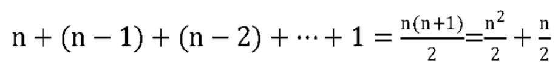
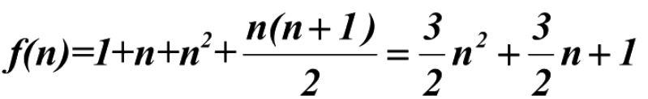

## 2.9.1　算法时间复杂度定义

```
在进行算法分析时，语句总的执行次数T（n）是关于问题规模n的函数，进而分析T（n）随n的变化情况并确定T（n）的数量级。算法的时间复杂度，也就是算法的时间量度，记作：T（n）=O(f(n))。它表示随问题规模n的增大，算法执行时间的增长率和f（n）的增长率相同，称作算法的渐近时间复杂度，简称为时间复杂度。其中f（n）是问题规模n的某个函数。
```

这样用大写O( )来体现算法时间复杂度的记法，我们称之为大O记法。

一般情况下，随着n的增大，T(n)增长最慢的算法为最优算法。

显然，由此算法时间复杂度的定义可知，我们的三个求和算法的时间复杂度分别为O(n)，O(1)，O(n^2)。我们分别给它们取了非官方的名称，O(1)叫常数阶、O(n)叫线性阶、O(n2)叫平方阶，当然，还有其他的一些阶，我们之后会介绍。

## 2.9.2　推导大O阶方法

那么如何分析一个算法的时间复杂度呢？即如何推导大O阶呢？我们给出了下面的推导方法，基本上，这也就是总结前面我们举的例子。

**推导大O阶：**

1. 用常数1取代运行时间中的所有加法常数。
2. 在修改后的运行次数函数中，只保留最高阶项。
3. 如果最高阶项存在且不是1，则去除与这个项相乘的常数。

哈，仿佛是得到了游戏攻略一样，我们好像已经得到了一个推导算法时间复杂度的万能公式。可事实上，分析一个算法的时间复杂度，没有这么简单，我们还需要多看几个例子。

## 2.9.3　常数阶

首先顺序结构的时间复杂度。下面这个算法，也就是刚才的第二种算法（高斯算法），为什么时间复杂度不是O(3)，而是O(1)。

```c++
    int sum = 0,n = 100;    /* 执行一次 */
    sum = （1+n）*n/2;      /* 执行一次 */
    printf（"%d", sum）;    /* 执行一次 */
```

这个算法的运行次数函数是f（n）=3。根据我们推导大O阶的方法，第一步就是把常数项3改为1。在保留最高阶项时发现，它根本没有最高阶项，所以这个算法的时间复杂度为O(1)。

另外，我们试想一下，如果这个算法当中的语句sum=（1+n）*n/2有10句，即：

```c++
    int sum = 0, n = 100;    /* 执行1次 */
    sum = （1+n）*n/2;       /* 执行第1次 */
    sum = （1+n）*n/2;       /* 执行第2次 */
    sum = （1+n）*n/2;       /* 执行第3次 */
    sum = （1+n）*n/2;       /* 执行第4次 */
    sum = （1+n）*n/2;       /* 执行第5次 */
    sum = （1+n）*n/2;       /* 执行第6次 */
    sum = （1+n）*n/2;       /* 执行第7次 */
    sum = （1+n）*n/2;       /* 执行第8次 */
    sum = （1+n）*n/2;       /* 执行第9次 */
    sum = （1+n）*n/2;       /* 执行第10次 */
    printf（"%d",sum）;      /* 执行1次 */
```

事实上无论n为多少，上面的两段代码就是3次和12次执行的差异。这种与问题的大小无关（n的多少），执行时间恒定的算法，我们称之为具有O(1)的时间复杂度，又叫常数阶。

注意：不管这个常数是多少，我们都记作O(1)，而不能是O(3)、O(12)等其他任何数字，这是初学者常常犯的错误。

对于分支结构而言，无论是真，还是假，执行的次数都是恒定的，不会随着n的变大而发生变化，所以单纯的分支结构（不包含在循环结构中），其时间复杂度也是O(1)。

## 2.9.4　线性阶

线性阶的循环结构会复杂很多。要确定某个算法的阶次，我们常常需要确定某个特定语句或某个语句集运行的次数。因此，我们要分析算法的复杂度，关键就是要分析循环结构的运行情况。

下面这段代码，它的循环的时间复杂度为O(n)，因为循环体中的代码须要执行n次。

```c++
    int i;
    for（i = 0; i < n; i++）
    {
         /* 时间复杂度为O(1)的程序步骤序列 */
    }
```

## 2.9.5　对数阶

下面的这段代码，时间复杂度又是多少呢？

```c++
    int count = 1;
    while （count < n）
    {
        count = count * 2;
        /* 时间复杂度为O(1)的程序步骤序列 */
    }
```

由于每次count乘以2之后，就距离n更近了一分。也就是说，有多少个2相乘后大于n，则会退出循环。由2x=n得到x=log2n。所以这个循环的时间复杂度为O(logn)。

## 2.9.6　平方阶

下面例子是一个循环嵌套，它的内循环刚才我们已经分析过，时间复杂度为O(n)。

```c++
    int i,j;
    for（i = 0; i < n; i++）
    {
      for （j = 0; j < n; j++）
      {
      /* 时间复杂度为O(1)的程序步骤序列 */
      }
    }
```

而对于外层的循环，不过是内部这个时间复杂度为O(n)的语句，再循环n次。所以这段代码的时间复杂度为O(n^2)。

如果外循环的循环次数改为了m，时间复杂度就变为O(m×n)。

```c++
    int i,j;
    for（i = 0; i < m; i++）
    {
        for （j = 0; j < n; j++）
        {
            /* 时间复杂度为O(1)的程序步骤序列 */
        }
    }
```

所以我们可以总结得出，循环的时间复杂度等于循环体的复杂度乘以该循环运行的次数。

那么下面这个循环嵌套，它的时间复杂度是多少呢？

```c++
    int i,j;
    for（i = 0; i < n; i++）
    {
        for （j = i; j < n; j++）  /* 注意j = i而不是0 */
        {
            /* 时间复杂度为O(1)的程序步骤序列 */
        }
    }
```

由于当i=0时，内循环执行了n次，当i=1时，执行了n－1次，……当i=n－1时，执行了1次。所以总的执行次数为：



用我们推导大O阶的方法，第一条，没有加法常数不予考虑；第二条，只保留最高阶项，因此保留n^2/2；第三条，去除这个项相乘的常数，也就是去除1/2，最终这段代码的时间复杂度为O(n^2)。

从这个例子，我们也可以得到一个经验，其实理解大O推导不算难，难的是对数列的一些相关运算，这更多的是考察你的数学知识和能力，所以想考研的朋友，要想在求算法时间复杂度这里不失分，可能需要强化你的数学，特别是数列方面的知识和解题能力。

我们继续看例子，对于方法调用的时间复杂度又如何分析。

```c++
    int i,j;
    for（i = 0; i < n; i++）
    {
        function（i）;
    }
```

上面这段代码调用一个函数function。

```c++
    void function（int count）
    {
        print（count）;
    }
```

函数体是打印这个参数。其实这很好理解，function函数的时间复杂度是O(1)。所以整体的时间复杂度为O(n)。

假如function是下面这样的：

```c++
    void function（int count）
    {
        int j;
        for （j = count; j < n; j++）
        {
            /* 时间复杂度为O(1)的程序步骤序列 */
        }
    }
```

事实上，这和刚才举的例子是一样的，只不过把嵌套内循环放到了函数中，所以最终的时间复杂度为O(n^2)。

下面这段相对复杂的语句：

```c++
    n++;                                     /* 执行次数为1 */
    function（n）;                           /* 执行次数为n */
    int i,j;
    for（i = 0; i < n; i++）                 /* 执行次数为n^2 */
    {
          function （i）;
    }
    for（i = 0; i < n; i++）                 /* 执行次数为n（n + 1）/2 */
    {
          for （j = i;j < n; j++）
          {
                /* 时间复杂度为O(1)的程序步骤序列 */
          }
    }
```



它的执行次数，根据推导大O阶的方法，最终这段代码的时间复杂度也是O(n^2)。
