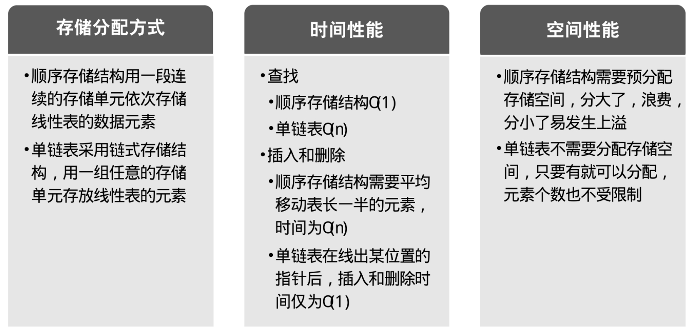

---
title: 3.11　单链表结构与顺序存储结构优缺点
----

简单地对单链表结构和顺序存储结构做对比：

通过上面的对比，我们可以得出一些经验性的结论：

- 若线性表需要频繁查找，很少进行插入和删除操作时，宜采用顺序存储结构。若需要频繁插入和删除时，宜采用单链表结构。比如说游戏开发中，对于用户注册的个人信息，除了注册时插入数据外，绝大多数情况都是读取，所以应该考虑用顺序存储结构。而游戏中的玩家的武器或者装备列表，随着玩家的游戏过程中，可能会随时增加或删除，此时再用顺序存储就不太合适了，单链表结构就可以大展拳脚。当然，这只是简单的类比，现实中的软件开发，要考虑的问题会复杂得多。
- 当线性表中的元素个数变化较大或者根本不知道有多大时，最好用单链表结构，这样可以不需要考虑存储空间的大小问题。而如果事先知道线性表的大致长度，比如一年12个月，一周就是星期一至星期日共七天，这种用顺序存储结构效率会高很多。

总之，线性表的顺序存储结构和单链表结构各有其优缺点，不能简单的说哪个好，哪个不好，需要根据实际情况，来综合平衡采用哪种数据结构更能满足和达到需求和性能。

休息一下，我们再来看看其他的链表结构。
