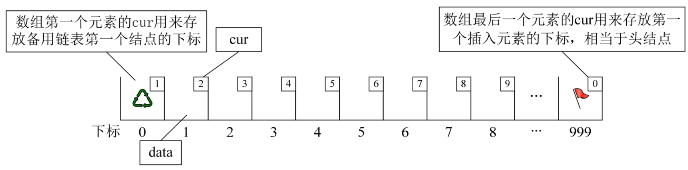
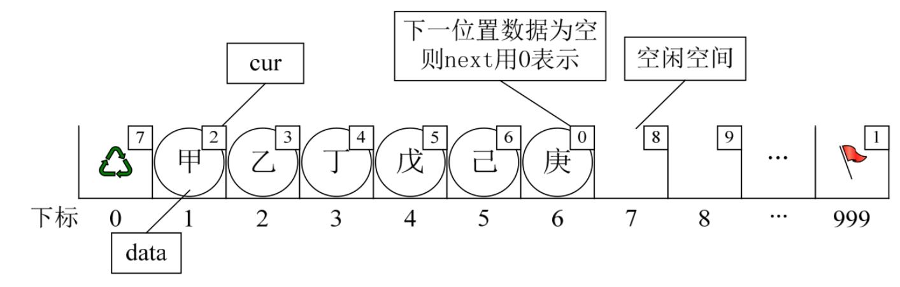
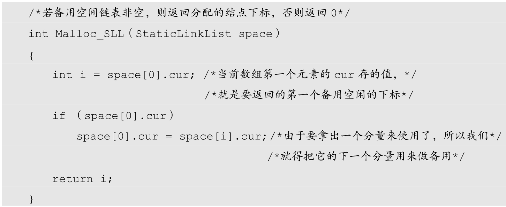
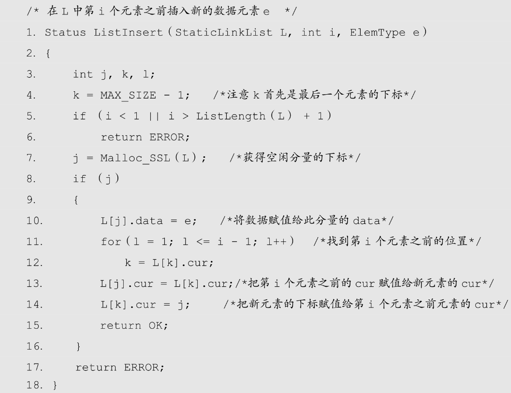
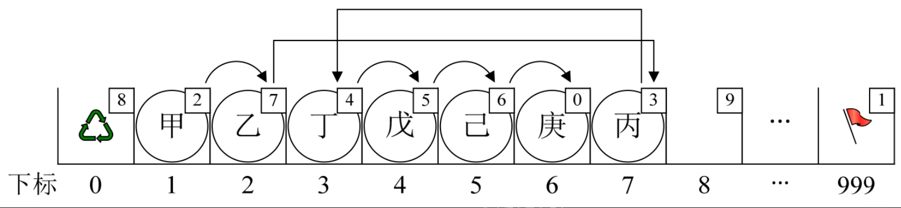
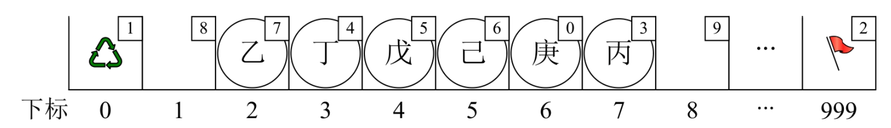
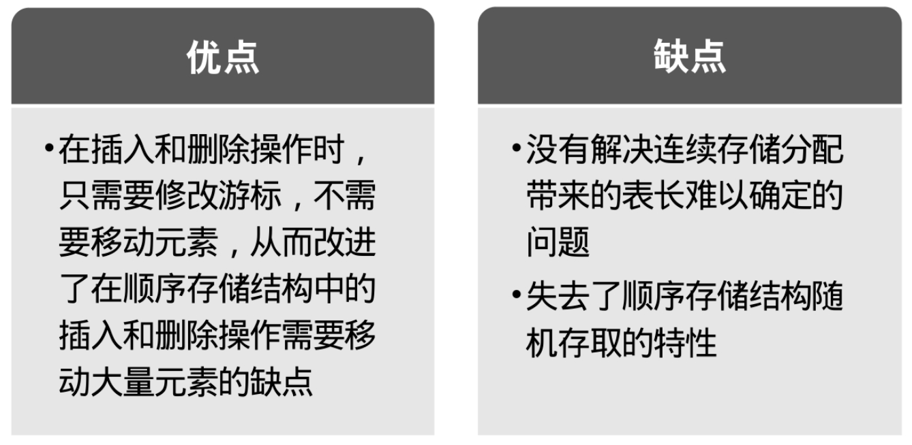

其实C语言真是好东西，它具有的指针能力，使得它可以非常容易地操作内存中的地址和数据，这比其他高级语言更加灵活方便。后来的面向对象语言，如Java、C#等，虽不使用指针，但因为启用了对象引用机制，从某种角度也间接实现了指针的某些作用。但对于一些语言，如Basic、Fortran等早期的编程高级语言，由于没有指针，链表结构按照前面我们的讲法，它就没法实现了。怎么办呢？

有人就想出来用数组来代替指针，来描述单链表。真是不得不佩服他们的智慧，我们来看看他是怎么做到的。

首先我们让数组的元素都是由两个数据域组成，data和cur。也就是说，数组的每个下标都对应一个data和一个cur。数据域data，用来存放数据元素，也就是通常我们要处理的数据；而游标cur相当于单链表中的next指针，存放该元素的后继在数组中的下标。

我们把这种用数组描述的链表叫做静态链表，这种描述方法还有起名叫做游标实现法。

为了我们方便插入数据，我们通常会把数组建立得大一些，以便有一些空闲空间可以便于插入时不至于溢出。

```c++
    /*线性表的静态链表存储结构*/
    #define MAXSIZE 1000         /*假设链表的最大长度是1000*/
    typedef struct
    {
        ElemType data;
        int cur;                /*游标（Cursor），为0时表示无指向*/
    } Component,StaticLinkList[MAXSIZE];
```

另外我们对数组第一个和最后一个元素作为特殊元素处理，不存数据。我们通常把未被使用的数组元素称为备用链表。而数组第一个元素，即下标为0的元素的cur就存放备用链表的第一个结点的下标；而数组的最后一个元素的cur则存放第一个有数值的元素的下标，相当于单链表中的头结点作用，当整个链表为空时，则为0。如图3-12-1所示。



此时的图示相当于初始化的数组状态，见下面代码：

```c++
    /*将一维数组space中各分量链成一备用链表，*/
    /*space[0].cur为头指针，"0"表示空指针 */
    Status InitList（StaticLinkList space）
    {
        int i;
        for （i=0; i<MAXSIZE-1; i++）
            space[i].cur = i+1;
        space[MAXSIZE-1].cur = 0; /*目前静态链表为空，最后一个元素的cur为0*/
        return OK;
    }
```

假设我们已经将数据存入静态链表，比如分别存放着“甲”、“乙”、“丁”、“戊”、“己”、“庚”等数据，则它将处于如图3-12-2所示这种状态。



此时“甲”这里就存有下一元素“乙”的游标2，“乙”则存有下一元素“丁”的下标3。而“庚”是最后一个有值元素，所以它的cur设置为0。

而最后一个元素的cur则因“甲”是第一有值元素而存有它的下标为1。而第一个元素则因空闲空间的第一个元素下标为7，所以它的cur存有7。

## 3.12.1　静态链表的插入操作

现在我们来看看如何实现元素的插入。

静态链表中要解决的是：如何用静态模拟动态链表结构的存储空间的分配，需要时申请，无用时释放。

我们前面说过，在动态链表中，结点的申请和释放分别借用malloc（）和free（）两个函数来实现。在静态链表中，操作的是数组，不存在像动态链表的结点申请和释放问题，所以我们需要自己实现这两个函数，才可以做插入和删除的操作。

为了辨明数组中哪些分量未被使用，解决的办法是将所有未被使用过的及已被删除的分量用游标链成一个备用的链表，每当进行插入时，便可以从备用链表上取得第一个结点作为待插入的新结点。



这段代码有意思，一方面它的作用就是返回一个下标值，这个值就是数组头元素的cur存的第一个空闲的下标。从上面的图示例子来看，其实就是返回7。

那么既然下标为7的分量准备要使用了，就得有接替者，所以就把分量7的cur值赋值给头元素，也就是把8给space[0].cur，之后就可以继续分配新的空闲分量，实现类似malloc（）函数的作用。

现在我们如果需要在“乙”和“丁”之间，插入一个值为“丙”的元素，按照以前顺序存储结构的做法，应该要把“丁”、“戊”、“己”、“庚”这些元素都往后移一位。但目前不需要，因为我们有了新的手段。

新元素“丙”，想插队是吧？可以，你先悄悄地在队伍最后一排第7个游标位置待着，我一会就能帮你搞定。我接着找到了“乙”，告诉他，你的cur不是游标为3的“丁”了，这点小钱，意思意思，你把你的下一位的游标改为7就可以了。“乙”叹了口气，收了钱把cur值改了。此时再回到“丙”那里，说你把你的cur改为3。就这样，在绝大多数人都不知道的情况下，整个排队的次序发生了改变（如图3-12-3所示）。

实现代码如下，代码左侧数字为行号。



- 当我们执行插入语句时，我们的目的是要在“乙”和“丁”之间插入“丙”。调用代码时，输入i值为3。
- 第4行让k=MAX_SIZE–1=999。
- 第7行，j=Malloc_SSL（L）=7。此时下标为0的cur也因为7要被占用而更改备用链表的值为8。
- 第11～12行，for循环l由1到2，执行两次。代码k=L[k].cur; 使得k=999，得到k=L[999].cur=1，再得到k=L[1].cur=2。
- 第13行，L[j].cur=L[k].cur;因j=7，而k=2得到L[7].cur=L[2].cur=3。这就是刚才我说的让“丙”把它的cur改为3的意思。
- 第14行，L[k].cur=j;意思就是L[2].cur=7。也就是让“乙”得点好处，把它的cur改为指向“丙”的下标7。
  
就这样，我们实现了在数组中，实现不移动元素，却插入了数据的操作（如图3-12-3所示）。没理解可能觉得有些复杂，理解了，也就那么回事。



## 3.12.2　静态链表的删除操作

故事没完，接着，排在第一个的甲突然接到一电话，看着很急，多半不是家里有紧急情况，就是单位有突发状况，反正稍有犹豫之后就急匆匆离开。这意味着第一位空出来了，那么自然刚才那个收了好处的乙就成了第一位——有人走运起来，喝水都长肉。

和前面一样，删除元素时，原来是需要释放结点的函数free（）。现在我们也得自己实现它：

```c++
    /* 删除在L中第i个数据元素e */
    Status ListDelete（StaticLinkList L, int i）
    {
        int j, k;
        if （i < 1 || i > ListLength（L））
            return ERROR;
        k = MAX_SIZE - 1;
        for （j = 1; j <= i - 1; j++）
            k = L[k].cur;
        j = L[k].cur;
        L[k].cur = L[j].cur;
        Free_SSL（L, j）;
        return OK;
    }
```

有了刚才的基础，这段代码就很容易理解了。前面代码都一样，for循环因为i=1而不操作，j=k[999].cur=1，L[k].cur=L[j].cur也就是L[999].cur=L[1].cur=2。这其实就是告诉计算机现在“甲”已经离开了，“乙”才是第一个元素。Free_SSL（L, j）;是什么意思呢？来看代码：

```c++
    /* 将下标为k的空闲结点回收到备用链表*/
    void Free_SSL（StaticLinkList space, int k）
    {
        space[k].cur = space[0].cur;/*把第一个元素cur值赋给要删除的分量cur*/
        space[0].cur = k;           /*把要删除的分量下标赋值给第一个元素的cur*/
    }
```

意思就是“甲”现在要走，这个位置就空出来了，也就是，未来如果有新人来，最优先考虑这里，所以原来的第一个空位分量，即下标是8的分量，它降级了，把8给“甲”所在下标为1的分量的cur，也就是space[1].cur=space[0].cur=8，而space[0].cur=k=1其实就是让这个删除的位置成为第一个优先空位，把它存入第一个元素的cur中，如图3-12-4所示。



当然，静态链表也有相应的其他操作的相关实现。比如我们代码中的ListLength就是一个，来看代码。

```c++
    /*初始条件：静态链表L已存在。操作结果：返回L中数据元素个数*/
    int ListLength（StaticLinkList L）
    {
        int j=0;
        int i=L[MAXSIZE-1].cur;
        while（i）
        {
            i=L[i].cur;
            j++;
        }
        return j;
    }
```

另外一些操作和线性表的基本操作相同，实现上也不复杂，我们在课堂上就不讲解了。

## 3.12.3　静态链表优缺点

总结一下静态链表的优缺点（见图3-12-5）：



总的来说，静态链表其实是为了给没有指针的高级语言设计的一种实现单链表能力的方法。尽管大家不一定会用得上，但这样的思考方式是非常巧妙的，应该理解其思想，以备不时之需。
