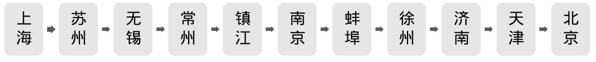
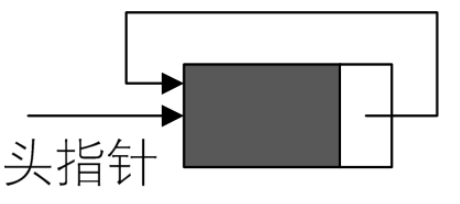
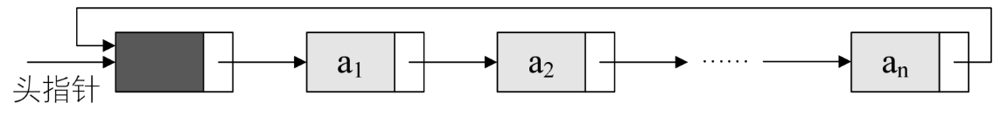
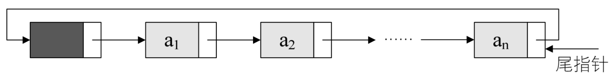
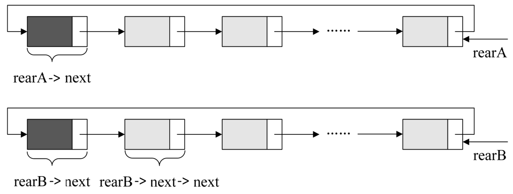
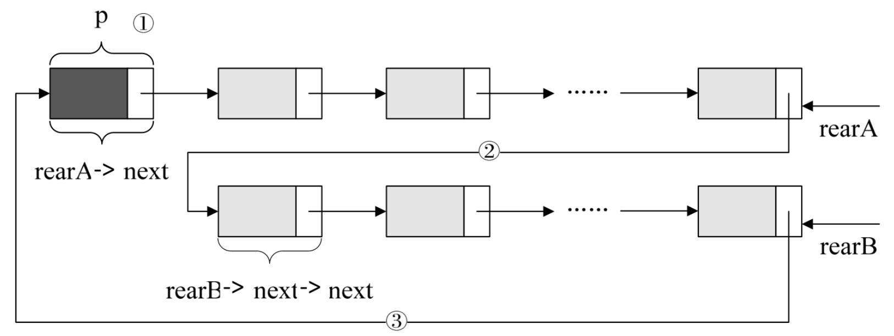

在座的各位都很年轻，不会觉得日月如梭。可上了点年纪的人，比如我——的父辈们，就常常感慨，要是可以回到从前该多好。网上也盛传，所谓的成功男人就是 3 岁时不尿裤子，5 岁能自己吃饭……80 岁能自己吃饭，90 岁能不尿裤子。


对于单链表，由于每个结点只存储了向后的指针，到了尾标志就停止了向后链的操作，这样，当中某一结点就无法找到它的前驱结点了，就像我们刚才说的，不能回到从前。

比如，你是一业务员，家在上海。需要经常出差，行程就是上海到北京一路上的城市，找客户谈生意或分公司办理业务。你从上海出发，乘火车路经多个城市停留后，再乘飞机返回上海，以后，每隔一段时间，你基本还要按照这样的行程开展业务，如图 3-13-2 所示。



有一次，你先到南京开会，接下来要对以上的城市走一遍，此时有人对你说，不行，你得从上海开始，因为上海是第一站。你会对这人说什么？神经病。哪有这么傻的，直接回上海根本没有必要，你可以从南京开始，下一站蚌埠，直到北京，之后再考虑走完上海及苏南的几个城市。显然这表示你是从当中一结点开始遍历整个链表，这都是原来的单链表结构解决不了的问题。

事实上，把北京和上海之间连起来，形成一个环就解决了前面所面临的困难。这就是我们现在要讲的循环链表。

将单链表中终端结点的指针端由空指针改为指向头结点，就使整个单链表形成一个环，这种头尾相接的单链表称为单循环链表，简称循环链表（circular l​inked l​ist）​。

从刚才的例子，可以总结出，循环链表解决了一个很麻烦的问题。如何从当中一个结点出发，访问到链表的全部结点。

为了使空链表与非空链表处理一致，我们通常设一个头结点，当然，这并不是说，循环链表一定要头结点，这需要注意。循环链表带有头结点的空链表如图 3-13-3 所示：



对于非空的循环链表就如图 3-13-4 所示。



其实循环链表和单链表的主要差异就在于循环的判断条件上，原来是判断 p->next 是否为空，现在则是 p->next 不等于头结点，则循环未结束。

在单链表中，我们有了头结点时，我们可以用 O(1)的时间访问第一个结点，但对于要访问到最后一个结点，却需要 O(n)时间，因为我们需要将单链表全部扫描一遍。

有没有可能用 O(1)的时间由链表指针访问到最后一个结点呢？当然可以。

不过我们需要改造一下这个循环链表，不用头指针，而是用指向终端结点的尾指针来表示循环链表（如图 3-13-5 所示）​，此时查找开始结点和终端结点都很方便了。



从上图中可以看到，终端结点用尾指针 rear 指示，则查找终端结点是 O(1)，而开始结点，其实就是 rear->next->next，其时间复杂也为 O(1)。

举个程序的例子，要将两个循环链表合并成一个表时，有了尾指针就非常简单了。比如下面的这两个循环链表，它们的尾指针分别是 rearA 和 rearB，如图 3-13-6 所示。



要想把它们合并，只需要如下的操作即可，如图 3-13-7 所示。



```rust
    p=rearA->next;                /* 保存A表的头结点，即① */
    rearA->next=rearB->next->next;/* 将本是指向B表的第一个结点（不是头结点）*/
                                  /* 赋值给reaA->next，即② */
    rearB->next=p;              /* 将原A表的头结点赋值给rearB->next，即③ */
    free（p）;                  /* 释放p */
```
