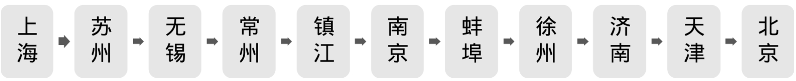
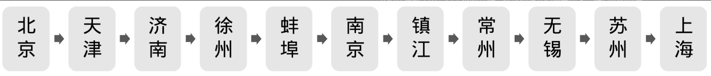
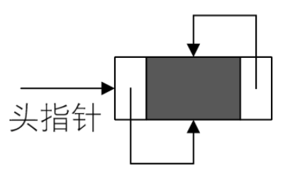
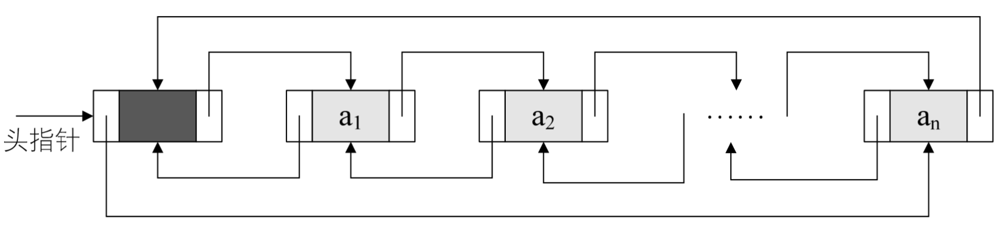
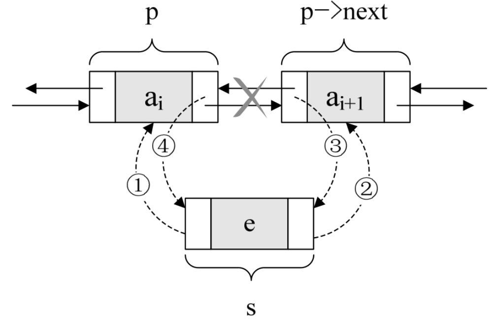
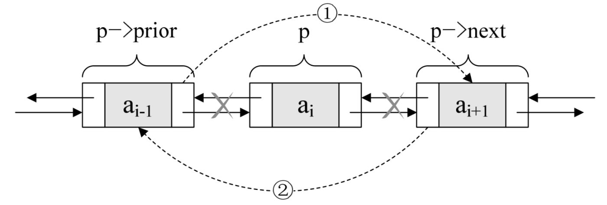

继续我们刚才的例子，你平时都是从上海一路停留到北京的，可是这一次，你得先到北京开会，谁叫北京是首都呢，会就是多。开完会后，你需要例行公事，走访各个城市，此时你怎么办？



有人又出主意了，你可以先飞回上海，一路再乘火车走遍这几个城市，到了北京后，你再飞回上海。

你会感慨，人生中为什么总会有这样出馊主意的人存在呢？真要气死人才行。哪来这么麻烦，我一路从北京坐火车或汽车回去不就完了吗。



对呀，其实生活中类似的小智慧比比皆是，并不会那么的死板教条。我们的单链表，总是从头到尾找结点，难道就不可以正反遍历都可以吗？当然可以，只不过需要加点东西而已。

我们在单链表中，有了 next 指针，这就使得我们要查找下一结点的时间复杂度为 O(1)。可是如果我们要查找的是上一结点的话，那最坏的时间复杂度就是 O(n)了，因为我们每次都要从头开始遍历查找。

为了克服单向性这一缺点，我们的老科学家们，设计出了双向链表。双向链表（double l​inked l​ist）是在单链表的每个结点中，再设置一个指向其前驱结点的指针域。所以在双向链表中的结点都有两个指针域，一个指向直接后继，另一个指向直接前驱。

```c++
    /*线性表的双向链表存储结构*/
    typedef struct DulNode
    {
        ElemType data;
        struct DuLNode *prior;      /*直接前驱指针*/
        struct DuLNode *next;       /*直接后继指针*/
    } DulNode, *DuLinkList;
```

既然单链表也可以有循环链表，那么双向链表当然也可以是循环表。

双向链表的循环带头结点的空链表如图 3-14-3 所示。





由于这是双向链表，那么对于链表中的某一个结点 p，它的后继的前驱是谁？当然还是它自己。它的前驱的后继自然也是它自己，即：

```rust
    p->next->prior = p = p->prior->next
```

这就如同上海的下一站是苏州，那么上海的下一站的前一站是哪里？哈哈，有点废话的感觉。

双向链表是单链表中扩展出来的结构，所以它的很多操作是和单链表相同的，比如求长度的 ListLength，查找元素的 GetElem，获得元素位置的 LocateElem 等，这些操作都只要涉及一个方向的指针即可，另一指针多了也不能提供什么帮助。

就像人生一样，想享乐就得先努力，欲收获就得付代价。双向链表既然是比单链表多了如可以反向遍历查找等数据结构，那么也就需要付出一些小的代价：在插入和删除时，需要更改两个指针变量。

插入操作时，其实并不复杂，不过顺序很重要，千万不能写反了。

我们现在假设存储元素 e 的结点为 s，要实现将结点 s 插入到结点 p 和 p->next 之间需要下面几步，如图 3-14-5 所示。



```rust
    s - >prior = p;            /*把p赋值给s的前驱，如图中①*/
    s -> next = p -> next;     /*把p->next赋值给s的后继，如图中②*/
    p -> next -> prior = s;    /*把s赋值给p->next的前驱，如图中③*/
    p -> next = s;             /*把s赋值给p的后继，如图中④*/
```

关键在于它们的顺序，由于第 2 步和第 3 步都用到了 p->next。如果第 4 步先执行，则会使得 p->next 提前变成了 s，使得插入的工作完不成。所以我们不妨把上面这张图在理解的基础上记忆，顺序是先搞定 s 的前驱和后继，再搞定后结点的前驱，最后解决前结点的后继。

如果插入操作理解了，那么删除操作，就比较简单了。

若要删除结点 p，只需要下面两步骤，如图 3-14-6 所示。



```rust
    p->prior->next=p->next;     /*把p->next赋值给p->prior的后继，如图中①*/
    p->next->prior=p->prior;    /*把p->prior赋值给p->next的前驱，如图中②*/
    free（p）;                  /*释放结点*/
```

好了，简单总结一下，双向链表相对于单链表来说，要更复杂一些，毕竟它多了 prior 指针，对于插入和删除时，需要格外小心。另外它由于每个结点都需要记录两份指针，所以在空间上是要占用略多一些的。不过，由于它良好的对称性，使得对某个结点的前后结点的操作，带来了方便，可以有效提高算法的时间性能。说白了，就是用空间来换时间。
