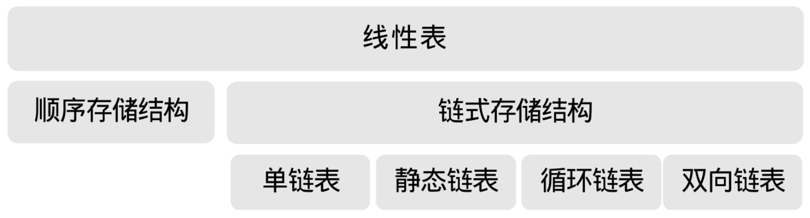

这一章，我们主要讲的是线性表。

先谈了它的定义，线性表是零个或多个具有相同类型的数据元素的有限序列。然后谈了线性表的抽象数据类型，如它的一些基本操作。

之后我们就线性表的两大结构做了讲述，先讲的是比较容易的顺序存储结构，指的是用一段地址连续的存储单元依次存储线性表的数据元素。通常我们都是用数组来实现这一结构。

后来是我们的重点，由顺序存储结构的插入和删除操作不方便，引出了链式存储结构。它具有不受固定的存储空间限制，可以比较快捷的插入和删除操作的特点。然后我们分别就链式存储结构的不同形式，如单链表、循环链表和双向链表做了讲解，另外我们还讲了若不使用指针如何处理链表结构的静态链表方法。

总的来说，线性表的这两种结构（如图 3-15-1 所示）其实是后面其他数据结构的基础，把它们学明白了，对后面的学习有着至关重要的作用。

