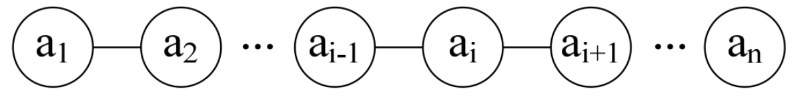
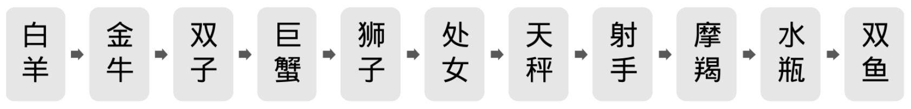
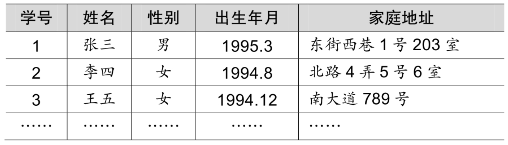

线性表，从名字上你就能感觉到，是具有像线一样的性质的表。在广场上，有很多人分散在各处，当中有些是小朋友，可也有很多大人，甚至还有不少宠物，这些小朋友的数据对于整个广场人群来说，不能算是线性表的结构。但像刚才提到的那样，一个班级的小朋友，一个跟着一个排着队，有一个打头，有一个收尾，当中的小朋友每一个都知道他前面一个是谁，他后面一个是谁，这样如同有一根线把他们串联起来了。就可以称之为线性表。

线性表（List）：零个或多个数据元素的有限序列。

这里需要强调几个关键的地方。

首先它是一个序列。也就是说，元素之间是有顺序的，若元素存在多个，则第一个元素无前驱，最后一个元素无后继，其他每个元素都有且只有一个前驱和后继。如果一个小朋友去拉两个小朋友后面的衣服，那就不可以排成一队了；同样，如果一个小朋友后面的衣服，被两个甚至多个小朋友拉扯，这其实是在打架，而不是有序排队。

然后，线性表强调是有限的，小朋友班级人数是有限的，元素个数当然也是有限的。事实上，在计算机中处理的对象都是有限的，那种无限的数列，只存在于数学的概念中。

如果用数学语言来进行定义。可如下：

若将线性表记为（a1，…，ai-1，ai，ai+1，…，an），则表中ai-1领先于ai，ai领先于ai+1，称ai-1是ai的直接前驱元素，ai+1是ai的直接后继元素。当i=1，2，…，n－1时，ai有且仅有一个直接后继，当i=2，3，…，n时，ai有且仅有一个直接前驱。如图3-2-1所示。

所以线性表元素的个数n（n≥0）定义为线性表的长度，当n=0时，称为空表。

在非空表中的每个数据元素都有一个确定的位置，如a1是第一个数据元素，an是最后一个数据元素，ai是第i个数据元素，称i为数据元素ai在线性表中的位序。

我现在说一些数据集，大家来判断一下是否是线性表。

先来一个大家最感兴趣的，一年里的星座列表，是不是线性表呢？如图3-2-2所示。

当然是，星座通常都是用白羊座打头，双鱼座收尾，当中的星座都有前驱和后继，而且一共也只有十二个，所以它完全符合线性表的定义。

公司的组织架构，总经理管理几个总监，每个总监管理几个经理，每个经理都有各自的下属和员工。这样的组织架构是不是线性关系呢？

不是，为什么不是呢？哦，因为每一个元素，都有不只一个后继，所以它不是线性表。那种让一个总经理只管一个总监，一个总监只管一个经理，一个经理只管一个员工的公司，俗称皮包公司，岗位设置等于就是在忽悠外人。

班级同学之间的友谊关系，是不是线性关系？哈哈，不是，因为每个人都可以和多个同学建立友谊，不满足线性的定义。嗯？有人说爱情关系就是了。胡扯，难道每个人都要有一个爱的人和一个被爱的人，而且他们还都不可以重复爱同一个人这样的情况出现，最终形成一个班级情感人物串联？这怎么可能，也许网络小说里可能出现，但现实中是不可能的。

班级同学的点名册，是不是线性表？是，这和刚才的友谊关系是完全不同了，因为它是有限序列，也满足类型相同的特点。这个点名册（如表3-2-1所示）中，每一个元素除学生的学号外，还可以有同学的姓名、性别、出生年月什么的，这其实就是我们之前讲的数据项。在较复杂的线性表中，一个数据元素可以由若干个数据项组成。

一群同学排队买演唱会门票，每人限购一张，此时排队的人群是不是线性表？是，对的。此时来了三个同学要插当中一个同学A的队，说同学A之前拿着的三个书包就是用来占位的，书包也算是在排队。如果你是后面早已来排队的同学，你们愿不愿意？肯定不愿意，书包怎么能算排队的人呢，如果这也算，我浑身上下的衣服裤子都在排队了。于是不让这三个人进来。

这里用线性表的定义来说，是什么理由？嗯，因为要相同类型的数据，书包根本不算是人，当然排队无效，三个人想不劳而获，自然遭到大家的谴责。看来大家的线性表学得都不错。
